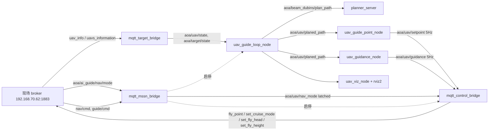

# beam_UAV_path_plan (2.0.0 · ROS2 Humble)

UAV 拦截制导系统：Beam Search + Dubins 路径规划、制导解算、以及 MQTT ↔ ROS2 桥。
本仓库已从 **ROS1 Noetic 1.0.1** 迁移到 **ROS2 Humble 2.0.0**（ROS1 代码保留在 git 历史中：
`1.0.1` 及更早提交）。

> 迁移与重构的完整设计、裁决记录与逐阶段验收数据见 [`doc/ros2rebuild.md`](doc/ros2rebuild.md)。

## 包结构

| 包 | 语言 / 构建 | 职责 | 关键入口 |
|---|---|---|---|
| `beam_dubins` | C++17 / ament_cmake | 束搜索 + Dubins 原语规划 + rosidl 接口 | 服务 `aoa/beam_dubins/plan_path`、`planner_server` |
| `uav_guide` | C++17 / ament_cmake | 拦截状态机、分段、引导点、巡航制导（**算法层零 ROS**） | `uav_guide_loop_node`、`uav_guide_point_node`、`uav_guidance_node` |
| `ros_mqtt_bridge` | C++17 / ament_cmake + libmosquitto | MQTT 入站位姿桥、模式状态桥、出站透传翻译、任务启停编排（**库层零 ROS**） | `mqtt_target_bridge`、`mqtt_control_bridge`、`mqtt_mssn_bridge` |
| `uav_guide_env` | C++17 / ament_cmake | 仅可视化：UAV/目标 3D Marker、边界、航迹、规划路径 | `uav_viz_node` + `rviz2` |

### 数据流



### 模式与出站透传（2.0 语义）

模式是**状态**而不是边沿：MQTT `aoa/ai_guide/nav/mode`（`auto` / `setpoint` / `guidance`）
→ `mqtt_mssn_bridge` → ROS `aoa/uav/nav_mode`（`std_msgs/String`，**latched**，启动即可得当前模式）
→ `mqtt_control_bridge` 按下表 **1:1 翻译**为 MQTT 指令（不节流、不去抖）。

| 模式 | 上游 ROS 话题 | 出网 MQTT（逐帧翻译） |
|---|---|---|
| `auto` | — | 不出网（失效安全） |
| `setpoint` | `aoa/uav/setpoint`（5 Hz） | `fly_point`（5 Hz） |
| `guidance` | `aoa/uav/guidance`（5 Hz） | `set_cruise_mode` + `set_fly_head` + `set_fly_height`（各 5 Hz，同一帧成组发出） |

两个制导节点均为**严格 `publish_rate_hz`（5 Hz）单一定时器**（实测平均 5.000 Hz、σ≈0.3 ms），
故出站三路也稳定在 5 Hz；实测模式切换生效延迟 ≈ **0.6 ms**。
失效安全：模式未收到（默认 `auto`）/ 模式报文非法 / `uav_sn` 未知 → 不出网。

## 依赖

```bash
sudo apt install -y libmosquitto-dev mosquitto-clients
sudo apt install -y ros-humble-rviz2 ros-humble-tf2-ros ros-humble-tf2-geometry-msgs
```

## 构建

```bash
cd ~/beamDubins_ws
colcon build --cmake-args -DCMAKE_BUILD_TYPE=Release
source install/setup.bash
```

单包构建 / 测试：

```bash
colcon build --packages-select beam_dubins uav_guide ros_mqtt_bridge uav_guide_env
colcon test  --packages-select beam_dubins uav_guide ros_mqtt_bridge
```

## 运行

```bash
# 1) MQTT → ROS2 位姿桥
ros2 launch ros_mqtt_bridge mqtt_bridge.launch.py

# 2) 规划 + 制导（planner + 3 个 guide 节点）
ros2 launch uav_guide uav_guide_launch.py

# 3) 出站控制桥（⚠ 会向真机话题发布，联调请用测试配置或 dry_run）
ros2 launch ros_mqtt_bridge mqtt_control_bridge.launch.py
ros2 launch ros_mqtt_bridge mqtt_control_bridge.launch.py dry_run:=true

# 4) 模式/任务桥（决定 2)、3) 的启停，并提供 aoa/uav/nav_mode）
ros2 launch ros_mqtt_bridge mqtt_mssn_bridge.launch.py

# 5) 可视化
ros2 launch uav_guide_env viz.launch.py
```

### 安全联调（推荐）

出站/入站话题全部重定向到 `beam_test/*` 沙箱，且不启停任何进程：

```bash
ros2 launch ros_mqtt_bridge mqtt_mssn_bridge.launch.py \
  config:=$PWD/install/ros_mqtt_bridge/share/ros_mqtt_bridge/config/mqtt_mssn_bridge_test.yaml
ros2 launch ros_mqtt_bridge mqtt_control_bridge.launch.py \
  config:=$PWD/install/ros_mqtt_bridge/share/ros_mqtt_bridge/config/mqtt_control_bridge_test.yaml

# 注入模式（auto | setpoint | guidance）
mosquitto_pub -h 192.168.70.62 -t 'beam_test/ai_guide/nav/mode' -m '{"mode":"guidance"}'
mosquitto_sub -h 192.168.70.62 -t 'beam_test/#' -v
```

## 重要工程约束

1. **局部 ENU 适用范围**：`ros_mqtt_bridge` 的 `geodesy` 与 1.0.1 逐字节相同，使用切平面投影，
   仅在作业区尺度（≲10 km）内有效；远距目标存在 $d^2/2R$ 的高度误差（115 km ≈ −1 km）。
   **本机与目标必须在同一作业区内**，`geodesy.origin_*` 取作业区中心（现场标定）。
2. **算法层零 ROS**：`beam_dubins_core`、`uav_guide_algo`、`ros_mqtt_bridge_core` 不链接任何 ROS 库，
   便于离线单测与复用。
3. **ROS 话题/服务统一 `aoa/` 前缀**；巡航路径话题拼写为 `aoa/uav/planed_path`。

## 测试

```bash
colcon test && colcon test-result --all
```

覆盖：束搜索/Dubins 单测（`beam_dubins`）、几何/分段/引导点/制导/状态机单测（`uav_guide`）、
JSON 编解码 30 例 + 模式截断矩阵 10 例（`ros_mqtt_bridge`）。
