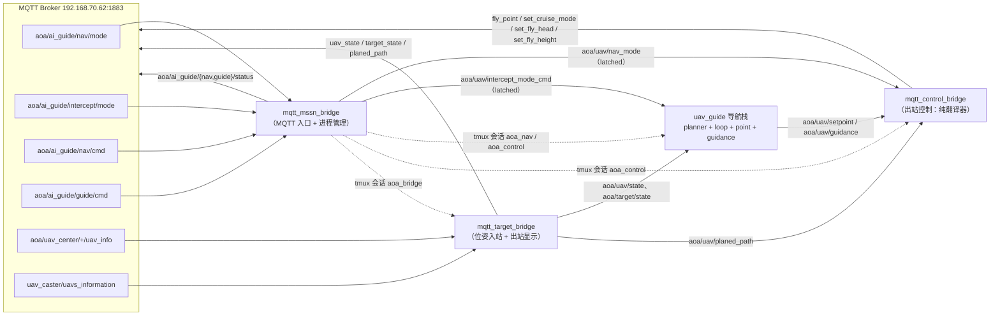

# MQTT 接口文档（ros_mqtt_bridge 2.4）

> 面向对象：**上位机 / 窗口程序 / 地面站开发者**，以及本仓库的集成调试人员。
> 范围：`ros_mqtt_bridge` 全部 MQTT 入站 / 出站话题、报文结构、字段含义，
> 以及 `mqtt_mssn_bridge` 的**进程管理契约**（tmux 会话）。
>
> 编写日期：2026-10-09　｜　对应代码：`ros_mqtt_bridge` 2.4（ROS2 Humble）
> 协议依据：《LJD 网络通讯协议》（method 名为准）

---

## 1. 全局约定

| 项 | 值 |
|---|---|
| Broker | `192.168.70.62:1883`（由各节点 yaml `mqtt.host/port` 配置） |
| 协议版本 | MQTT 3.1.1，QoS **0**，**不 retain** |
| 话题前缀 | 协议话题固定 `aoa/...`；本应用自有话题使用 `aoa/ai_guide/...` |
| ROS 侧话题 | 统一 `aoa/` 前缀（如 `aoa/uav/state`） |
| 时间戳 | `timestamp`：Unix 毫秒（`system_clock`） |
| 报文 ID | `mid`：`uavg-<pid>-<epoch_ms>-<seq>`，进程内单调递增，供上位机去重 |
| 角度约定 | **MQTT 侧**：度（°），航空约定 `0°=正北、顺时针`，航向范围 `[0,360)`；<br>**ROS 侧**：弧度，ENU 约定 `0=东、逆时针` |
| 坐标约定 | ROS `aoa/uav/state`、`aoa/target/state`、`aoa/uav/planed_path` 均为局部 ENU（单位 m），原点见 `geodesy.origin_*`（当前 `31.5934765 / 104.9271017 / 100.0`） |
| 失效安全 | 模式未收到 / 报文非法 / `${uav_sn}` 未知 → 一律**不出网** |

### 1.1 节点与数据流



---

## 2. 入站接口（MQTT → ROS）

### 2.1 `aoa/ai_guide/nav/mode` — 导航模式（**纯翻译**）

| 项 | 内容 |
|---|---|
| 方向 | 上位机 → `mqtt_mssn_bridge` |
| 频率 | 不定频（状态量，仅在切换时发即可） |
| method | 无（裸字符串）或 JSON `{"mode":"..."}` / `{"data":{"mode":"..."}}` |
| ROS 输出 | `aoa/uav/nav_mode`（`std_msgs/String`，**纯模式名**，QoS `transient_local` + reliable，latched） |

**取值**（固定三值，**不做旧值兼容**）：

| 值 | 含义 |
|---|---|
| `auto` | 初始态 / 失效安全态：出站**不发任何控制指令** |
| `setpoint` | 指点模式：仅 `fly_point` 出网 |
| `guidance` | 制导模式：`set_cruise_mode` + `set_fly_head` + `set_fly_height` 出网 |

**示例**
```text
guidance
```
```json
{"mode": "guidance"}
```

**语义要点**
- 模式是**状态**而非边沿：`mqtt_control_bridge` 启动时靠 `aoa/uav/nav_mode` 的 latched 语义立即得知当前模式。
- **本话题不启停任何进程**（2026-10-08 起）：进程完全由 §2.2 / §2.3 控制。
- 非法值 → 告警忽略，保持当前模式。

### 2.2 `aoa/ai_guide/nav/cmd` — 导航组进程启停

| 项 | 内容 |
|---|---|
| 方向 | 上位机 → `mqtt_mssn_bridge` |
| 载荷 | `{"start": <bool>}` |
| `true` | 按序拉起 **nav 组**（默认 2 个进程，见 §6） |
| `false` | **逆序**停止 nav 组（先停控制桥，再停导航栈） |

```json
{"start": true}
```
```json
{"start": false}
```

### 2.3 `aoa/ai_guide/guide/cmd` — 显示/位姿桥启停

| 项 | 内容 |
|---|---|
| 方向 | 上位机 → `mqtt_mssn_bridge` |
| 载荷 | `{"start": <bool>}` |
| `true` | 拉起 **guide 组**（默认 1 个：`mqtt_bridge.launch.py` = `mqtt_target_bridge`） |
| `false` | 停止 guide 组 |

```json
{"start": true}
```

### 2.4 `aoa/ai_guide/intercept/mode` — 拦截模式（迎头 / 尾追，**纯翻译**）

| 项 | 内容 |
|---|---|
| 方向 | 上位机 → `mqtt_mssn_bridge` |
| 频率 | 不定频（状态量，仅在切换时发即可） |
| method | 无（裸字符串）或 JSON `{"mode":"..."}` / `{"intercept_mode":"..."}` / `{"data":{"mode":...}}` |
| ROS 输出 | **`aoa/uav/intercept_mode_cmd`**（`std_msgs/String`，取值 `head-on` \| `tail`；默认 latched，见 `intercept.latch`） |
| 消费方 | `uav_guide_loop_node`（订阅后 `sm_->reset()` 清缓存 / 退出 TRACKING 并立即重规划）；`uav_guide_point_node` 在 TRACKING 下也用于几何选择 |

**取值**（大小写不敏感、容忍空白；一律**规范化为** `head-on` / `tail` 后再下发）：

| 输入 | 规范化结果 | 含义 |
|---|---|---|
| `head-on` / `headon` / `head_on` / `HEAD-ON` | `head-on` | 迎头拦截（目标前方设虚拟目标，期望航向 `ψ_tgt + π`） |
| `tail` / `TAIL` | `tail` | 尾追（目标后方设虚拟目标，期望航向 `ψ_tgt`） |
| 其它 | **不发布**（告警限流），保持当前值 | — |

**示例**
```text
tail
```
```json
{"intercept_mode": "head-on"}
```

**语义要点**
- 与 `nav/mode` 一样是**纯翻译**：不启停任何进程。
- 非法值**不会被转发**：下游 `uav_guide_loop_node` 只接受 `head-on|tail`，收到脏值只会告警丢弃；在 bridge 侧直接拦截可避免污染 ROS 话题。
- 默认 **latched**（`intercept.latch: true`）：允许“先发拦截模式、后启导航栈（`nav/cmd`）”的时序。

### 2.5 `aoa/uav_center/${uav_sn}/uav_info` — 位姿上报（协议 4.3.2）

| 项 | 内容 |
|---|---|
| 方向 | 地面站（LJD 插件）→ `mqtt_target_bridge` |
| 订阅方式 | `aoa/uav_center/+/uav_info`（通配，按 `uav_sn` 路由） |
| 频率 / QoS | 2 Hz / 0 |
| method | `uav_info` |
| ROS 输出 | `aoa/uav/state`（本机）、`aoa/target/state`（目标）`nav_msgs/Odometry` + tf2 `map → <uav_sn>` |

**字段（★ = 被消费）**

| 字段 | 类型 | 说明 |
|---|---|---|
| ★ `method` | string | 必须为 `uav_info`，否则丢弃 |
| ★ `mid` | string | 去重标识（与 `timestamp` 组合判重，重复帧丢弃） |
| ★ `timestamp` | int | epoch 毫秒 |
| ★ `data.uav_sn` | string | 飞机序列号，用于 own/target 辨识 |
| ★ `data.mode` | string | 飞控模式（`Auto` / `unknown` …），仅用于显示通道透传 |
| ★ `data.longitude` / `latitude` / `altitude` | double | WGS84；经 `geodesy` 转局部 ENU |
| ★ `data.yaw` / `pitch` / `roll` | double | **度**，航空约定；yaw 内部转 ENU 弧度 |
| ★ `data.vvg` | double | 标量地速 (m/s) |
| ★ `data.climb_cur` | double | 爬升率 (m/s) |
| `data.lock` / `gnss_num` / `ins_status` / `voltage` / `cmd` / `rotate_speed` | — | 真实报文存在，**本版本不消费**（保留） |

**注意**
- 水平速度由桥用「位置差分（COG）」+ 卡尔曼融合 `vvg` 得到（`vx/vy`）；`vz = climb_cur`。
- 经纬度越界 / 缺 `longitude|latitude|altitude` → 整帧丢弃。

### 2.6 `uav_caster/uavs_information` — 飞机列表

| 项 | 内容 |
|---|---|
| 方向 | 上位机 → `mqtt_target_bridge` |
| 载荷 | `{"data":{"uavs":[{"uav_sn":"..."}, ...]}}` |
| 用途 | 选出本机（`bridge.own_uav_filter`，默认 `NOCON`）与目标（`bridge.target_uav_filter`，默认 `SIL`）；无匹配时回退列表首项 |

### 2.7 `aoa/uav_center/fst_info` — 发射桶状态（能力保留）

| 项 | 内容 |
|---|---|
| 方向 | 地面站 → `mqtt_target_bridge` |
| method | `fst_info` |
| 载荷 | `{"data":{"barrels":[{"barrel_index":1,"fill":1,"self_check":1,"uav_sn":"..."}]}}` |
| 状态 | 解析函数 `decodeFstInfo` 保留；当前**未订阅**该话题（列表来源为 §2.6） |

---

## 3. 出站控制接口（ROS → MQTT）

**唯一出口**：`mqtt_control_bridge` → 话题 `aoa/uav_control/${uav_sn}/event_services`（QoS 0，不 retain）。
`${uav_sn}` 取自 `aoa/uav/state.child_frame_id`（本机选中的 sn）。

### 3.1 模式 → 指令映射表

| 当前模式 | 收到 `aoa/uav/setpoint` | 收到 `aoa/uav/guidance` |
|---|---|---|
| `auto` | 丢弃 | 丢弃（**不出网**） |
| `setpoint` | `fly_point` ×1 | 丢弃 |
| `guidance` | 丢弃 | `set_cruise_mode` + `set_fly_head` + `set_fly_height`（**每帧 3 条**） |

- **纯翻译器**：不做节流、不做阈值去抖、不做时间戳去重；出站频率 == 上游 ROS 频率（两个制导节点均为 5 Hz）。
- 三条指令**顺序固定**：`set_cruise_mode → set_fly_head → set_fly_height`。
- **唯一例外：`set_fly_height` 走「闭环重发门控」**（见 §3.2）。
  历史演进：① 5 Hz 逐帧发 → 飞控「持续初始化」；② 自举式死区门控（差 > 5 m 才发）→ 指令稳定时**永不重发** → **高度静差**，
  目标快速变化时又发得过快。现方案：每发一条后监测 `aoa/uav/state` 的高度变化率，飞机“**停了但没到位**”才补发、“**已到位**”则静默。
  → guidance 模式下典型出往为 **1 条 head/帧 + height 按需**，而非固定 3 条/帧。

### 3.2 报文

**`fly_point`（协议 4.4.1，来源 `aoa/uav/setpoint`）**
```json
{
  "method": "fly_point",
  "data":{
    "target_longitude":104.9271017,
    "target_latitude":31.5934765,
    "target_altitude":400.0,
    "target_radius":500
    }
}
```

| 字段 | 类型 | 精度/单位 | 含义 |
|---|---|---|---|
| `target_longitude` | double | 7 位小数 | 目标点经度（WGS84） |
| `target_latitude` | double | 7 位小数 | 目标点纬度（WGS84） |
| `target_altitude` | double | 1 位小数，m | 目标高度 |
| `target_radius` | double | m | `>0` 顺时针盘旋 / `<0` 逆时针（弧段圆心取 `±R_arc`；偏移引导点取 `finalshot.radius_m`） |

**`set_cruise_mode`（协议 4.4.17，来源同帧 `aoa/uav/guidance`）**
```json
{
  "method": "set_cruise_mode",
  "timestamp": 1789634596882,
  "mid": "uavg-4711-1789634596882-0007",
  "data": {}
}
```

**`set_fly_head`（协议 4.4.19，来源 `aoa/uav/guidance.heads`）**
```json
{
  "method": "set_fly_head",
  "timestamp": 1789634596882,
  "mid": "uavg-4711-1789634596882-0008",
  "data": {
    "heading": 45.2
  }
}
```

| 字段 | 类型 | 说明 |
|---|---|---|
| `heading` | double | 航向，度，**范围 `[0,360)`**；编码前「归一到 [0,360) → 量化 0.1° → 回绕」（`359.96 → 0.0`） |

**`set_fly_height`（协议 4.4.21，来源 `aoa/uav/guidance.fly_height`）**
```json
{
  "method": "set_fly_height",
  "timestamp": 1789634596882,
  "mid": "uavg-4711-1789634596882-0009",
  "data": {
    "height": 451,
    "height_type": 0
  }
}
```

| 字段 | 类型 | 说明 |
|---|---|---|
| `height` | int | 高度，米（由 `fly_height` 四舍五入） |
| `height_type` | int | `0` 场高 / `1` 绝对高度（由 `mqtt_control_bridge` yaml `cmd.height_type` 指定） |

**发送门控（重要，2026-10-09 改为闭环）**：`set_fly_height` **不**按 5 Hz 逐帧发，而是
**闭环重发** —— 用 `aoa/uav/state.pose.pose.position.z` 判断飞机是否「已停下但未到位」：

| 条件 | 行为 |
|---|---|
| 本次模式进入后**尚未发过**（含首帧、模式切回 guidance） | **必发 1 条**（建立闭环） |
| 距上次下发 `< cmd.height_resend_delay_s`（默认 1 s） | **不发**（等飞机反应，防连发） |
| `\|fly_height − 实测高度\| ≤ cmd.height_reach_eps_m`（默认 0.5 m） | **不发**（已到位 → 静默，不再刷指令） |
| `\|dz/dt\| < cmd.height_rate_eps_mps`（默认 0.25 m/s）**且**未到位 | **补发 1 条**（停了但没到位 → 消除高度静差） |
| 仍在爬/降（`\|dz/dt\| ≥ 阈值`） | **不发**（不打断正在执行的机动） |
| `aoa/uav/state` 超过 `cmd.height_state_timeout_s`（默认 2 s）未更新 | **暫停补发**（不做盲判） |

实现细节：
- **实测高度** = `state.pose.z + cmd.height_offset_m`（默认 0）——若指令高度与 ENU z 存在固定基准偏差，用它对齐；
- **`dz/dt`** 用 **滑动窗差分**（窗长 `cmd.height_rate_window_s`，默认 1 s）而非 EMA：EMA 从 20 m/s 衰减到阈值以下需 ~3 s，会漏判“已停下”；
- 连续 5 次补发仍未收敛 → 告警提示校准 `cmd.height_offset_m`；
- 仅当 `publish` **真正成功**时才前移基准（`uav_sn` 未知 / broker 断线不会误当已发）。

### 3.3 预留

| method | 章节 | 来源 | 状态 |
|---|---|---|---|
| `set_fly_speed` | 4.4.23 | `aoa/uav/guidance.fly_speed`（当前为 yaml 常量占位） | **未实现** |

---

## 4. 出站显示接口（ROS → MQTT，供窗口程序叠加显示）

> 2026-10-08 新增。**只读展示**，不参与控制链路；由 `mqtt_target_bridge` 发布，
> 可用 `display.enabled: false` 整体关闭。

| 话题 | 来源 ROS 话题 | 频率 | method |
|---|---|---|---|
| `aoa/ai_guide/display/uav_state` | `aoa/uav/state` | `display.rate_hz`（默认 2 Hz） | `uav_state` |
| `aoa/ai_guide/display/target_state` | `aoa/target/state` | 同上 | `target_state` |
| `aoa/ai_guide/display/planed_path` | `aoa/uav/planed_path` | **变化时发一次**（时间戳/点数变化） | `planed_path` |

全部采用协议基础包：`{ "method", "timestamp", "mid", "data" }`。

### 4.1 `uav_state` / `target_state`

```json
{
  "method": "uav_state",
  "timestamp": 1791458935610,
  "mid": "uavg-59026-1791458935610-202",
  "data": {"uav_sn":"V2.4AOACRAFT-NOCONF0","role":"own","frame":"map","mode":"Auto",
           "position":{"x":-5831.718,"y":-49151.754,"z":4.198},
           "orientation":{"x":0.028367,"y":0.027393,"z":-0.718780,"w":0.694118},
           "linear":{"x":-1.999,"y":-50.703,"z":0.000},
           "geodetic":{"longitude":104.8659461,"latitude":31.1501738,"altitude":297.00}}
}
```

| 字段 | 类型 | 单位/精度 | 含义 |
|---|---|---|---|
| `data.uav_sn` | string | — | 飞机序列号 |
| `data.role` | string | — | `own`（本机，发到 `uav_state`）/ `target`（目标，发到 `target_state`） |
| `data.frame` | string | — | 局部坐标所属 frame，默认 `map` |
| `data.mode` | string | — | 飞控模式透传（如 `Auto`；飞控上报 `unknown` 时即原样透传） |
| `data.position.x/y/z` | double | m，3 位小数 | ENU 位置（东/北/天） |
| `data.orientation.x/y/z/w` | double | 6 位小数 | 姿态四元数（ENU/地图系） |
| `data.linear.x/y/z` | double | m/s，3 位小数 | ENU 线速度（x/y 为融合后速度，z 为爬升率） |
| `data.geodetic.longitude/latitude` | double | 度，**7 位小数** | 由 ENU **反算**的 WGS84 经纬度（便于窗口直接落图） |
| `data.geodetic.altitude` | double | m，2 位小数 | 海拔高度 |

> `geodetic` 整段是否出现由 `display.include_geodetic` 控制（默认 `true`）。

### 4.2 `planed_path`

```json
{
  "method": "planed_path",
  "timestamp": 1791458963092,
  "mid": "uavg-59026-1791458963092-366",
  "data": {"uav_sn":"V2.4AOACRAFT-NOCONF0","frame":"map","success":true,
           "cost":58310.289,"status_message":"goal reached","count":48,
           "path":[[x,y,z,yaw,pitch,curvature], ...]}
}
```

| 字段 | 类型 | 含义 |
|---|---|---|
| `data.uav_sn` | string | 路径归属（本机 sn；未知时为 `unknown`） |
| `data.frame` | string | 默认 `map` |
| `data.success` | bool | 规划是否成功 |
| `data.cost` | double | 路径代价（米，保留 3 位小数） |
| `data.status_message` | string | 规划状态文本（已做 JSON 转义） |
| `data.count` | int | **本次实际下发的点数**（抽稀后） |
| `data.path[]` | array | 每点 `[x, y, z, yaw, pitch, curvature]`：位置 m、`yaw/pitch` 弧度、`curvature` 1/m |

**抽稀**：`display.path_max_points > 0` 时等间隔抽稀并**保留首尾点**；`0`（默认）= 全量。

---

## 5. 状态上报接口（`mqtt_mssn_bridge` 出站）

| 话题 | 频率 | 载荷 |
|---|---|---|
| `aoa/ai_guide/nav/status` | 1 Hz（`mssn.status_poll_hz`） | `{"running":bool,"mode":"auto","intercept":"head-on","procs":[{"name":"aoa_nav","running":true},{"name":"aoa_control","running":true}]}` |
| `aoa/ai_guide/guide/status` | 1 Hz | `{"running":bool,"mode":"...","tracking":bool,"procs":[{"name":"aoa_bridge","running":true}]}` |

| 字段 | 含义 |
|---|---|
| `running` | **组内全部进程都在跑**才为 `true`（空组 = `false`） |
| `mode` | 当前导航模式（与 `aoa/uav/nav_mode` 同源） |
| `intercept` | 最近一次有效拦截模式（未收到过命令时为空串） |
| `tracking` | 规划器 APPROACH/TRACKING 状态（`aoa/uav/tracking_mode`） |
| `procs[].name` | tmux 会话名 |
| `procs[].running` | 该会话内进程是否存活（`remain-on-exit` 下"会话在、进程死"记为 `false`） |

---

## 6. 进程管理契约（tmux）

`mqtt_mssn_bridge` 作为导航算法的 **MQTT 入口 + 进程管理节点**，在 docker 封装阶段作为启动服务。

### 6.1 默认受管进程组

| 触发 | 序号 | tmux 会话 | 命令 | `/proc` pattern |
|---|---|---|---|---|
| `nav/cmd` `start=true` | 1 | `aoa_nav` | `ros2 launch uav_guide uav_guide_launch.py` | `uav_guide_launch.py` |
| `nav/cmd` `start=true` | 2 | `aoa_control` | `ros2 launch ros_mqtt_bridge mqtt_control_bridge.launch.py` | `mqtt_control_bridge.launch.py` |
| `guide/cmd` `start=true` | 1 | `aoa_bridge` | `ros2 launch ros_mqtt_bridge mqtt_bridge.launch.py` | `mqtt_bridge.launch.py` |

> 停止顺序：`nav/cmd start=false` 时**逆序**（先 `aoa_control` 后 `aoa_nav`），避免停机期间产生无效指令。

### 6.2 配置格式（`config/mqtt_mssn_bridge.yaml`）

```yaml
mssn:
  use_tmux: true               # true = tmux 会话；false = fork+setsid 回退
  tmux_bin: tmux               # use_tmux=true 时缺失 → 启动即 FATAL（exit 1）
  tmux_remain_on_exit: true    # 进程退出后保留 pane，便于回溯崩溃原因
  workspace_dir: /home/ros-dev/beamDubins_ws
  setup_shell: source /opt/ros/humble/setup.bash && source install/setup.bash
  log_dir: /tmp/ros_mqtt_bridge_logs
  nav_procs:                   # 每项 "<command>|<pattern>|<session>"
    - "ros2 launch uav_guide uav_guide_launch.py|uav_guide_launch.py|aoa_nav"
    - "ros2 launch ros_mqtt_bridge mqtt_control_bridge.launch.py|mqtt_control_bridge.launch.py|aoa_control"
  guide_procs:
    - "ros2 launch ros_mqtt_bridge mqtt_bridge.launch.py|mqtt_bridge.launch.py|aoa_bridge"
```

### 6.3 运行期行为

| 行为 | 实现 |
|---|---|
| 启动 | 生成 `<log_dir>/<session>.sh`（`cd` + `source` + `exec <cmd> 2>&1 \| tee -a <log_dir>/<session>.log`），再 `tmux new-session -d -s <session> -c <ws> "bash <script>"` |
| 停止 | `tmux kill-session` → 等待 `/proc` pattern 清空（`stop_timeout_s`）→ 残留 SIGTERM/SIGKILL 兜底 |
| 存活 | `tmux has-session` + `list-panes -F '#{pane_dead}'`；会话缺失/已死时用 `/proc` pattern 兜底 |
| 幂等 | 已在运行 → 记日志跳过，不重复拉起 |
| 崩溃恢复 | `remain-on-exit` 保留 pane（可 `tmux attach` 看报错）；再次 `start=true` 会**清理残留会话后重建** |
| 人工调试 | `tmux attach -t aoa_nav`；或 `tail -f /tmp/ros_mqtt_bridge_logs/aoa_nav.log` |

---

## 7. 安全开关

| 开关 | 位置 | 默认 | 作用 |
|---|---|---|---|
| `mssn.enable_process_control` | `mqtt_mssn_bridge.yaml` | `true` | `false` = 只转发模式，**不启停任何进程**（离线测试） |
| `mssn.use_tmux` | 同上 | `true` | `false` = 回退 `fork+setsid`（无 tmux 的现场） |
| `mqtt.dry_run` | `mqtt_control_bridge.yaml` | `false` | `true` = 只打印不外发控制指令 |
| `mqtt.event_services_template` | 同上 | `aoa/uav_control/${uav_sn}/event_services` | 重定向到沙箱话题（联调用） |
| `cmd.height_reach_eps_m` | `mqtt_control_bridge.yaml` | `0.5` | 到位判据（m）：`|指令 − 实测| ≤ 本值` → 静默 |
| `cmd.height_rate_eps_mps` | 同上 | `0.25` | 静止判据（m/s）：`|dz/dt| < 本值` → 视为飞机已停下 |
| `cmd.height_rate_window_s` | 同上 | `1.0` | `dz/dt` 滑动窗长（s） |
| `cmd.height_resend_delay_s` | 同上 | `1.0` | 最小重发间隔（s），防连发 |
| `cmd.height_offset_m` | 同上 | `0.0` | 实测高度基准修正：`实测 = state.z + 本值` |
| `cmd.height_state_timeout_s` | 同上 | `2.0` | `aoa/uav/state` 超时 → 暂停闭环补发 |
| `display.enabled` | `mqtt_bridge.yaml` | `true` | `false` = 关闭全部显示出站 |

**失效安全**：MQTT 断线 / 模式报文非法 / `${uav_sn}` 未知 → 保持 `auto`，不出网（漏发优于误发）。

---

## 8. 自测命令速查

```bash
# ── 入站：模式纯翻译（不启动任何进程）──
mosquitto_pub -h 192.168.70.62 -t aoa/ai_guide/nav/mode -m 'guidance'
source install/setup.bash
timeout 5 ros2 topic echo /aoa/uav/nav_mode --qos-durability transient_local --qos-reliability reliable
mosquitto_pub -h 192.168.70.62 -t aoa/ai_guide/nav/mode -m 'auto'   # 复位

# ── 入站：拦截模式（迎头/尾追）纯翻译 ──
mosquitto_pub -h 192.168.70.62 -t aoa/ai_guide/intercept/mode -m 'tail'
timeout 5 ros2 topic echo /aoa/uav/intercept_mode_cmd --once --qos-durability transient_local --qos-reliability reliable
timeout 5 ros2 topic echo /aoa/uav/intercept_mode     --once --qos-durability transient_local --qos-reliability reliable  # 规划器上行状态
mosquitto_pub -h 192.168.70.62 -t aoa/ai_guide/intercept/mode -m 'head-on'   # 复位

# ── 入站：nav 组启停（期望出现 aoa_nav + aoa_control 两个 tmux 会话）──
mosquitto_pub -h 192.168.70.62 -t aoa/ai_guide/nav/cmd -m '{"start":true}'
tmux ls
tail -f /tmp/ros_mqtt_bridge_logs/aoa_nav.log
mosquitto_pub -h 192.168.70.62 -t aoa/ai_guide/nav/cmd -m '{"start":false}'

# ── 入站：显示/位姿桥（aoa_bridge）──
mosquitto_pub -h 192.168.70.62 -t aoa/ai_guide/guide/cmd -m '{"start":true}'

# ── 状态上报 ──
mosquitto_sub -h 192.168.70.62 -t 'aoa/ai_guide/nav/status' -C 1
mosquitto_sub -h 192.168.70.62 -t 'aoa/ai_guide/guide/status' -C 1

# ── 出站显示 ──
mosquitto_sub -h 192.168.70.62 -t 'aoa/ai_guide/display/uav_state' -C 1 -F '%t|%p'
mosquitto_sub -h 192.168.70.62 -t 'aoa/ai_guide/display/target_state' -C 1 -F '%t|%p'
mosquitto_sub -h 192.168.70.62 -t 'aoa/ai_guide/display/planed_path' -C 1 -F '%t|%p'

# ── 出站控制（抓本机控制话题，注意：会在 guidance 模式下真发指令）──
mosquitto_sub -h 192.168.70.62 -t 'aoa/uav_control/+/event_services' -F '%t|%p'

# ── 高度闭环门控验证（建议先用沙箱话题，不碰真机）──
#   期望：set_fly_head 每帧都有（5 Hz）；set_fly_height 仅“首条 + 停滞且未到位时的补发”
ros2 run ros_mqtt_bridge mqtt_control_bridge --ros-args \
  --params-file install/ros_mqtt_bridge/share/ros_mqtt_bridge/config/mqtt_control_bridge.yaml \
  -p mqtt.event_services_template:='beam_test/uav_control/${uav_sn}/event_services'
mosquitto_sub -h 192.168.70.62 -t 'beam_test/#' -v | grep -A 5 '"method"'
# 观察点：控制桥日志 "set_fly_height 下发: …（实测 … 差 … dz/dt …）" 与 "… 静默: …"
```

> ⚠ `ros2 topic echo` 必须带前导斜杠（`/aoa/uav/nav_mode`），并同时指定 `--qos-durability transient_local --qos-reliability reliable`，否则收不到 latched 消息。

---

## 9. 与本文档相关的其它文档

| 文档 | 内容 |
|---|---|
| `doc/ros2rebuild.md` | 迁移总设计、附录 G（模式改状态 + 出站纯翻译器） |
| `doc/quick_start.md` | 部署与分节点验收流程 |
| `doc/L1_tracking_plan.md` | `aoa/uav/guidance` 的 L1 制导算法 |

---

## 10. 变更记录

| 日期 | 版本 | 说明 |
|---|---|---|
| 2026-10-09 | 2.4 | **`set_fly_height` 改闭环重发门控**（替代自举式死区）：发一条后监测 `aoa/uav/state` 的 `dz/dt`，飞机「停了但没到位」才补发、「到位」则静默；新增阈值 `height_reach_eps_m`/`height_rate_eps_mps`/`height_rate_window_s`/`height_resend_delay_s`/`height_offset_m`/`height_state_timeout_s`。沙箱实测（15 s，指令恒定 400 m）：停滞在 200 m → 3 条；爬升中 → 0 条；停滞在 260 m → 2 条；到位 400 m → 0 条。同时修复 `set_cruise_mode` 首个发布失败仍被标记为“已发”而导致**永久丢失**的 bug |
| 2026-10-09 | 2.3 | `set_fly_height` 首次尝试门控（自举式死区，差 > 5 m 才发）；**已被 v2.4 取代**（存在高度静差与目标快变时过快的问题） |
| 2026-10-09 | 2.2 | ① **新增拦截模式入站** `aoa/ai_guide/intercept/mode` → ROS `aoa/uav/intercept_mode_cmd`（`head-on`\|`tail`，兼容 `headon`/`head_on`，非法值不转发，默认 latched）；② `nav/status` 增加 `intercept` 字段；③ 修复列表报文含非法 UTF-8 导致两张状态话题整个断流（`sanitizeUtf8` + 扫描兜底） |
| 2026-10-08 | 2.1 | ① **进程管理改 tmux**：`nav/cmd` 经 tmux 启动/停止 `uav_guide_launch.py` + `mqtt_control_bridge.launch.py`；`guide/cmd` 管 `mqtt_bridge.launch.py`；② **`aoa/ai_guide/nav/mode` 降为纯翻译器**（不再因模式变化启停进程）；③ **新增出站显示通道** `aoa/ai_guide/display/{uav_state,target_state,planed_path}`；④ 状态上报增加 `procs[]` 明细 |
