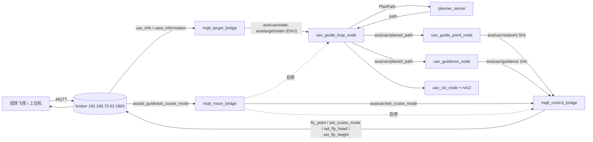

# beam_UAV_path_plan 2.0 · Quick Start（架构 / 分节点测试 / 启动流程）

> 适用版本：**2.0.0（ROS2 Humble）**，基线上游 ROS1 Noetic 1.0.1（commit `87615c5`）。
> 详细设计与逐阶段验收记录见 [`ros2rebuild.md`](ros2rebuild.md)。
> 本文所有命令与实测数值均在 **2026-09-18 现场环境**（Ubuntu 22.04 + Humble + 真机 broker）验证通过。

---

## 0. 环境基线

| 项 | 值 |
|---|---|
| OS / ROS | Ubuntu 22.04 / ROS2 Humble（`/opt/ros/humble`） |
| 工作区 | `/home/ros-dev/beamDubins_ws`（包位于 `src/beam_UAV_path_plan/`） |
| MQTT broker | `192.168.70.62:1883`（MQTT 3.1.1，QoS0） |
| 本机（own） | `V2.4AOACRAFT-NOCONF0`，匹配 `own_uav_filter: "NOCON"` |
| 目标（target） | `V2.4AOACRAFT-SIL3NF0`，匹配 `target_uav_filter: "SIL"` |
| 大地原点 | `geodesy.origin_*` = 31.5959681 / 104.9380182 / 100.0（**两处配置必须一致**） |
| 坐标系 | `map` = 局部 ENU（x 东、y 北、z 上），单位 m；角度：ENU yaw(rad) / 航向 heads(°) |

依赖安装（只需一次）：

```bash
sudo apt install -y libmosquitto-dev mosquitto-clients
sudo apt install -y ros-humble-rviz2 ros-humble-tf2-ros ros-humble-tf2-geometry-msgs
```

---

## 1. 架构

### 1.1 四个功能包

| 包 | 构建/语言 | 职责 | 可执行文件 |
|---|---|---|---|
| `beam_dubins` | ament_cmake / C++17 | 束搜索规划 + Dubins 原语；**算法层与 1.0.1 逐字节一致** | `planner_server` |
| `uav_guide` | ament_cmake / C++17 | 拦截状态机、路径切分、引导点、巡航制导；**算法层零 ROS** | `uav_guide_loop_node`、`uav_guide_point_node`、`uav_guidance_node` |
| `ros_mqtt_bridge` | ament_cmake / C++17 + libmosquitto | MQTT 入站位姿、出站模式截断、任务启停编排；**库层零 ROS** | `mqtt_target_bridge`、`mqtt_control_bridge`、`mqtt_mssn_bridge` |
| `uav_guide_env` | ament_cmake / C++17 | 仅可视化（1.0.1 仿真闭环已移除） | `uav_viz_node` + rviz2 |

**零 ROS 库**（可离线单测、可复用）：

```bash
nm -uC build/beam_dubins/libbeam_dubins_core.a   | grep -cE 'rclcpp|rosidl|ros::'   # → 0
nm -uC build/uav_guide/libuav_guide_algo.a       | grep -cE 'rclcpp|rosidl|ros::'   # → 0
nm -uC build/ros_mqtt_bridge/libros_mqtt_bridge_core.a | grep -cE 'rclcpp|rosidl|ros::'  # → 0
```

### 1.2 节点与接口

| 节点 | 订阅 | 发布 / 服务 |
|---|---|---|
| `mqtt_target_bridge` | MQTT `aoa/uav_center/+/uav_info`、`uav_caster/uavs_information` | `aoa/uav/state`、`aoa/target/state`（`nav_msgs/Odometry`）、TF `map→<uav_sn>` |
| `planner_server` | — | 服务 `aoa/beam_dubins/plan_path`（`beam_dubins/srv/PlanPath`） |
| `uav_guide_loop_node` | `aoa/uav/state`、`aoa/target/state`、`aoa/uav/intercept_mode_cmd` | `aoa/uav/planed_path`(latched)、`aoa/uav/intercept_mode`、`aoa/uav/tracking_mode`(1 Hz 心跳)；客户端 `aoa/beam_dubins/plan_path` |
| `uav_guide_point_node` | `aoa/uav/planed_path`、`aoa/uav/state`、`aoa/target/state`、`aoa/uav/intercept_mode` | `aoa/uav/setpoint`（5 Hz，**不判模式**） |
| `uav_guidance_node` | `aoa/uav/planed_path`、`aoa/uav/state`、`aoa/target/state` | `aoa/uav/guidance`（1 Hz + 变化触发，**不判模式**） |
| `mqtt_control_bridge` | `aoa/uav/set_cruise_mode`、`aoa/uav/setpoint`、`aoa/uav/guidance`、`aoa/uav/state` | MQTT `aoa/uav_control/${uav_sn}/event_services` |
| `mqtt_mssn_bridge` | MQTT `aoa/ai_guide/set_cruise_mode`、`aoa/ai_guide/nav/cmd`、`aoa/ai_guide/guide/cmd` | ROS `aoa/uav/set_cruise_mode`(latched)；MQTT `aoa/ai_guide/{nav,guide}/status`；**启停** `uav_guide_launch.py` 与 `mqtt_control_bridge` |
| `uav_viz_node` | `aoa/uav/state`、`aoa/target/state`、`aoa/uav/planed_path`、`aoa/viz/status_text` | `aoa/viz/*`（Marker、`nav_msgs/Path`） |

### 1.3 数据流



### 1.4 模式与出站截断（2.0 核心行为）

模式权威源 = MQTT `aoa/ai_guide/set_cruise_mode`（取值 `auto` / `setpoint` / `cruise`），
由 `mqtt_mssn_bridge` 转为 ROS 镜像 `aoa/uav/set_cruise_mode`。

| 模式 | `fly_point`（← `aoa/uav/setpoint`） | `set_fly_head` + `set_fly_height`（← `aoa/uav/guidance`） | `set_cruise_mode` |
|---|---|---|---|
| `auto` | ✗ 不出网 | ✗ 不出网 | ✗ |
| `setpoint` | ✓ | ✗ | ✗ |
| `cruise` | ✗ | ✓（≥1 Hz 限流 + 阈值去抖） | 进入 `cruise` 的**跃迁边沿发 1 次** |

- 两个制导节点**始终发布**，模式互斥完全下沉到 `mqtt_control_bridge`（便于单测与复用）。
- 失效安全：MQTT 断线 / 模式报文非法 / `${uav_sn}` 未知 → 一律不出网（等价 `auto`）。
- 回退开关：`cmd.require_mode: false` = 直通模式（始终按 `setpoint` 发 `fly_point`，即 1.0.1 行为）。

### 1.5 坐标系铁律（现场最容易出错的地方）

1. **`ros_mqtt_bridge/config/mqtt_bridge.yaml` 的 `geodesy.*` 与
   `uav_guide/config/uav_guide.yaml` 的 `geodesy.*` 必须完全一致**。
   - 前者：MQTT 大地坐标 → ENU；后者：ENU → `fly_point` 经纬度。
   - 不一致的后果（实测）：原点差 5.4 km 时，`fly_point` 经纬度整体偏移
     **5357.7 m（水平）+ 417.6 m（高度）** → 飞机飞向完全错误的位置。
2. **切平面 ENU 只适用于作业区尺度**（≲10 km）。`geodesy` 与 1.0.1 逐字节相同，
   采用 ECEF 差向量投影，远距存在曲率下沉 $\Delta z \approx -d^2/2R$
   （115 km 时约 −1.0 km）。**本机与目标必须同处 `space.lx × ly` 作业区内。**
3. 规划空间 `space.*` 以**起点为锚**（服务定义：起点处 X=0），不是以原点为锚。
4. 实现级校验（比跑节点更直接、与时间无关）：

```bash
cat > /tmp/geodesy_check.cpp <<'EOF'
#include <cstdio>
#include "ros_mqtt_bridge/geodesy.h"
int main(){
  ros_mqtt_bridge::Geodesy g(31.5959681, 104.9380182, 100.0);   // ← 换成你的原点
  auto e = g.toLocal({31.614284, 104.902533, 700.2});            // ← 换成待校验点
  std::printf("%.6f %.6f %.6f\n", e.x, e.y, e.z);
}
EOF
g++ -std=c++17 -O2 /tmp/geodesy_check.cpp \
    -Isrc/beam_UAV_path_plan/ros_mqtt_bridge/include \
    -Lbuild/ros_mqtt_bridge -lros_mqtt_bridge_core -o /tmp/geodesy_check && /tmp/geodesy_check
```
   与独立 Python WGS84 实现对拍，应**逐位一致**（本次实测 0 差异）。

### 1.6 命名与配置文件

- ROS 话题/服务统一 `aoa/` 前缀；**注意拼写：`aoa/uav/planed_path`**（协议/历史沿用，非 `planned`）。
- 配置一览：

| 文件 | 关键项 |
|---|---|
| `ros_mqtt_bridge/config/mqtt_bridge.yaml` | `mqtt.host/port`、`geodesy.origin_*`、`target_uav_filter: SIL`、`own_uav_filter: NOCON`、`topics.*`、`tf.world_frame: map` |
| `ros_mqtt_bridge/config/mqtt_control_bridge.yaml` | `mqtt.event_services_template`、`cmd.height_type/min_interval_s/heading_eps_deg/height_eps_m/require_mode/mode_timeout_s`、`mqtt.dry_run` |
| `ros_mqtt_bridge/config/mqtt_mssn_bridge.yaml` | `mqtt.*_cmd_topic/status_topic`、`mssn.enable_process_control/workspace_dir/setup_shell/nav_launch_command/guide_run_command/*_pgrep_pattern/log_dir`、`mssn.start_guide_on_mode` |
| `uav_guide/config/uav_guide.yaml` | `geodesy.origin_*`（**同上**）、`target.approach_distance_*`、`guidance.*`、`space.*`、`finalshot.*`、`guide_point.publish_rate_hz` |
| `beam_dubins/config/beam_dubins.yaml` | `service_name`、`beam_width`、`scorer.w_h`、`uav.min_turn_radius_m` |
| `uav_guide_env/config/viz.yaml` | `space.*`（与 uav_guide 一致）、Marker 话题、刷新率 |

---

## 2. 构建

```bash
cd ~/beamDubins_ws
source /opt/ros/humble/setup.bash
colcon build --cmake-args -DCMAKE_BUILD_TYPE=Release
source install/setup.bash
colcon test && colcon test-result --all      # 41 个单测，应 0 失败
```

单包：`colcon build --packages-select <beam_dubins|uav_guide|ros_mqtt_bridge|uav_guide_env>`。
**改 yaml 后必须重新 `colcon build`**（配置随 install 拷贝）。

---

## 3. 分功能包测试方法

> 约定：每节给出「前置 → 命令 → 期望 → 本版本实测基线」。所有节点测试请先 `source install/setup.bash`。
> 现场有真机在线时，**任何会出网的操作都必须用第 4.3 节的沙箱配置**。

### T1 `mqtt_target_bridge`（MQTT → ROS 位姿）

前置：无（只需 broker 可达）。

```bash
ros2 launch ros_mqtt_bridge mqtt_bridge.launch.py
# 另开终端
ros2 topic hz aoa/uav/state          # 期望 ≈ 飞机上报率（现场 ≈ 2 Hz）
ros2 topic hz aoa/target/state
ros2 topic echo --once aoa/uav/state | head -20
```

期望与实测基线：

| 检查项 | 期望 | 实测 |
|---|---|---|
| 日志识别双机 | `target UAV:` / `ownship UAV:` | `V2.4AOACRAFT-SIL3NF0` / `V2.4AOACRAFT-NOCONF0` |
| `aoa/uav/state` 频率 | ≈ 飞机上报率 | 1.87 ~ 2.29 Hz |
| `aoa/target/state` 频率 | 同上 | ≈ 2 Hz |
| ENU 数值 | 落在 ±10 km 作业区 | 本机 ≈ (−4.0 km, −1.3 km, 198 m) |
| TF | `map → <uav_sn>` | ✓（`ros2 run tf2_ros tf2_echo map V2.4AOACRAFT-NOCONF0`） |

**坐标交叉校验（换原点/换场地后必做）**：

```bash
python3 src/beam_UAV_path_plan/tools/enu_check.py \
  --config src/beam_UAV_path_plan/ros_mqtt_bridge/config/mqtt_bridge.yaml
```

期望 `结论: 通过`。实测样例：目标 **d3D = 0.0 m**（精确配对），本机 51 m（链路时延 × 50 m/s）。

### T2 `beam_dubins` / `planner_server`（规划服务）

```bash
ros2 run beam_dubins planner_server --ros-args \
  --params-file install/beam_dubins/share/beam_dubins/config/beam_dubins.yaml
# 另开终端：用自带客户端（输出精简，避免打印上千路径点）
T=src/beam_UAV_path_plan/tools/plan_path_client.py
python3 $T                                                          # 2 km 直飞
python3 $T --goal 6000 3000 400 0 0                                 # 远景
python3 $T --obstacle 700 300 0 1300 900 1000                       # 障碍绕行
python3 $T --start 0 0 198 3.09 0 --goal 458 4965 599 0 0           # 真实几何
```

期望与实测基线（实测日期 2026-09-18）：

| 用例 | success | cost | 绕行比 | 目标误差 |
|---|---|---|---|---|
| 2 km 直飞 | true | 2255.65 m | 1.009 | 0.000 m |
| 障碍绕行 | true | 3133.41 m | 1.401 | 0.000 m |
| 真实几何（y≈4965 贴近边界） | true | 5534 m | 1.110 | 0.000 m |

判定：`success=true`、`status_message='goal reached'`、`goal error ≈ 0`；
障碍用例的 `cost` 与弧段点数应显著增加（53 → 105 个弧段点）。

### T3 `uav_guide_loop_node`（状态机 + 规划调度）

前置：T1 + T2 已运行。

```bash
ros2 launch uav_guide uav_guide_launch.py with_planner:=false
ros2 topic echo --once aoa/uav/planed_path | head -5     # success/cost/status_message
ros2 topic hz aoa/uav/planed_path                        # ≈ 4~5 Hz
grep -a 'plan ok' <终端输出>                              # 形如:
# [uav_guide_loop] plan ok cost=4014.3 pts=49 phase=APPROACH intercept=head-on
```

**闭环校验（判定坐标链路无系统偏移）**：`path[0]` 应等于本机 ENU 位置；`path[-1]` 不是目标，
而是「目标 + `approach_distance_headon` × 目标航向」的**虚拟拦截门**。实测：

| 项 | 实测 |
|---|---|
| `path[0]` vs 本机 ENU | 偏差 **0.0 m** |
| `path[-1]` vs 目标+2300 m×航向 | 偏差 **0.0 m** |
| phase / intercept | `APPROACH` / `head-on`（本机距目标 > `tracking_entry_dist` 时） |

### T4 `uav_guide_point_node`（point 制导 → `aoa/uav/setpoint`）

```bash
ros2 topic hz aoa/uav/setpoint        # ≈ 5 Hz（不受模式影响）
ros2 topic echo --once aoa/uav/setpoint
```

期望与实测基线：

| 检查项 | 期望 | 实测 |
|---|---|---|
| 频率 | 5 Hz | 5.08 Hz |
| `target_radius` | ±`R_arc`（弧心情形，符号=绕行方向） | −500.0（顺时针） |
| 几何自洽 | 引导点到 `planed_path` 最近距离 ≈ |radius| | **500.0 m** ✓ |
| 经纬度 | 落在目标附近（**不得偏离一个原点误差**） | 到真实目标 ≈ 1.75 km（旧原点是 +5.36 km） |

> 判定要点：把 `target_longitude/latitude` 用 T1 的 Python 实现反算回 ENU（或直接看是否偏离目标数公里以上），
> 若偏移量 ≈ 「新旧原点之差」则说明**两个 yaml 的原点不一致**。

### T5 `uav_guidance_node`（cruise 制导 → `aoa/uav/guidance`）

```bash
ros2 topic hz aoa/uav/guidance         # 1 Hz 基准 + 变化触发（实测 2.5~3.7 Hz）
ros2 topic echo --once aoa/uav/guidance
grep -a 'heads=' <终端输出>
```

采样点规则（Q12/Q16）：自本机沿 `planed_path` 起**首个曲率为 0 的点**（参数 `sample_rule`）。

复算验证：取 `path[closest_index(uav)]` 起首个 `|curvature| <= 1e-4` 的点，
`heads = (90 − yaw_enu°) mod 360`、`fly_height = sample.z`。实测：

| 项 | 发布值 | 复算值 | 偏差 |
|---|---|---|---|
| heads | 110.64° | 110.64° | **0.000°** |
| fly_height | 197.5 m | 197.5 m | **0.000 m** |

判定：`heads ∈ [0,360)`、与复算逐位一致；日志无 `tf2 ... failed`（见故障排查 §5）。

### T6 `uav_guide_env` / `uav_viz_node`（可视化）

```bash
ros2 launch uav_guide_env viz.launch.py          # 含 rviz2
ros2 launch uav_guide_env viz.launch.py rviz:=false
ros2 topic list | grep aoa/viz
ros2 topic hz aoa/viz/uav_model                  # 5 Hz
ros2 topic echo --once aoa/viz/status | grep text:
```

实测基线：

| 检查项 | 期望 | 实测 |
|---|---|---|
| Marker 频率 | 5 Hz | 4.97 Hz |
| 文本频率 | 1 Hz | 1.03 Hz |
| 状态文本 | 含本机/目标 ENU 坐标 | `Beam Dubins 2.0   UAV (-4477,1324,195)   目标 (-3191,2030,599)` |
| 规划摘要 | `plan OK cost=… pts=…` | `plan OK  cost=3639 m  pts=154` |
| `aoa/viz/planed_path` | 点数 = `planed_path` 点数 | 154 |
| rviz2 | 配置加载无插件错误 | ✓（GL 4.3） |

1.0.1 视觉设计已保留：`uav_model`(ARROW 30/80 橙)、`uav_sphere`(100 m)、
`target_model`(SPHERE 120 m 红)、`target_arrow`(20/60)、`env_bounds`(LINE_LIST 宽 3.0，24 点)。

### T7 `mqtt_mssn_bridge`（模式 + 启停编排）

**先用沙箱配置（不出网、不启停进程）**：

```bash
ros2 launch ros_mqtt_bridge mqtt_mssn_bridge.launch.py enable_process_control:=false \
  config:=$PWD/install/ros_mqtt_bridge/share/ros_mqtt_bridge/config/mqtt_mssn_bridge_test.yaml
```
（该配置的 MQTT 话题在 `beam_test/ai_guide/*`，不会碰到现场真机话题。）

```bash
# 另开终端观察
mosquitto_sub -h 192.168.70.62 -t 'beam_test/#' -v
# 注入模式
mosquitto_pub -h 192.168.70.62 -t 'beam_test/ai_guide/set_cruise_mode' -m '{"mode":"cruise"}'
# ROS 镜像
ros2 topic echo --once aoa/uav/set_cruise_mode
```

实测基线：

| 检查项 | 期望 | 实测 |
|---|---|---|
| 模式镜像 | ROS `aoa/uav/set_cruise_mode` 随 MQTT 变化 | ✓ `auto→cruise` |
| 状态上报 | `beam_test/ai_guide/nav/status`、`guide/status` | ✓ `{"running":false,"mode":"cruise","tracking":false}` |
| `enable_process_control:=false` | 拒绝启停并 WARN | ✓ `process control disabled, nav ignored` |

**再验证真实启停**（安全做法：用测试配置 + 不接真机的量）：

```bash
ros2 launch ros_mqtt_bridge mqtt_mssn_bridge.launch.py \
  config:=$PWD/install/ros_mqtt_bridge/share/ros_mqtt_bridge/config/mqtt_mssn_bridge_test.yaml \
  enable_process_control:=true
mosquitto_pub -h 192.168.70.62 -t 'beam_test/ai_guide/nav/cmd'   -m '{"start":true}'
mosquitto_pub -h 192.168.70.62 -t 'beam_test/ai_guide/guide/cmd' -m '{"start":true}'
pgrep -af '[u]av_guide/lib|[m]qtt_control_bridge'      # 应看到子进程
mosquitto_pub -h 192.168.70.62 -t 'beam_test/ai_guide/guide/cmd' -m '{"start":false}'
```

实测基线：`nav start` → `install/uav_guide/lib` 下 3 个进程；`guide start` → 1 个进程；
`{"start":false}` → 约 0.2 s 内 `group cleared`、残留 0、桥自身存活。

### T8 `mqtt_control_bridge`（出站截断）

**必须用沙箱配置**（出站落到 `beam_test/uav_control/<sn>/event_services`）：

```bash
ros2 launch ros_mqtt_bridge mqtt_control_bridge.launch.py \
  config:=$PWD/install/ros_mqtt_bridge/share/ros_mqtt_bridge/config/mqtt_control_bridge_test.yaml
# 观察出网
mosquitto_sub -h 192.168.70.62 -t 'beam_test/#' -v
# 切换模式（经 mssn_bridge 镜像）
mosquitto_pub -h 192.168.70.62 -t 'beam_test/ai_guide/set_cruise_mode' -m '{"mode":"setpoint"}'
mosquitto_pub -h 192.168.70.62 -t 'beam_test/ai_guide/set_cruise_mode' -m '{"mode":"cruise"}'
```

实测基线（真实制导数据驱动，2026-09-18）：

| 阶段 | 期望 | 实测 |
|---|---|---|
| `auto`（8 s） | 零出网 | **0 条** |
| `setpoint`（9 s） | 仅 `fly_point` | **45 条**（= 9 s × 5 Hz，逐个新引导点下发） |
| `cruise`（~26 s） | `set_cruise_mode`(1) + head/height | **1 + 20 + 20**（≈1 Hz 限流） |
| 出网话题 | 仅沙箱话题 | `beam_test/uav_control/V2.4AOACRAFT-NOCONF0/event_services` |
| `fly_point` 数值 | 与真实目标同量级 | lon 104.8651 / lat 31.6100 / alt 700.2 / radius 500.0（距真实目标 1.75 km） |
| `set_fly_height` | `height` 取整、`height_type` 可配 | `{"height":200,"height_type":0}` |

> `dry_run` 开关：`ros2 launch … mqtt_control_bridge.launch.py dry_run:=true` 只打印不外发，最安全的联调方式。

### T9 launch 路径冒烟（推荐的正常启动方式）

```bash
ros2 launch ros_mqtt_bridge mqtt_bridge.launch.py &
ros2 launch uav_guide uav_guide_launch.py &          # 含 planner_server
ros2 node list                                       # 应含 4 个节点 + planner_server
ros2 topic hz aoa/uav/planed_path                    # 3.6 Hz
ros2 topic hz aoa/uav/setpoint                       # 5.1 Hz
ros2 topic hz aoa/uav/guidance                       # 3.7 Hz
ros2 service list | grep plan_path                   # /aoa/beam_dubins/plan_path
```

实测：planed_path 3.63 Hz、setpoint 5.08 Hz、guidance 3.66 Hz，setpoint/guidance 数值正常，launch 日志无 error。

---

## 4. 正常启动流程命令

### 4.1 调试用（手动分步，推荐顺序）

```bash
# 0) 环境
cd ~/beamDubins_ws && source /opt/ros/humble/setup.bash && source install/setup.bash

# 1) MQTT → ROS 位姿桥（所有数据源，先起）
ros2 launch ros_mqtt_bridge mqtt_bridge.launch.py

# 2) 校验双机与坐标（可选但强烈建议）
ros2 topic hz aoa/uav/state ; ros2 topic hz aoa/target/state
python3 src/beam_UAV_path_plan/tools/enu_check.py \
  --config src/beam_UAV_path_plan/ros_mqtt_bridge/config/mqtt_bridge.yaml

# 3) 规划 + 制导（planner_server + 3 个 guide 节点，一个 launch 搞定）
ros2 launch uav_guide uav_guide_launch.py

# 4) 出站控制桥（⚠ 会向真机话题发布指令）
ros2 launch ros_mqtt_bridge mqtt_control_bridge.launch.py

# 5) 任务/模式桥（决定 3)、4) 的启停；也可用 MQTT 远程编排，见 4.2）
ros2 launch ros_mqtt_bridge mqtt_mssn_bridge.launch.py

# 6) 可视化（可选）
ros2 launch uav_guide_env viz.launch.py
```

**顺序理由**：位姿桥最先（提供 `aoa/uav/state`、`aoa/target/state`）→ 规划/制导 → 出站桥（读取订阅的
`setpoint`/`guidance`/模式）→ 模式桥（模式源）。出站桥先于 mssn_bridge 启动也没问题：
mssn_bridge 启动时会以 `auto` 广播一次镜像（latched），控制桥收到即进入"不出网"态。

### 4.2 现场任务流程（MQTT 远程编排）

现场只需常驻 **两个**进程，其余由上位机通过 MQTT 控制：

```bash
# 常驻 1：位姿桥
ros2 launch ros_mqtt_bridge mqtt_bridge.launch.py
# 常驻 2：任务/模式桥（可启停 nav 栈与控制桥）
ros2 launch ros_mqtt_bridge mqtt_mssn_bridge.launch.py
```

上位机下发（协议话题，QoS0）：

```bash
# 启动导航栈（uav_guide_launch.py：planner + 3 个 guide 节点）
mosquitto_pub -h 192.168.70.62 -t 'aoa/ai_guide/nav/cmd' -m '{"start":true}'
# 启动出站控制桥
mosquitto_pub -h 192.168.70.62 -t 'aoa/ai_guide/guide/cmd' -m '{"start":true}'
# 切换模式（auto / setpoint / cruise；非 auto 时 mssn_bridge 会自动确保控制桥在线）
mosquitto_pub -h 192.168.70.62 -t 'aoa/ai_guide/set_cruise_mode' -m '{"mode":"setpoint"}'
# 观察状态（1 Hz 上报）
mosquitto_sub -h 192.168.70.62 -t 'aoa/ai_guide/+/status' -v
# 停止
mosquitto_pub -h 192.168.70.62 -t 'aoa/ai_guide/guide/cmd' -m '{"start":false}'
mosquitto_pub -h 192.168.70.62 -t 'aoa/ai_guide/nav/cmd'   -m '{"start":false}'
```

关键参数（`config/mqtt_mssn_bridge.yaml`）：

| 参数 | 含义 |
|---|---|
| `mssn.enable_process_control` | `false` = 只转发模式，不启停任何进程 |
| `mssn.nav_launch_command` / `nav_pgrep_pattern` | 导航栈启动命令与存活判定模式 |
| `mssn.guide_run_command` / `guide_pgrep_pattern` | 控制桥启动命令与存活判定模式 |
| `mssn.start_guide_on_mode` | 模式 ≠ auto 时自动确保控制桥在线（默认 true） |
| `mssn.stop_guide_on_auto` | 模式回 auto 时是否停控制桥（默认 false，保活） |
| `mssn.log_dir` | 子进程日志目录（`/tmp/ros_mqtt_bridge_logs`） |
| `mssn.workspace_dir` / `setup_shell` | 子进程的工作目录与环境（默认 `source /opt/ros/humble/setup.bash && source install/setup.bash`） |

### 4.3 安全联调（有真机在线时必用）

三个隔离手段，任选其一或叠加：

1. **沙箱话题**：用 `config/mqtt_control_bridge_test.yaml`（出站 → `beam_test/uav_control/${uav_sn}/event_services`）
   与 `config/mqtt_mssn_bridge_test.yaml`（入站 → `beam_test/ai_guide/*`，且 `enable_process_control: false`）。
2. **`dry_run`**：`ros2 launch ros_mqtt_bridge mqtt_control_bridge.launch.py dry_run:=true` 只打印不外发。
3. **回退直通/关闭模式门控**：`cmd.require_mode:=false`（1.0.1 行为）——一般不建议在有真机时使用。

完整沙箱联调脚本：

```bash
CFG=$PWD/install/ros_mqtt_bridge/share/ros_mqtt_bridge/config
ros2 launch ros_mqtt_bridge mqtt_mssn_bridge.launch.py config:=$CFG/mqtt_mssn_bridge_test.yaml &
ros2 launch ros_mqtt_bridge mqtt_control_bridge.launch.py config:=$CFG/mqtt_control_bridge_test.yaml &
mosquitto_sub -h 192.168.70.62 -t 'beam_test/#' -v &
mosquitto_pub -h 192.168.70.62 -t 'beam_test/ai_guide/set_cruise_mode' -m '{"mode":"cruise"}'
```

### 4.4 停止

```bash
# 前台 launch：Ctrl-C 即可
# 后台/残留进程清理：
pkill -f 'ros2 launch'
pkill -f '[m]qtt_target_bridge'
pkill -f '[p]lanner_server'
pkill -f '[u]av_guide'          # 覆盖 loop/point 节点
pkill -f '[u]av_guidance'
pkill -f '[u]av_viz_node'
pkill -f '[m]qtt_control_bridge'
pkill -f '[m]qtt_mssn_bridge'
```

> `mqtt_mssn_bridge` 启动的子进程位于**独立会话**（`setsid`），不会随终端 Ctrl-C 一起退出；
> 正常做法是通过 `nav/cmd`、`guide/cmd` 的 `{"start":false}` 停止，或上面的 `pkill` 兜底。

---

## 5. 故障排查（均为本次实测遇到过的真实问题）

| 症状 | 原因 | 处理 |
|---|---|---|
| `fly_point` 经纬度整体偏移数公里 | `uav_guide.yaml` 与 `mqtt_bridge.yaml` **原点不一致**（实测差 5.4 km → 水平偏 5357.7 m、高度偏 417.6 m） | 两处 `geodesy.origin_*` 改为同值，重新 `colcon build` |
| 目标 ENU 的 `z` 明显异常（如 −385 m） | 切平面 ENU 在远距的曲率误差 $d^2/2R$（115 km ≈ −1.0 km），**非 Bug** | 保证两机同处作业区；原点取作业区中心 |
| 每秒 `tf2 map→aoa/uav_base_link failed ... fallback to topic` | `guidance.pose_source: tf2` 但 TF 子帧名是飞机 SN，不是 `aoa/uav_base_link` | 用 `pose_source: "topic"`（现场推荐，已设为默认）；或把 `uav_frame` 改成实际 SN |
| `WARNING: topic [aoa/target/state] does not appear to be published yet` | 目标尚未上线（`uav_caster/uavs_information` 里没有匹配 `target_uav_filter` 的 sn，回退列表首项） | 确认目标在线与 `target_uav_filter` 取值 |
| 服务 `aoa/beam_dubins/plan_path` 不可用 | `planner_server` 未启动 | 起 `ros2 launch uav_guide uav_guide_launch.py`（默认含 planner）或单独起 planner |
| 模式切换后无任何出网 | 当前模式为 `auto`（设计如此：不发优于误发） | 先 `set_cruise_mode` 到 `setpoint`/`cruise`；检查 mssn_bridge 是否在跑（它是模式镜像源） |
| `set_fly_head/height` 频率只有 ~1 Hz | `cmd.min_interval_s` 限流 + `heading_eps_deg`/`height_eps_m` 去抖 | 按需调小间隔/阈值；`fly_point` 不受此限流（沿用 1.0.1，逐点 5 Hz 下发） |
| mssn_bridge 日志 `N untracked instance(s) already running, skip start` | 已有同名进程在跑（可能是手工启动的） | 先停止旧进程，或用 `nav_pgrep_pattern`/`guide_pgrep_pattern` 指定更精确的匹配串 |
| 桥进程被误杀 / 无法启动子进程 | 早期版本用 `pgrep -f`/`pkill -f` 会**自我匹配** | 2.0 已改 `/proc` 扫描并排除「自身/同进程组/同会话」，不要回退到 shell 匹配 |
| 改完 yaml 不生效 | 配置在 `install/` 有副本 | `colcon build --packages-select <pkg>` 重新安装 |

---

## 6. 频率与单位约定（汇总）

| 信号 | 频率 | 单位/取值范围 |
|---|---|---|
| `aoa/uav/state`、`aoa/target/state` | 随飞机上报（≈2 Hz） | m（ENU）、rad |
| `aoa/uav/planed_path` | ≈4~5 Hz（latched） | `PathPoint{x,y,z,yaw,pitch,curvature}`，m/rad/1/m |
| `aoa/uav/setpoint` | 5 Hz | `target_longitude/latitude`(°) `target_altitude`(m) `target_radius`(m，符号=绕行方向) |
| `aoa/uav/guidance` | 1 Hz + 变化触发 | `heads`(°)∈[0,360) `fly_height`(m) `fly_speed`(m/s) |
| `aoa/uav/tracking_mode` | 1 Hz 心跳 | bool |
| 出站 `set_fly_head` / `set_fly_height` | ≥1 s 间隔 + 阈值去抖 | ° / m（取整）+ `height_type`(0 场高/1 绝对) |
| 出站 `fly_point` | 每个新引导点（≈5 Hz） | °(7 位小数) / m |
| `aoa/ai_guide/{nav,guide}/status` | 1 Hz（可配 `status_poll_hz`） | `{"running":bool,"mode":...}` |

---

## 7. 附录

### 7.1 完整话题 / 服务清单

```bash
ros2 topic list | sort          # aoa/* 前缀；aoa/viz/* 为可视化
ros2 service list | sort        # /aoa/beam_dubins/plan_path
ros2 topic info <topic> -v      # 查 QoS（planed_path 为 transient_local/latched）
```

ROS 侧：`aoa/uav/state`、`aoa/target/state`、`aoa/uav/planed_path`、`aoa/uav/setpoint`、
`aoa/uav/guidance`、`aoa/uav/intercept_mode`、`aoa/uav/intercept_mode_cmd`、`aoa/uav/tracking_mode`、
`aoa/uav/set_cruise_mode`、`aoa/viz/*`（10 个）、服务 `aoa/beam_dubins/plan_path`。

MQTT 侧：
入站 `aoa/uav_center/+/uav_info`、`uav_caster/uavs_information`、`aoa/uav_center/fst_info`、`aoa/ai_guide/{set_cruise_mode,nav/cmd,guide/cmd}`；
出站 `aoa/uav_control/${uav_sn}/event_services`、`aoa/ai_guide/{nav,guide}/status`。

### 7.2 启动检查清单

- [ ] `source install/setup.bash` 已执行，`colcon build` 无 error
- [ ] broker 可达：`mosquitto_sub -h 192.168.70.62 -t 'aoa/uav_center/+/uav_info' -W 3 -v`
- [ ] **两个 yaml 的 `geodesy.origin_*` 一致**（`grep -A3 geodesy */config/*.yaml`）
- [ ] `tools/enu_check.py` 结论为「通过」
- [ ] `own_uav_filter` / `target_uav_filter` 与在线飞机 SN 匹配
- [ ] 双机在 `space.lx × ly` 作业区内（ENU 数值 < 10 km）
- [ ] 模式初值为 `auto`（不出网）；下单前确认目标模式
- [ ] 有真机在线时，出站操作走沙箱配置或 `dry_run:=true`
- [ ] 收工后 `pkill` 清理残留进程（尤其 mssn_bridge 拉起的 setsid 子进程）
