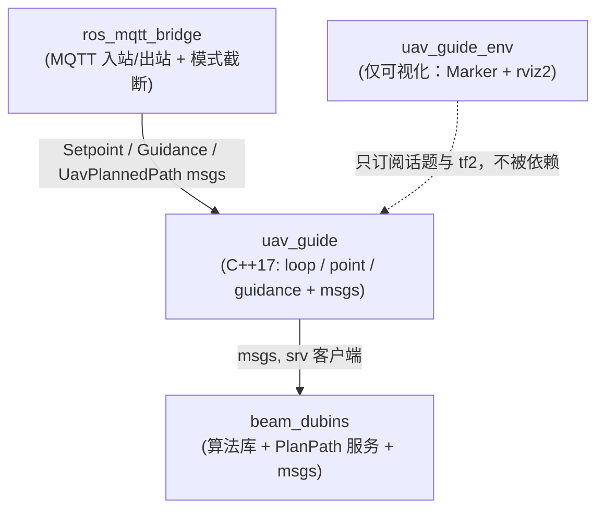
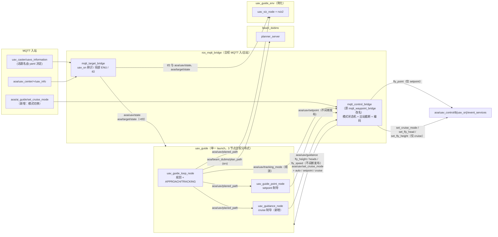
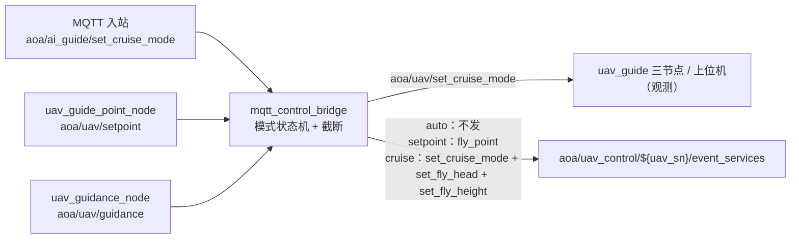
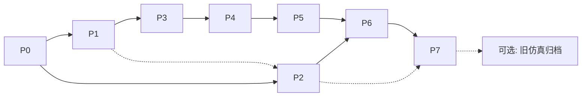
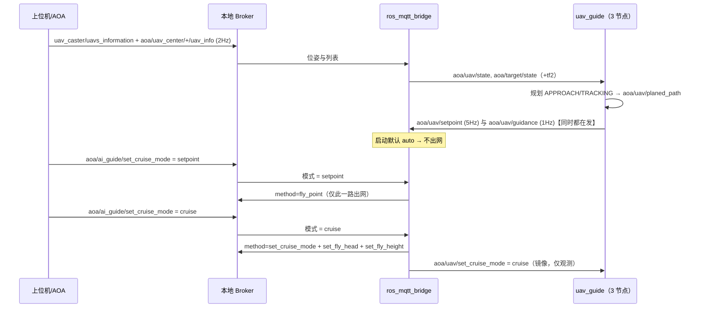

# Beam UAV 路径规划 ROS2 Humble 重构方案

> 从 `beam_UAV_path_plan` **1.0.1**（ROS1 Noetic）迁移到 **ROS2 Humble**，并同步实施 MQTT 指令面新增与 `uav_guide` 的 C++17 重写。

| 项 | 内容 |
|---|---|
| 文档版本 | **v2.0**（评审修订稿，**未开始编码**） |
| 修订依据 | 2026-09-18 审计意见：协议编号以 method 为准；模式语义改为 `auto/setpoint/cruise` 三态并由 `mqtt_control_bridge` 截断；`uav_guide` 两制导节点全权分布式；`uav_guide_env` 简化为 rviz2 可视化 |
| 日期 | 2026-09-18（v2.0 修订） |
| 基线 | git 分支 `1.0.1` = `87615c5`（`for_xc25_simulation`），工作区干净 |
| 协议依据 | `doc/LJD网络通讯协议.docx`（封面 V1.1，修订履历含 V1.2；4.4 节 Word 自动编号） |
| 目标平台 | Ubuntu 22.04 + ROS2 Humble（实测 `/opt/ros/humble`，**无 noetic**） |
| 交付物 | 本方案 → 评审通过后编码 |

---

## 0. 需求约束（评审基准）

以下 R1~R3 为本次重构的**硬约束**，后文所有设计均以此判定合规。

| 编号 | 约束原文（要点） | 设计含义 |
|---|---|---|
| **R1** | `beam_dubins` 核心功能包**无 ROS 依赖部分不变**，除 `ROS_INFO` 之外的构造不要改动 | 6 个纯算法 `.cpp` + 7 个 `.h` 逐字节保留；只改写 `planner_server.cpp`（ROS 包装）与构建/接口描述 |
| **R2** | `ros_mqtt_bridge` **全权负责 MQTT 入站与出站**。入站：`uav_caster/uavs_information`（uav/target 列表，话题名仍由 yaml 决定）、`aoa/uav_center/${uav_sn}/uav_info`（按 sn 取位姿）、**新增** `aoa/ai_guide/set_cruise_mode`（切换指点/巡航模式）。其中 `mqtt_target_bridge` 全权负责 MQTT 侧 uav_sn 过滤与 uav/target 辨识、局部 ENU 坐标系、tf2 接口，输出 `aoa/uav/state`、`aoa/target/state`；出站为协议控制话题（setpoint 与 cruise 两类），由 **`mqtt_control_bridge`（原 `mqtt_waypoint_bridge`）** 依据模式截断 | 位姿话题改名 `aoa/`；出站收敛为**单一节点** `mqtt_control_bridge`；入站 MQTT 解析逻辑不变；`fly_point` 报文不变 |
| **R3** | `uav_guide` 重构为 C++17：① `uav_guide_loop_node` 只专注规划，发布 `aoa/uav/planed_path`；② `uav_guide_point_node` 依据 `planned_path` 产出 `aoa/uav/setpoint`；③ 新增 `uav_guidance_node` 依据 `planned_path` 产出 `aoa/uav/guidance`（消息字段 `fly_height`、`heads`、`fly_speed`，`fly_speed` 暂由 yaml 巡航速度给定，为后续期望速度控制预留接口）；④ 两制导节点在 **ROS 层不间断发布、互不耦合（全权分布式）**，对外 MQTT 由 `mqtt_control_bridge` 依 `aoa/ai_guide/set_cruise_mode` 截断；⑤ 三节点由单一 `uav_guide_launch.py` 拉起 | 新增节点 `uav_guidance_node`；ROS 层不做模式耦合，模式互斥下沉到 bridge；**注意 TRACKING 下两模式的"后置导航位置参数"不同** |
| **R4** | `uav_guide_env` 简化：**仅单独启动 rviz2 + 一个 GUI 导航验证节点**——获取 uav/target 的 tf2 frame、沿用原箭头设计发布 Marker 到 rviz2，并订阅 `planned_path` 可视化 | 删除仿真主循环/目标轨迹/障碍/日志等节点与旧 launch；仅保留可视化节点 + rviz2 配置 |

### 0.1 协议章节编号核对（重要）

文档 4.4 节为 Word 自动编号，实测标题顺序为：

| 章节号 | 标题 | method |
|---|---|---|
| 4.4.15 / 4.4.16 | 紧急开伞指令 / 响应 | `egy_open_umbrella` |
| **4.4.17 / 4.4.18** | **设置巡航模式** / 响应 | **`set_cruise_mode`** |
| **4.4.19 / 4.4.20** | **设置飞行航向** / 响应 | **`set_fly_head`** |
| **4.4.21 / 4.4.22** | **设置飞行高度** / 响应 | **`set_fly_height`** |
| 4.4.23 / 4.4.24 | 设置飞行速度 / 响应 | `set_fly_speed` |

> 需求描述中把「设置巡航高度」写在 4.4.19、「航向角」写在 4.4.21，与文档实际编号互换；本方案**以 method 名为准**：
> `4.4.17 → set_cruise_mode（切换飞行模式）`、`4.4.19 → set_fly_head（设置航向角）`、`4.4.21 → set_fly_height（设置巡航高度）`。
> 与需求的对应关系：三者分别映射为 MQTT `set_cruise_mode`（4.4.17）、`set_fly_head`（4.4.19）、`set_fly_height`（4.4.21）；ROS 侧统一由 `aoa/uav/guidance` 一条消息承载（见 §3.1 / §3.2）。

### 0.2 术语

| 术语 | 含义 |
|---|---|
| `auto` | **初始/失效安全态**：由 `mqtt_control_bridge` 启动时发布；此状态下**任何控制指令都不外发** |
| `setpoint` | 指点模式：`uav_guide_point_node` 发布 `aoa/uav/setpoint`，bridge 外发 `fly_point`（**不发送** `set_cruise_mode`） |
| `cruise` | 巡航模式：`uav_guidance_node` 发布 `aoa/uav/guidance`，bridge 外发 `set_cruise_mode` + `set_fly_head` + `set_fly_height` |
| 模式权威源 | MQTT 入站 `aoa/ai_guide/set_cruise_mode` 的 `mode` 字段；ROS 侧镜像话题为 `aoa/uav/set_cruise_mode` |
| 后置导航参数 | 供飞控直接使用的末端参数：setpoint = 位置 + 半径（圆心/偏移点）；cruise = 高度 + 航向（+速度） |
| heads | 航向角，航空约定（0°=正北、顺时针），范围 `[0,360)`，对应协议 `set_fly_head.heading` |
| APPROACH / TRACKING | 制导阶段状态机两个阶段：虚拟目标接近 / 直飞目标本体 |
| 首个转弯点 `P_turn` | `aoa/uav/planned_path` 中**第一个曲率非 0** 的路径点（本轮 cruise 模式几何基准） |

---

## 1. 现状与目标对照

### 1.1 现状（1.0.1）

| 包 | 语言/构建 | 职责 | ROS1 构件 |
|---|---|---|---|
| `beam_dubins` | C++17 / catkin | 束搜索 + Dubins 规划算法库 + `/beam_dubins/plan_path` 服务 | `srv/PlanPath.srv`、`msg/Obstacle.msg`、`msg/PathPoint.msg`、`planner_server` |
| `ros_mqtt_bridge` | C++17 / catkin + libmosquitto | MQTT↔ROS：位姿桥、`fly_point` 出站、任务远程控制 | `mqtt_target_bridge`、`mqtt_waypoint_bridge`、`mqtt_mssn_bridge` |
| `uav_guide` | Python3 / catkin | 规划调度（APPROACH/TRACKING）+ 引导点发布 | `uav_guide_loop_node.py`、`uav_guide_point_node.py` + 7 个纯 Python 模块 |
| `uav_guide_env` | C++17 / catkin | 2D SITL 仿真、目标轨迹、障碍、RViz 可视化 | `simulation_loop`、`target_publisher`、`viz`、`logger` |

关键现状特征（构成迁移工作量）：

- 规划服务与算法强耦合在 `planner_server.cpp`（唯一 ROS 依赖点）。
- `uav_guide` 的 Python 模块含 `rospy.set_param("/uav_guide/tracking_mode")` 作为**跨节点状态共享**（`mqtt_mssn_bridge` 读取）——ROS2 无参数服务器语义，必须改为话题。
- `mqtt_mssn_bridge` 通过 `pgrep/pkill` + `xterm/tmux` 管理 `roslaunch/rosrun` 子进程——ROS2 无 master，该机制整体失效。
- `uav_guide_env/launch/sitl_2d.launch` 仍引用已注释的 `sitl_loop` 目标（1.0.1 遗留不一致）。

### 1.2 目标（2.0.0，Humble）

| 包 | 语言/构建 | 变化级别 |
|---|---|---|
| `beam_dubins` | C++17 / `ament_cmake` | **算法零改动**，仅 ROS 包装 + rosidl + CMake |
| `ros_mqtt_bridge` | C++17 / `ament_cmake` + libmosquitto | 通信层迁移 + 话题前缀 + 新增 3 条出站指令 |
| `uav_guide` | **C++17 / `ament_cmake`** | Python→C++ 全量重写 + 新增 `uav_guidance_node`；消息为 `UavPlannedPath` + `Setpoint` + `Guidance` |
| `uav_guide_env` | C++17 / `ament_cmake` | **简化为可视化验证包**：1 个 Marker 发布节点 + rviz2（见 §4.4） |

### 1.3 变更摘要

| # | 变更项 | 旧 | 新 | 来源 |
|---|---|---|---|---|
| 1 | 构建系统 | catkin / `catkin_make` | ament / `colcon` | 迁移 |
| 2 | 位姿话题名 | `/uav/state`、`/target/state` | `aoa/uav/state`、`aoa/target/state` | R2 |
| 3 | 全局命名规约 | 混杂（`/uav/*`、`/uav_guide/*`） | 统一 `aoa/` 前缀 | R2 推广 |
| 4 | 出站节点 | `mqtt_waypoint_bridge`（+ 计划中的 `mqtt_command_bridge`） | **单一 `mqtt_control_bridge`**（原 `mqtt_waypoint_bridge` 改名并扩展），按模式截断 | R2 |
| 5 | MQTT 出站指令 | 仅 `fly_point` | `setpoint` → `fly_point`；`cruise` → `set_cruise_mode`、`set_fly_head`、`set_fly_height`；`auto` → 全不发 | R2 |
| 6 | 新增 MQTT 入站 | — | `aoa/ai_guide/set_cruise_mode`（`mode` = `auto`/`setpoint`/`cruise`） | R2 |
| 7 | 模式语义 | 仅拦截模式（head-on/tail） | 新增 `auto`（初始/失效安全）↔ `setpoint` ↔ `cruise`，权威源为 MQTT 入站 | R2 |
| 8 | `uav_guide` 语言与制导输出 | Python3；`/uav/guide_point` | C++17（STL）；3 节点全权分布式，`aoa/uav/setpoint` + `aoa/uav/guidance` | R3 |
| 9 | 新增节点 | — | `uav_guidance_node`（cruise 制导） | R3③ |
| 10 | TRACKING 状态共享 | `rosparam` | `aoa/uav/tracking_mode` 话题（仅观测，**不参与两模式耦合**） | 迁移 |
| 11 | MQTT 入站话题/解析 | `aoa/uav_center/+/uav_info`、`uav_caster/uavs_information` | **不变**（另加第 6 项模式主题） | R2 |
| 12 | `fly_point` 报文格式 | 手拼 JSON（无基础包） | **不变**（是否补齐基础包见 Q7） | R2 |
| 13 | `uav_guide_env` | 仿真主循环 + 目标轨迹 + 障碍 + RViz1 | **仅 rviz2 可视化节点**（箭头 + planned_path） | R4 |

---

## 2. 目标架构

### 2.1 包依赖



依赖链保持 1.0.1 方向：`beam_dubins ← uav_guide ← ros_mqtt_bridge`（避免新增环）；`uav_guide_env` 只作为叶子可视化包，不反向被依赖。

### 2.2 运行时数据流



> 关键：**模式互斥不在 ROS 层**——两个制导节点各自不间断发布 `aoa/uav/setpoint` / `aoa/uav/guidance`，由 `mqtt_control_bridge` 依据 `aoa/ai_guide/set_cruise_mode` 决定"哪一路能出 MQTT"。

### 2.3 节点清单

| 包 | 可执行文件（节点名） | 语言 | 状态 |
|---|---|---|---|
| `beam_dubins` | `planner_server` | C++17 | 迁移 |
| `ros_mqtt_bridge` | `mqtt_target_bridge` | C++17 | 迁移 + 话题前缀（出 `aoa/uav/state`、`aoa/target/state` + tf2） |
| `ros_mqtt_bridge` | **`mqtt_control_bridge`** | C++17 | **原 `mqtt_waypoint_bridge` 改名 + 扩展**：模式状态机 + 唯一出站节点（R2） |
| `ros_mqtt_bridge` | `mqtt_mssn_bridge` | C++17 | **保留（Q8 裁决）**：负责 **`mqtt_control_bridge` 与 `uav_guide_launch.py` 的启停**，并订阅 MQTT 模式主题、发布 ROS 镜像 `aoa/uav/set_cruise_mode` |
| `uav_guide` | `uav_guide_loop_node` | **C++17** | 重写：规划 + APPROACH/TRACKING → `aoa/uav/planed_path` |
| `uav_guide` | `uav_guide_point_node` | **C++17** | 重写：→ `aoa/uav/setpoint` |
| `uav_guide` | `uav_guidance_node` | **C++17** | **新增**：→ `aoa/uav/guidance` |
| `uav_guide_env` | `uav_viz_node`（+ rviz2） | C++17 | **简化保留**：Marker 箭头 + `planed_path` 可视化 |

---

## 3. 接口设计

### 3.1 ROS 话题/服务总表（命名规约：统一 `aoa/` 前缀）

| 旧名（1.0.1） | 新名（2.0） | 类型 | 发布 → 订阅 | QoS 建议 |
|---|---|---|---|---|
| `/uav/state` | **`aoa/uav/state`** | `nav_msgs/Odometry` | `mqtt_target_bridge` → loop/point/guidance/viz | reliable, depth 10 |
| `/target/state` | **`aoa/target/state`** | `nav_msgs/Odometry` | `mqtt_target_bridge` → loop/point/guidance/viz | reliable, depth 10 |
| `/uav/planned_path` | **`aoa/uav/planed_path`** | `uav_guide/msg/UavPlannedPath` | loop → point/guidance/viz | **transient_local**（等效 latch）, depth 1 |
| `/uav/guide_point` | **`aoa/uav/setpoint`** | `uav_guide/msg/Setpoint` | point → `mqtt_control_bridge`（5 Hz **不间断**发布） | reliable, depth 1 |
| — | **`aoa/uav/guidance`** | `uav_guide/msg/Guidance`（`fly_height`、`heads`、`fly_speed`） | guidance → `mqtt_control_bridge`（1 Hz **不间断**发布） | reliable, depth 1 |
| — | **`aoa/uav/set_cruise_mode`** | `std_msgs/String`（JSON `{"mode": "auto\|setpoint\|cruise"}`） | `mqtt_mssn_bridge`（模式权威镜像）→ `mqtt_control_bridge`（**仅用于出站截断**）；其余节点仅作 debug 观测 | transient_local, depth 1 |
| `/uav_guide/intercept_mode_cmd` | `aoa/uav/intercept_mode_cmd` | `std_msgs/String` | 外部 → loop | reliable, depth 10 |
| `/uav_guide/intercept_mode` | `aoa/uav/intercept_mode` | `std_msgs/String` | loop → 观测 | transient_local |
| `rosparam /uav_guide/tracking_mode` | **`aoa/uav/tracking_mode`** | `std_msgs/Bool` | loop → 观测（**不参与模式耦合**） | transient_local + 1 Hz |
| `/beam_dubins/plan_path`（服务） | **`aoa/beam_dubins/plan_path`** | `beam_dubins/srv/PlanPath` | loop/外部 → planner_server | 服务名参数化 |
| `/uav/model`、`/uav/sphere`、`/target/model`、`/target/arrow`、`/env/bounds`、`/sim/status_text` | `aoa/viz/{uav_model,uav_sphere,target_model,target_arrow,bounds,status_text}` | `visualization_msgs/Marker` | `uav_viz_node` → rviz2 | bounds/status_text 用 transient_local |
| `/target/virtual_goal`、`/target/intercept_mode`、`/uav/trail`、`/beam_dubins/path`、`/sim/status` | 随仿真删除（如需外部提供，按 `aoa/` 前缀命名） | — | — | 见 Q9 |

> 命名规约：`aoa/` 前缀覆盖全部话题与服务。**`aoa/uav/set_cruise_mode` 是关键模式话题**，三值语义见 §0.2 与 §3.6。
> **拼写约定（Q19 裁决）**：ROS 话题统一为 **`aoa/uav/planed_path`**；消息类型名保持 `UavPlannedPath`。文档正文中若出现 `planned_path`，与 `planed_path` 指同一话题，**实现以 `planed_path` 为准**。

### 3.2 MQTT 话题

**入站（由 `ros_mqtt_bridge` 全权处理）**

| 主题 | method / 载荷 | 消费节点 | 用途 |
|---|---|---|---|
| `uav_caster/uavs_information`（**话题名由 yaml 决定**） | `data.uavs[].uav_sn` | `mqtt_target_bridge` | uav 与 target 列表，按 filter 辨识 |
| `aoa/uav_center/${uav_sn}/uav_info`（订阅用 `+` 通配） | `method=uav_info` | `mqtt_target_bridge` | 对应 uav sn 的位姿状态 → `aoa/uav/state`、`aoa/target/state`（+tf2） |
| **`aoa/ai_guide/set_cruise_mode`（新增）** | JSON `{"mode":"auto\|setpoint\|cruise"}` | **`mqtt_mssn_bridge`** | **切换指点/巡航模式（模式权威源）**；再由 mssn_bridge 发布 ROS 镜像 `aoa/uav/set_cruise_mode` |
| `aoa/ai_guide/nav/cmd`（沿用 1.0.1） | JSON `{"start": bool}` | **`mqtt_mssn_bridge`** | 启停 `uav_guide_launch.py`（3 个 uav_guide 节点） |
| `aoa/ai_guide/guide/cmd`（沿用 1.0.1） | JSON `{"start": bool}` | **`mqtt_mssn_bridge`** | 启停 **`mqtt_control_bridge`**（Q8：出站节点的启停归属 mssn_bridge） |
| （保留能力）`aoa/uav_center/fst_info` | `method=fst_info` | `mqtt_target_bridge` | 发射桶列表（`decode_fst_info` 保留） |

> 职责划分：**`mqtt_mssn_bridge` 独占 `aoa/ai_guide/*` 入站**（模式 + 启停），`mqtt_target_bridge` 独占位姿/列表入站，`mqtt_control_bridge` 只做 ROS→MQTT 出站 + 截断（不直连 MQTT 入站模式主题，改订阅 ROS 镜像，便于单测）。
> 1.0.1 的 target/own 双列表、双 broker 能力**保留不变**；`uav_info` 解析与路由规则不变。
> 新增入站为主格式 `{"mode": "..."}`，同时**容错**接受 `{"data":{"mode":"..."}}` 包裹；未知取值告警忽略并保持当前模式。

**出站（唯一节点 `mqtt_control_bridge`，主题 `aoa/uav_control/${uav_sn}/event_services`，QoS 0，不 retain）**

| 模式 | 出站 method | 协议章节 | 来源 ROS 话题 | 备注 |
|---|---|---|---|---|
| `auto` | **无任何指令** | — | — | 启动初始态 / 失效安全态 |
| `setpoint` | `fly_point` | 4.4.1 | `aoa/uav/setpoint` | **不发** `set_cruise_mode` |
| `cruise` | `set_cruise_mode` | **4.4.17** | 由模式跃迁触发（不来自 ROS 制导消息） | 进入 cruise **边沿触发 1 次**；可选周期重发（Q21） |
| `cruise` | `set_fly_head` | **4.4.19** | `aoa/uav/guidance.heads` | 变化节流 |
| `cruise` | `set_fly_height` | **4.4.21** | `aoa/uav/guidance.fly_height` | 变化节流；`height_type` 由 bridge yaml 给定 |
| （预留）`set_fly_speed` | 4.4.23 | — | `aoa/uav/guidance.fly_speed` | 本轮不实现（Q10/Q15） |

**截断逻辑（新增核心，建议单测覆盖矩阵）**

```
mqtt_mssn_bridge（模式权威源，独占 ai_guide 入站）:
    mode = auto（启动默认）
    on MQTT aoa/ai_guide/set_cruise_mode {mode}:
        if mode ∈ {auto,setpoint,cruise} 且 != 当前:
            更新 mode；发布 ROS 镜像 aoa/uav/set_cruise_mode（transient_local）
mqtt_control_bridge（纯 ROS→MQTT 出站 + 截断）:
    on ROS aoa/uav/set_cruise_mode {mode}: 更新本地 mode；若跃迁到 cruise：发一次 set_cruise_mode MQTT
    on ROS aoa/uav/setpoint:  if mode == setpoint -> 发 fly_point；           否则丢弃（节流告警）
    on ROS aoa/uav/guidance:  if mode == cruise   -> 发 set_fly_head + set_fly_height；否则丢弃
    失效安全：未收到模式 / broker 断线 / ${uav_sn} 未知 -> mode 视为 auto（不出网）
```

> 分工理由：模式入站只有一个订阅者（`mqtt_mssn_bridge`，与 `aoa/ai_guide/*` 启停命令同一归属），`mqtt_control_bridge` 因此**只依赖 ROS 话题**，其截断逻辑可用 gtest/Rosbag 直接回放验证，无需连 broker。

### 3.3 MQTT 报文构造（新增指令采用协议基础包）

```json
{
  "method": "set_fly_head",
  "timestamp": 1789634596882,
  "mid": "uavg-4711-1789634596882-0007",
  "data": {
    "heading": 45.2
  }
}
```

- `timestamp`：Unix 毫秒（`std::chrono::system_clock`）。
- `mid`：`"uavg-<pid>-<epoch_ms>-<seq>"`，进程内单调递增，用于上位机去重。
- `set_cruise_mode` → `"data": {}`；`set_fly_height` → `{"height": 451, "height_type": 0}`（`height_type` 由 `mqtt_control_bridge` yaml 指定）。
- **下发策略**：`set_fly_head` / `set_fly_height` 由 `aoa/uav/guidance` 驱动，仅当值变化（高度 ≥ 0.5 m、航向 ≥ 1.0°）且满足最小间隔 1 Hz 时下发；`set_cruise_mode` 为**边沿触发**（模式跃迁到 `cruise` 时发 1 次，可选周期重发见 Q21）。
- 三条新增报文一律携带基础包（`method`/`timestamp`/`mid`/`data`），字段取值见附录 A。
- `fly_point` 报文**保持原样**（R2 未要求改动，仍为手拼 JSON）；是否补基础包见 Q7。

### 3.4 消息与服务定义（rosidl）

**`beam_dubins`（原样迁移，字段不变）**

```
msg/Obstacle.msg    : float64[3] aabb_min, float64[3] aabb_max, uint32 id, bool is_dynamic, float64[3] velocity
msg/PathPoint.msg   : float64 x, y, z, yaw, pitch, curvature
srv/PlanPath.srv    : 请求 std_msgs/Header + float64[5] start/goal + space_lx/ly/lz
                      + boundary_margin + Obstacle[] obstacles + float32 time_limit_ms + bool use_3d
                      响应 bool success + float64 cost + PathPoint[] path + int32 nodes_explored
                      + int32 depth_reached + float64 planning_time_ms + string status_message
```

**`uav_guide`**

```
msg/UavPlannedPath.msg  : std_msgs/Header header, bool success, float64 cost,
                          string status_message, beam_dubins/PathPoint[] path
                          （字段不变）→ aoa/uav/planed_path
msg/Setpoint.msg        : std_msgs/Header header, float64 target_longitude, target_latitude,
                          target_altitude, target_radius
                          【重命名】原 UavGuidePoint，字段语义不变 → aoa/uav/setpoint
msg/Guidance.msg        : std_msgs/Header header, float64 fly_height, float64 heads,
                          float64 fly_speed
                          【新增】→ aoa/uav/guidance（fly_speed 暂由 yaml 巡航速度给定）
```

> 与 v1.0 的差异：`SetFlyHeight/SetFlyHead/CruiseGuideMode` 三个 msg **不再需要**——其职责合并为 ros_mqtt_bridge 内部的编码函数（`encode_set_fly_height` / `encode_set_fly_head` / `encode_set_cruise_mode`），ROS 层只需 `Guidance` 一条消息。
> 若希望改动最小，`Setpoint.msg` 可沿用原名 `UavGuidePoint.msg`（仅话题改名）。

### 3.5 参数（按节点，ROS2 参数 + YAML）

| 节点 | 参数文件 | 关键参数 |
|---|---|---|
| `planner_server` | `beam_dubins/config/beam_dubins.yaml` | 沿用 `/beam_dubins/*` 扁平名：`beam_width`、`max_depth`、`scorer.w_h`、`uav/min_turn_radius_m` 等（**名字不变**，减少配置迁移） |
| `mqtt_target_bridge` | `ros_mqtt_bridge/config/mqtt_bridge.yaml` | `mqtt.host/port/qos/keepalive_s`、`mqtt.uav_info_topic`、`bridge.target_uav_*`、`bridge.own_uav_*`、`geodesy.*`、`target.publish_tf`（**入站部分字段不变**） |
| `mqtt_control_bridge` | `ros_mqtt_bridge/config/mqtt_control_bridge.yaml` | `mqtt.*`、`topics.event_services`、`topics.mode_cmd`（←`aoa/ai_guide/set_cruise_mode`）、`topics.mode_state`（→`aoa/uav/set_cruise_mode`）、`topics.setpoint`、`topics.guidance`、`cmd.min_interval_s`、`cmd.heading_eps_deg`、`cmd.height_eps_m`、`cmd.height_type`（0 场高 / 1 绝对高度）、`cmd.resend_cruise_mode_s`（默认 0=不重发） |
| `uav_guide_loop_node` | `uav_guide/config/uav_guide.yaml` | 沿用 `intercept_mode*`、`target.*`、`planning.*`、`space.*`；`output.planned_path_topic`、`tracking_mode_topic` |
| `uav_guide_point_node` | 同上 | `segmentation.*`、`finalshot.*`、`setpoint.topic`（`aoa/uav/setpoint`）、`publish_rate_hz`（5） |
| `uav_guidance_node` | 同上（新增 `guidance:` 段） | `curvature_eps`、`heads_source`（`bearing_to_turn` \| `path_yaw`）、`height_source`（`turn_point_z` \| `target_z`）、`fly_speed_mps`（默认取 `/uav/cruise_speed_mps`）、`publish_rate_hz`（1）、`pose_source`（`tf2` \| `topic`）、`map_frame`、`uav_frame` |
| `uav_viz_node` | `uav_guide_env/config/viz.yaml` | `map_frame`、`uav_frame`、`target_frame`、`marker_scale_*`、`publish_rate_hz` |

### 3.6 模式语义（`auto` / `setpoint` / `cruise`）

| 项 | 说明 |
|---|---|
| 权威源 | MQTT 入站 `aoa/ai_guide/set_cruise_mode` 的 `mode` 字段（由 `mqtt_mssn_bridge` 订阅并转入 ROS） |
| ROS 镜像 | `aoa/uav/set_cruise_mode`（`std_msgs/String`，JSON `{"mode": "..."}`），由 **`mqtt_mssn_bridge`** 发布；启动即发 `auto`，`transient_local` 保证迟加入节点可感知 |
| 取值规范 | 固定三个字符串：`auto` / `setpoint` / `cruise`（Q14 裁决：**不用** `cruise_mode`） |
| 消费方 | **仅 `mqtt_control_bridge`**（用于出站截断）订阅；`uav_guide_point_node` / `uav_guidance_node` **不订阅**（保持分布式、互不依赖），该话题对其仅为 debug 状态流 |
| `auto` | 初始态与**失效安全态**：bridge 不发任何控制 MQTT；ROS 两制导节点仍正常发布（只是不出网） |
| `setpoint` | 仅 `fly_point` 出网；**不发** `set_cruise_mode` |
| `cruise` | `set_cruise_mode`（跃迁边沿 1 次）+ `set_fly_head` + `set_fly_height` 出网 |
| 失效安全 | 模式未收到 / 解析失败 / broker 断线 → 保持 `auto`（不出网）；恢复后取最新有效值 |
| 与 `intercept_mode` 的关系 | 二者**正交**：`intercept_mode`（head-on/tail）只影响制导几何；`set_cruise_mode` 只决定"哪一路能出网" |
| 与 TRACKING 的关系 | TRACKING 由 `planned_path` 几何体现，**不参与模式耦合**；两制导节点在 TRACKING 下的后置参数差异见 §5.4 |

---

## 4. 分模块重构设计

### 4.1 `beam_dubins`（R1：算法零改动）

**不变的（逐字节保留，禁止格式化/重排）**

| 文件 | 说明 |
|---|---|
| `include/beam_dubins/{types,geometry,collision,dubins_path,primitive_gen,beam_scorer,beam_search}.h` | 纯 C++17，无 ROS 头 |
| `src/{geometry,collision,dubins_path,primitive_gen,beam_scorer,beam_search}.cpp` | 已核验：**6 文件内 ROS 宏/API 出现 0 次**（`ROS_` 全量 55 处在 `planner_server.cpp`） |

**改写的（ROS 包装层）**

| 文件 | 改动点 |
|---|---|
| `src/planner_server.cpp` | `ros::NodeHandle` → `rclcpp::Node`；`ROS_INFO/WARN` → `RCLCPP_INFO/WARN(get_logger(), ...)`；`nh.param` → `declare_parameter/get_parameter`（**参数名保持 `/beam_dubins/` 扁平路径**）；`advertiseService` → `create_service`；`ros::spin()` → `rclcpp::spin(node)`；`setlocale` 与中文日志保留 |
| `CMakeLists.txt` | `catkin` → `ament_cmake`；`rosidl_generate_interfaces(beam_dubins ...)`；`add_library(beam_dubins_core STATIC ...)` 源列表不变；`ament_target_dependencies(planner_server rclcpp std_msgs)`；测试 `catkin_add_gtest` → `ament_add_gtest` |
| `package.xml` | `format="3"`，`buildtool_depend` → `ament_cmake`，新增 `rclcpp`、`rosidl_default_generators/runtime`，保留 `eigen`（仅头文件） |
| `test/test_beam_search.cpp` | 改为 `ament_add_gtest_executable` + `add_test`（该文件**自带 `main()`**，不能链接 `gtest_main`）；**测试断言与用例不动** |
| `launch/planner.launch` → `launch/planner.launch.py` | ROS2 Python launch（`Node(parameters=[yaml])`） |

**验收**：`colcon build --packages-select beam_dubins` 通过；`ament_add_gtest_executable` 用例数与 1.0.1 一致且全绿；`git diff` 对核心 6 个 `.cpp` 为空（可用 `cmp` 逐一证明）。

> **P1 实施注记（2026-09-18 实测）**
> 1. `srv/PlanPath.srv` **必须删除 3 行 ROS1 风格的缩进展开**（`uint32 seq` / `time stamp` / `string frame_id`）——rosidl 解析器不支持该写法，且 ROS2 的 `std_msgs/Header` 本身已无 `seq`。字段集合与顺序**其余部分不变**。
> 2. `config/beam_dubins.yaml` 需改为 ROS2 参数文件结构（`/**` → `ros__parameters`），**取值逐个保持一致**；ROS2 参数名用 `.` 表达层级（如 `scorer.w_h`、`uav.min_turn_radius_m`）。
> 3. 实测结果：`colcon build` 通过；`test_beam_search` **23 个用例 / 6 个测试套件全绿**；核心静态库 `nm -uC` 中 `rclcpp|rosidl|ros::` 符号数 **0**（零 ROS 依赖成立）；`aoa/beam_dubins/plan_path` 服务冒烟返回 `success=true, cost=3574.68m, status_message="goal reached"`。

### 4.2 `ros_mqtt_bridge`（R2）

**层 1：库层迁移（语义不变）**

| 文件 | 改动 |
|---|---|
| `mqtt_client.{h,cpp}` | 逻辑不变（异步连接、重连重订阅、payload 按长度构造 std::string）；仅头文件依赖与命名空间保持；新增 MQTT5 可选开关（Q3，默认仍 v3.1.1） |
| `geodesy.{h,cpp}` | ASCII 常量与算法**不变**（WGS84↔ECEF↔ENU） |
| `velocity_filter.h` | 不变（标量/二维卡尔曼） |
| `json_codec.{h,cpp}` | ① 入站解析函数 `decode_uav_info`/`decode_uavs_info`/`decode_fst_info` **行为与容错不变**；② 新增 `encode_set_cruise_mode()`、`encode_set_fly_head(heading)`、`encode_set_fly_height(height, height_type)`，并抽出 `make_base_package(method, data_json)`（`method/timestamp/mid`）；③ JSON 实现建议由 `boost::property_tree` 换为 header-only（Q4），便于精确控制数值格式 |
| `message_types.h` | 新增 `FlyCommandHeader`（mid/seq 生成）等小结构，其余不动 |

**层 2：节点改造**

| 文件 | 改动 |
|---|---|
| `src/mqtt_target_bridge.cpp` | 保留并改造（Q8 裁决）**：① 独占 `aoa/ai_guide/*` 入站：`set_cruise_mode`（模式，发布 ROS 镜像）、`nav/cmd`（启停 `uav_guide_launch.py`）、`guide/cmd`（启停 **`mqtt_control_bridge`**）；② 进程管理改 ROS2 方式（`ros2 launch`/`ros2 run` + 进程组管理），不再依赖 `roscore` 与 `ROS_MASTER_URI`；③ 保留状态上报能力，`tracking_mode` 改订阅 `aoa/uav/tracking_mode`、去重、卡尔曼逻辑全部不变** |
| `src/mqtt_control_bridge.cpp` | **由 `src/mqtt_waypoint_bridge.cpp` 改名并扩展为唯一出站节点**：① 订阅 MQTT `aoa/ai_guide/set_cruise_mode` → 维护 `auto/setpoint/cruise` 状态，并发布 ROS 镜像 `aoa/uav/set_cruise_mode`（启动先发 `auto`）；② 订阅 `aoa/uav/setpoint`（`Setpoint`）与 `aoa/uav/guidance`（`Guidance`）；③ 从 `aoa/uav/state.child_frame_id` 取 `${uav_sn}`；④ 按 §3.2 截断矩阵编码并发布到 `aoa/uav_control/${uav_sn}/event_services`；⑤ 无 `uav_sn` 时告警限流等待 |
| `src/mqtt_mssn_bridge.cpp` | **建议整体删除**（Q8）：模式切换职责已由 `aoa/ai_guide/set_cruise_mode` 承担，进程启停由 `ros2 launch` / systemd 承担 |
| `launch/*.launch` → `*.launch.py` | `mqtt_bridge.launch.py`（`mqtt_target_bridge`）、`mqtt_control_bridge.launch.py` |
| `scripts/start|stop_mqtt_mssn_bridge.sh`、`beam_dubins_autostart.service` | 重写为 ROS2 版本（去掉 `roscore`/`ROS_MASTER_URI`/noetic 路径/`aos-dev` 用户硬编码），改用 `ros2 launch` + systemd user unit |
| `scripts/MQTT_INTERFACE.md` | 更新为 2.0：新增入站模式主题、三条出站指令、模式截断矩阵、ROS 话题新名 |

**关于节点划分**：出站统一收敛到 **`mqtt_control_bridge` 单节点**（改名自 `mqtt_waypoint_bridge`）——"模式截断"因此只有**一个实现点**，避免两个出站节点各自判断模式造成竞争。`fly_point` 的编码与去重逻辑保持 1.0.1 原样，仅额外增加模式门控（R2）。

### 4.3 `uav_guide`（R3：Python→C++17）

#### 4.3.1 目录与类设计

```
uav_guide/                       # ament_cmake + C++17；单包三节点
  msg/{UavPlannedPath,Setpoint,Guidance}.msg
  include/uav_guide/               # 全部零 ROS 依赖（不 include 任何 rclcpp 头）
    types.hpp        # 配置 POD：SetpointConfig / GuidanceConfig / OrchestratorConfig / SpaceConfig
    geo.hpp          # uav_guide::geo       角度 wrap、WGS84↔ENU(Geodesy)、距离、ENU↔航空航向
    path.hpp         # uav_guide::path      PathPoint 序列切分(Line/Arc)、最近点、弧心、**采样点检索**
    setpoint.hpp     # uav_guide::setpoint  引导点解算（远弧圆心 / 偏移点）
    guidance.hpp     # uav_guide::guidance  采样点 → heads / fly_height / fly_speed
    state.hpp        # uav_guide::state     5D 状态提取（四元数、角度、单位）
    mode.hpp         # uav_guide::mode      拦截模式解析与复位策略
    orchestrator.hpp # uav_guide::orchestrator  APPROACH / TRACKING 状态机
    plan.hpp         # uav_guide::plan      规划请求装配 / 响应解析（服务调用以 std::function 注入）
  src/                      # 上述 .hpp 的实现：自由函数 + 少量聚合结构体
  src/nodes/{uav_guide_loop_node,uav_guide_point_node,uav_guidance_node}.cpp
  config/uav_guide.yaml     # 三节点共用（含 setpoint: / guidance: 段）
  launch/uav_guide_launch.py  # 一个 launch 拉起三节点（可选 include planner / mqtt bridge）
```

**算法层组织原则（修订，按 2026-09-18 指示）**：**不再 1:1 复刻原 7 个 Python 模块**，改为按"两节点是否共享"重新切分：

| 归属 | 模块 | 说明 |
|---|---|---|
| 两节点**共享** | `geo`、`path`、`state`、`types` | 坐标系/角度换算、路径切分与采样点检索、状态提取、配置 POD |
| 各自**独有** | `setpoint`、`guidance` | 引导点几何（圆心/偏移点）与巡航制导量（heads/高度/速度） |
| **主循环独有** | `orchestrator`、`plan`、`mode` | APPROACH/TRACKING 状态机、服务装配、拦截模式 |

实现风格：命名空间 `uav_guide::<模块>` + **自由函数 + 配置 POD**（无继承、无虚函数、无全局状态、无 ROS 依赖）；`orchestrator`/`plan` 通过 `std::function` 注入"S调用服务/发布结果"回调，因此同样可在 gtest 中零 ROS 运行。`src/nodes/` 只做"参数→POD、ROS↔结构体、话题收发"。

#### 4.3.2 `uav_guide_loop_node`（R3③，含 APPROACH/TRACKING）

| 项 | 设计 |
|---|---|
| 职责 | **只专注规划**：state 更新即调服务 → 发布 `aoa/uav/planed_path`；不参与制导输出、不做模式判断（R3①） |
| 订阅 | `aoa/uav/state`、`aoa/target/state`（触发"每次 state 更新即规划"）、`aoa/uav/intercept_mode_cmd` |
| 发布 | `aoa/uav/planed_path`（**transient_local**，等效 latch）、`aoa/uav/tracking_mode`（bool，transient_local + 1 Hz，仅观测）、`aoa/uav/intercept_mode` |
| 服务客户端 | `aoa/beam_dubins/plan_path`（启动时等待，超时告警不阻塞） |
| 状态机 | 见 §5.2（判据/参数与 1.0.1 完全一致，仅实现语言变化） |
| 模式切换 | 拦截模式变更 → `reset_on_mode_change()`：清路径缓存、退出 TRACKING、`tracking_mode=false`、立即重规划 |
| 日志 | 保留 1.0.1 关键日志文案（`tracking gate (...)`、`>>> 进入 TRACKING 模式`、`MODE TRACKING -> APPROACH (miss)`、`plan ok ... phase=`），便于与旧版对照回归 |

#### 4.3.3 `uav_guide_point_node`（R3①）

| 项 | 设计 |
|---|---|
| 订阅 | `aoa/uav/planed_path`、`aoa/uav/state`、`aoa/target/state`、`aoa/uav/intercept_mode` |
| 发布 | **`aoa/uav/setpoint`**（`Setpoint`，5 Hz） |
| 发布策略 | **不间断发布**（不论当前模式为 `auto`/`setpoint`/`cruise`），**不做**模式判断、**不暂停**——模式互斥下沉到 `mqtt_control_bridge`（R3④） |
| 几何 | 有未飞过弧段 → 沿航路最远弧段**圆心**（`target_radius = ±R_arc`）；无剩余弧段/全直线 → 目标偏移点（head-on 身后 `offset_m + 0.4·offset_m_t`、tail 前方 `offset_m + offset_m_t`，`radius = finalshot.radius_m`）；高度取目标实时 WGS84 高度 |
| 不变项 | 字段与几何语义与 1.0.1 的 `/uav/guide_point` **完全一致**，仅话题名与实现语言变化 |
| TRACKING | 见 §5.4：TRACKING 下 setpoint 的"后置导航位置参数"与 guidance **不同** |

#### 4.3.4 `uav_guidance_node`（R3②，新增）

| 项 | 设计 |
|---|---|---|
| 订阅 | `aoa/uav/planed_path`（主输入）、本机位姿（`pose_source`：`tf2` 查 `map→uav` **默认**，或回退订阅 `aoa/uav/state`）、`aoa/target/state`（高度/目标备份源） |
| 发布 | **`aoa/uav/guidance`**（`Guidance`：`fly_height`、`heads`、`fly_speed`），周期 `publish_rate_hz`（默认 1 Hz）+ 变化触发 |
| 发布策略 | **不间断发布**（不判断模式；`auto`/`setpoint` 下消息仅留在 ROS 层、不出网） |
| 算法 | 见 §5.3 |
| `fly_speed` | 暂由 yaml `guidance.fly_speed_mps`（默认取 `/uav/cruise_speed_mps`）填充，为后续期望速度控制预留接口 |
| 边界处理 | 路径为空 / 全直线（无曲率非 0 点）→ 取路径末端点并告警限流；位姿源不可用 → 跳过本轮（不发布陈旧值）；`curvature_eps` 默认 `1e-4`（与 `segmentation.curvature_eps` 一致） |

#### 4.3.5 制导话题与模式归属（修订）

| 话题 | 载荷 | 发布方 | 语义 |
|---|---|---|---|
| `aoa/uav/setpoint` | `Setpoint`（lon/lat/alt/radius） | `uav_guide_point_node` | setpoint 制导输出（**不间断**） |
| `aoa/uav/guidance` | `Guidance`（`fly_height`/`heads`/`fly_speed`） | `uav_guidance_node` | cruise 制导输出（**不间断**） |
| `aoa/uav/set_cruise_mode` | `{"mode": "auto\|setpoint\|cruise"}` | **`mqtt_control_bridge`** | 模式状态（权威源为 MQTT 入站；ROS 侧仅作镜像/观测） |



> 模式归属**不在 `uav_guide` 层**：两制导节点既不订阅也不判断模式，仅无条件输出各自的制导结果；模式状态由 bridge 维护并广播，供观测/调试。

### 4.4 `uav_guide_env`（R4：简化为可视化验证包）

只保留"GUI 导航验证"能力：**一个 Marker 发布节点 + rviz2**，不做仿真。

| 项 | 设计 |
|---|---|
| 节点 | `uav_viz_node`（单节点，由原 `rviz_publisher.cpp` 裁剪改写） |
| 位姿来源 | 优先 tf2：`lookupTransform(map_frame → uav_frame / target_frame)`；TF 不可用时回退订阅 `aoa/uav/state`、`aoa/target/state`（参数 `pose_source: tf2\|topic`，默认 `tf2`） |
| 箭头设计（**沿用 1.0.1**） | UAV：`ARROW` ns `uav_model`，`scale.x=30`（杆径）/`scale.y=80`（头径），橙色 `(1.0, 0.45, 0.0, 1.0)`；另发 `SPHERE` ns `uav_sphere` 直径 100 m 同色。目标：`SPHERE` ns `target_model` 直径 120 m、红 `(1.0, 0.15, 0.15, 0.9)`，加 `ARROW` ns `target_arrow`（`scale 20/60`）同红 |
| 新增可视化 | `aoa/uav/planned_path` → 转为 `nav_msgs/Path`（rviz2 原生 Path 显示，推荐）或 `LINE_STRIP` Marker（备选） |
| 其他 Marker | 空间边界 `LINE_LIST` ns `env_bounds`（线宽 3.0、灰 0.6/α0.3、transient_local）；状态文本 `TEXT_VIEW_FACING` ns `status_text`（沿用 80 m 字高，白 α0.9） |
| 发布话题 | `aoa/viz/{uav_model,uav_sphere,target_model,target_arrow,bounds,status_text}` |
| 频率 | 位姿模型 5 Hz；文本 1 Hz；边界 latched 1 次 |
| rviz2 配置 | 新增 `config/rviz/beam_dubins_3d.rviz`（**rviz2 格式，需重建**；1.0.1 的 rviz1 配置不兼容） |
| launch | `launch/viz.launch.py`：启动 `uav_viz_node` + `rviz2`（参数可只启动 rviz2 或只启动节点） |
| 删除 | `simulation_loop.cpp`、`target_publisher.cpp`、`target_trajectory.{h,cpp}`、`uav_model.{h,cpp}`、`obstacle_manager.{h,cpp}`、`uav_logger.cpp`、旧 launch（`simulation/sitl_2d/start_guide/target_publisher/rviz.launch`）与旧 rviz 配置 |

> 旧仿真代码建议**另存分支/tag**保留（不删除历史）；本包仅做可视化，避免与真机链路争抢 `aoa/uav/state` 的发布权（同一话题只应有一个权威发布者）。

---

## 5. 关键逻辑规格

### 5.1 引导点几何（保持不变）

| 路径状态 | 输出 | `target_radius` |
|---|---|---|
| 存在未飞过弧段（`end_index ≥ closest_path_index`） | 沿航路**最远**剩余弧段的**圆心** | `+R`（右转）/ `-R`（左转） |
| 无剩余弧段 / 全直线 / 无路径 | 目标偏移点：head-on 目标**身后** `offset_m + 0.4·offset_m_t`；tail 目标**前方** `offset_m + offset_m_t` | `+radius_m` |

### 5.2 APPROACH / TRACKING 判据（与 1.0.1 逐条对齐）

| 阶段 | 规划终点 | 期望 yaw |
|---|---|---|
| APPROACH | `target + sign·L·(cos ψ_t, sin ψ_t)`，`L = approach_distance_headon`（head-on，`sign=+1`）/ `approach_distance_tail`（tail，`sign=-1`） | head-on：`ψ_t + π`；tail：`ψ_t` |
| TRACKING | 目标本体实时位置 | 同上 |

| 判据 | 参数（当前值） | 条件 |
|---|---|---|
| 进入距离 | `tracking_entry_dist = 2400` | `d ≤ 该值` |
| 共线 | `velocity_align_deg = 70` | `|wrap(ψ_uav − ψ_ref)| ≤ 70°` |
| 接近（head-on） | `min_closure_m = 3.0` | `closure ≥ 3 m/帧` |
| 接近（tail） | `min_closure_m_tail = 1.5` | `closure ≥ 1.5 m/帧` |
| 防抖 | `entry_hold_count = 1` | 连续满足帧数 |
| 退出评估 | `tracking_window = 100 m` | 每累计飞行 100 m 评估一次 |
| 退出阈值 | `divergence_threshold = 3` | 连续 3 次距离增大 → 退出并清缓存 |

> `closure` = 上一帧距离 − 当前帧距离（相邻 state 消息间）；进入/退出均需 `rospy.set_param` 语义被 `aoa/uav/tracking_mode` 话题替代。

### 5.3 cruise 制导解算（`aoa/uav/guidance`，R3②）

```
输入：aoa/uav/planed_path、本机位姿（pose_source=tf2 默认）、配置
1) 采样点检索（uav_guide::path::find_sample_point，Q12/Q16 裁决）：
   取路径中距本机最近的索引 i0，自 i0 向后扫描：
     - 命中 |curvature| <= curvature_eps 的**首个点** → 采样点 P_sample
       （语义：自 uav 起、到"首个曲率为 0 的点"，即**首个直线段的起点**，
         其 yaw 即为该直线段的飞行航向 —— cruise 模式要摆正的目标方向）
     - 若扫到末尾仍无曲率为 0 的点（全弧段）→ 取 path.back()（告警限流）
   参数 sample_rule = first_zero_curvature（默认）| first_nonzero_curvature（旧规则，可切换）
2) 局部 ENU：tf2 lookupTransform(map_frame→uav_frame) 取本机位姿（或回退订阅 aoa/uav/state）
3) heads（默认 heads_source = sample_yaw）：
   - sample_yaw（默认）：ψ_enu = P_sample.yaw   （planed_path 点自带 ENU 航向）
   - bearing_to_sample  ：ψ_enu = atan2(dNorth, dEast)，dEast/dNorth = P_sample − uav
   heading_deg = fmod(90 − deg(ψ_enu) + 360, 360)     # ENU(0°=东,CCW) → 航空(0°=北,CW)
4) fly_height：
   - height_source = sample_point_z（默认）：h = P_sample.z
   - height_source = target_z              ：h = target_state.z
   （height_type 由 mqtt_control_bridge yaml 决定：0 场高 / 1 绝对高度）
5) fly_speed：yaml `guidance.fly_speed_mps`（默认取 `/uav/cruise_speed_mps`），本轮为常量占位
6) 发布：aoa/uav/guidance {header, fly_height, heads, fly_speed}
   节流：≥ 1 Hz 且（|Δheads| ≥ 阈值 或 |Δfly_height| ≥ 阈值）
```

> `sample_rule` / `heads_source` / `height_source` / `pose_source` 均为参数化开关，评审后可无代码改动地切换语义（Q12）。
> **本节点输出无条件发布**；是否出网、是否下发 `set_cruise_mode`，完全由 `mqtt_control_bridge` 依模式决定。

### 5.4 TRACKING 下两模式"后置导航位置参数"的差异（R3 注意点）

`planned_path` 在 TRACKING 阶段的规划终点是**目标本体**（APPROACH 阶段是虚拟点），因此两制导节点的末端参数表现不同：

| 阶段 | setpoint（`aoa/uav/setpoint` → `fly_point`） | guidance（`aoa/uav/guidance` → `set_fly_head`/`set_fly_height`） |
|---|---|---|由**采样点**（自 uav 起首个曲率为 0 的点）给出，通常比 APPROACH 阶段更靠近目标；fly_height 取该点高度；全弧段
| APPROACH | 最远剩余弧段圆心（`radius = ±R_arc`）；无剩余弧段 → 目标偏移点 | 首个曲率非 0 点 → heads / fly_height |
| TRACKING | 路径终点回到目标本体、剩余弧段通常耗尽 → **偏移引导点**（head-on 目标身后 / tail 目标前方，半径 `finalshot.radius_m`）：即"后置位置参数"由圆心切换为偏移点 | heads 仍由**首个曲率非 0 点**给出（通常更靠近目标），fly_height 取该点高度；全直线时回退路径末端点 |
| 差异要点 | 关注**位置 + 盘旋半径**（飞控按点/圆盘旋） | 关注**航向 + 高度**（飞控按航向定高） |

> 上表为"同一 `planned_path`、两种后置参数"的规格说明；**精确定义待确认**（Q16）——例如 TRACKING 下 setpoint 偏移点是否仍取 `offset_m + offset_m_t` 组合、guidance 是否改用目标本体航向而非首个转弯点。

### 5.5 出站截断矩阵（`mqtt_control_bridge`，**必须单测**）

| 当前模式 | 收到 `aoa/uav/setpoint` | 收到 `aoa/uav/guidance` | 模式跃迁副作用 |
|---|---|---|---|
| `auto` | 丢弃 | 丢弃 | 无 |
| `setpoint` | 发 `fly_point` | 丢弃 | 无 |
| `cruise` | 丢弃 | 发 `set_fly_head` + `set_fly_height` | 跃迁进入 `cruise` 时发 1 次 `set_cruise_mode` |
| `cruise` → `auto`/`setpoint` | — | — | 立即停止全部出站（是否需上发"退出巡航"指令见 Q22） |

> **失效安全**：MQTT 断线、模式报文非法、`${uav_sn}` 未知 → 一律回落 `auto`（不出网），避免误发指令。

---

## 6. 分阶段实施计划

> 原则：**每阶段可独立编译、可独立验收、可独立回滚**；先"壳与接口"，再"行为"；算法包先于业务包。

| 阶段 | 名称 | 目标 | 前置 | 主要交付物 | 验收标准 |
|---|---|---|---|---|---|
| **P0** | 骨架与依赖 | 建立 ROS2 工作区与包骨架，锁定依赖 | 无 | `src/beam_dubins`、`src/ros_mqtt_bridge`、`src/uav_guide` 的 ament 骨架 + `package.xml`(format3) + 空 `launch.py` + `doc/ros2rebuild.md` | `rosdep install` 通过；`colcon build` 三包空壳可编译；`apt` 依赖清单确认（`libmosquitto-dev`、`ros-humble-tf2-ros`、`ros-humble-rviz2` 等） |
| **P1** | `beam_dubins` 迁移 | 算法零改动 + ROS 包装 ROS2 化 + rosidl + 单测 | P0 | `rosidl_generate_interfaces`（Obstacle/PathPoint/PlanPath）、`beam_dubins_core` 静态库、`planner_server`(rclcpp)、`planner.launch.py` | `git diff 1.0.1 -- beam_dubins/src/{geometry,collision,dubins_path,primitive_gen,beam_scorer,beam_search}.cpp` **为空**；单测通过；`ros2 service call` 手工请求返回合理路径 |
| **P2** | MQTT 库层 + 位姿桥 | 库层语义不变迁移；位姿话题改名 `aoa/` | P0 | `mqtt_client`/`geodesy`/`velocity_filter`/`json_codec`（含 `make_base_package`）、`mqtt_target_bridge`（发 `aoa/uav/state`、`aoa/target/state`） | 接入真实/回放 broker 后 `ros2 topic hz aoa/uav/state` ≈ 2 Hz；100 帧位姿与 1.0.1 对比误差 < 1e-6（记录回放法） |
| **P3** | `uav_guide` 算法层（纯 C++） | 7 个 Python 模块 → C++ 类，零 ROS 依赖 | P1 | `geodesy`/`state_extractor`/`path_segmenter`/`guide_point_builder`/`intercept_mode`/`plan_orchestrator`/`guidance_planner` + gtest | 与 Python 版**同输入同输出**对照测试（用 1.0.1 录制的路径/状态样本做黄金数据）；引导点 lon/lat/radius 一致 |
| **P4** | `uav_guide` 三节点 + 单 launch | loop（规划）+ point（→`aoa/uav/setpoint`） | P3 | 3 个 rclcpp 节点 + `Setpoint`/`Guidance` msg + `uav_guide_launch.py` | 状态机日志与 1.0.1 文案一致；`aoa/uav/planned_path` 有输出；`aoa/uav/setpoint` 5 Hz **不间断**；TRACKING 进入/退出判据同样本同结果 |
| **P5** | cruise 制导节点 | `uav_guidance_node` 输出 `aoa/uav/guidance` | P4 | `guidance_planner`（首个曲率非 0 点 + heads/fly_height/fly_speed 解算） | 手算用例校验 heads/fly_height；全直线/空路径边界；1 Hz 输出且**不感知模式**（任意模式下都发布） |
| **P6** | MQTT 模式截断与出站 | `mqtt_control_bridge`（改名 + 扩展）打通 | P2+P5 | 模式状态机（`auto`/`setpoint`/`cruise`）+ 截断矩阵 + 三条新编码 + 入站 `aoa/ai_guide/set_cruise_mode` + 配置/launch | mosquitto 抓包：`auto` 不出网、`setpoint` 仅 `fly_point`、`cruise` 出三条；截断矩阵单测全覆盖；`fly_point` 行为无回归 |
| **P7** | 集成、可视化、文档与部署 | 端到端联调 + rviz2 验证 + 交付文档 | P6 | 端到端 launch、`uav_viz_node` + rviz2 配置、`README.md`、`MQTT_INTERFACE.md` 2.0、ROS2 化脚本/systemd | 端到端时序（§8.2）通过；rviz2 中可见 UAV/目标箭头与 `planned_path`；上位机可完整驱动两模式 |
| **可选** | 旧仿真归档 | 保留历史能力 | — | 仿真代码另存分支/tag（不进入 2.0 主线） | 不影响主线编译与运行 |

### 6.1 阶段依赖与并行度



- **可并行**：P2（MQTT 库层/入站）与 P1/P3 无强耦合；`uav_viz_node` 只依赖 P2 的话题，可与 P4/P5 并行开发。
- **关键路径**：P1 → P3 → P4 → P5 → P6 → P7。
- **每阶段回滚**：各阶段均为独立包/独立节点，`git revert` 阶段提交即可；P6 完成前 `mqtt_control_bridge` 保持 1.0.1 的 `fly_point` 直通行为（不做模式门控，等价于"永远 setpoint"），不影响既有链路。

---

## 7. 文件级修改清单

### 7.1 `beam_dubins`

| 操作 | 文件 |
|---|---|
| **不动**（逐字节） | `include/beam_dubins/{types,geometry,collision,dubins_path,primitive_gen,beam_scorer,beam_search}.h`；`src/{geometry,collision,dubins_path,primitive_gen,beam_scorer,beam_search}.cpp`；`test/test_beam_search.cpp`（仅构建接入调整，断言不动） |
| 改写 | `src/planner_server.cpp`（ROS INFO/参数/服务 → rclcpp） |
| 改写 | `CMakeLists.txt`、`package.xml` |
| 迁移 | `msg/Obstacle.msg`、`msg/PathPoint.msg`（逐字节一致）；`srv/PlanPath.srv`（**删去 3 行 ROS1 风格缩进的 Header 子字段展开**，其余不变——rosidl 不支持该写法）；`config/beam_dubins.yaml`（改 ROS2 参数结构，取值不变） |
| 新增 | `launch/planner.launch.py` |
| 删除 | `launch/planner.launch` |

### 7.2 `ros_mqtt_bridge`

| 操作 | 文件 |
|---|---|
| 迁移（逻辑不变） | `src/mqtt_client.cpp`、`src/geodesy.cpp`、`src/json_codec.cpp`（**新增 `make_base_package` + 3 个编码函数**）、`include/ros_mqtt_bridge/{mqtt_client,geodesy,velocity_filter,message_types,json_codec}.h` |
| 改写（话题前缀 + tf2） | `src/mqtt_target_bridge.cpp` |
| **改名 + 扩展** | `src/mqtt_waypoint_bridge.cpp` → **`src/mqtt_control_bridge.cpp`**（模式状态机 + 截断矩阵 + 三条新指令编码） |
| **改写（保留，Q8）** | `src/mqtt_mssn_bridge.cpp`：独占 `aoa/ai_guide/*` 入站（模式 + 启停命令），启停 `uav_guide_launch.py` 与 `mqtt_control_bridge`；进程管理改 `ros2 launch`/`ros2 run`（去 `roscore`/`ROS_MASTER_URI`）、`config/mqtt_mssn_bridge.yaml`、`launch/mqtt_mssn_bridge.launch.py` |
| **新增** | `config/mqtt_control_bridge.yaml`、`launch/mqtt_control_bridge.launch.py` |
| 改写 | `CMakeLists.txt`、`package.xml` |
| 改写 | `config/mqtt_bridge.yaml`（入站字段不变，仅话题名/前缀与 tf frame 调整） |
| 改写 | `launch/mqtt_bridge.launch` → `launch/mqtt_bridge.launch.py` |
| 改写 | `scripts/start_mqtt_mssn_bridge.sh`、`scripts/stop_mqtt_mssn_bridge.sh`、`scripts/beam_dubins_autostart.service`（ROS2 化：去 roscore/ROS_MASTER_URI/noetic 路径） |
| 更新 | `scripts/MQTT_INTERFACE.md`（2.0：入站模式主题 + 截断矩阵 + 三条出站指令） |

### 7.3 `uav_guide`

| 操作 | 文件 |
|---|---|
| **新增** | `include/uav_guide/{types,geo,path,setpoint,guidance,state,mode,orchestrator,plan}.hpp` + `src/` 对应实现（命名空间 + 自由函数，**零 ROS 依赖**；不复刻原 Python 模块划分） |
| **新增** | `src/nodes/{uav_guide_loop_node,uav_guide_point_node,uav_guidance_node}.cpp`（**三节点同包**） |
| **新增** | `msg/Setpoint.msg`（原 `UavGuidePoint` 改名）、`msg/Guidance.msg`（`fly_height`/`heads`/`fly_speed`） |
| 迁移 | `msg/UavPlannedPath.msg`（字段不变） |
| 改写 | `CMakeLists.txt`（catkin→ament，Python→C++）、`package.xml` |
| 改写 | `config/uav_guide.yaml`（话题名改 `aoa/`；新增 `setpoint:` / `guidance:` 段） |
| 新增 | `launch/uav_guide_launch.py`（**一个 launch 拉起三节点**，可选 include planner / mqtt bridge） |
| **删除** | `msg/UavGuidePoint.msg`（**重命名为 `Setpoint.msg`**，二选一：改名或仅改话题名）、`scripts/uav_guide_loop_node.py`、`scripts/uav_guide_point_node.py`、`uav_guide/*.py`（7 个模块）、`setup.py`、`uav_guide.yaml.save` |
| 更新 | `README.md`（清理 1.0.1 中已失效的 `uav_guide_viz*`、`route_viz` 等条目） |

### 7.4 工作区级

| 操作 | 文件 |
|---|---|
| 更新 | `doc/ros2rebuild.md`（v2.0，本文档） |
| 更新 | 根 `README.md`（构建：`colcon build`；运行：`ros2 launch ...`） |
| 新增 | `tools/`：伪造 `uav_info` 驱动状态、注入 `aoa/ai_guide/set_cruise_mode` 模式、`aoa/` 话题录制回放、出站报文抓包校验 |
| **新增（uav_guide_env）** | `src/uav_viz_node.cpp`、`config/viz.yaml`、`config/rviz/beam_dubins_3d.rviz`（rviz2 格式）、`launch/viz.launch.py` |
| **删除（uav_guide_env）** | `simulation_loop.cpp`、`target_publisher.cpp`、`target_trajectory.{h,cpp}`、`uav_model.{h,cpp}`、`obstacle_manager.{h,cpp}`、`uav_logger.cpp`、旧 launch（`simulation/sitl_2d/start_guide/target_publisher/rviz.launch`）、旧 rviz 配置（**另存分支归档**） |

---

## 8. 验收与测试方案

### 8.1 单元测试（无 ROS，纯逻辑）

| 测试 | 对象 | 判据 |
|---|---|---|
| `beam_dubins` 原有 gtest | 搜索/几何/Dubins/碰撞/评分 | 用例集合与 1.0.1 相同且全绿 |
| `json_codec` 测试 | 入站解析容错 + 三条新指令编码 + `mid` 唯一性 + 数值精度（`heading` 精度、`height` 取整、`height_type`） | 与协议示例逐字段比对 |
| `path_segmenter` / `guide_point_builder` | 直线/弧段切分、圆心、偏移点（→ `Setpoint`） | 与 1.0.1 Python 输出一致（黄金样本） |
| `plan_orchestrator` | APPROACH/TRACKING 进入退出 | 构造序列帧，验证 `entry_hold_count`/`divergence_threshold` 行为一致 |
| `guidance_planner` | 首个曲率非 0 点检索、heads / fly_height / fly_speed 解算 | 手算用例：直线段跳过、首个转弯点命中、ENU→航空航向换算、边界（空路径 / 全直线） |
| **出站截断（gating）** | `mqtt_control_bridge` 的模式状态机与截断矩阵 | §5.5 矩阵 3×2 全覆盖 + 跃迁边沿（`set_cruise_mode` 仅发一次）+ 失效安全回落 |

### 8.2 集成测试



| 用例 | 步骤 | 期望 |
|---|---|---|
| 位姿链路 | 注入 `uav_info` | `aoa/uav/state`、`aoa/target/state` 频率/数值正确，tf2 可用 |
| ROS 不间断发布 | 不注入任何模式 | `aoa/uav/setpoint`（5 Hz）与 `aoa/uav/guidance`（1 Hz）持续存在，且**无任何 MQTT 出站**（初始 `auto`） |
| setpoint 截断 | 注入 `{"mode":"setpoint"}` | 仅 `fly_point` 出网；`set_fly_head`/`set_fly_height`/`set_cruise_mode` 均无；ROS 镜像为 `setpoint` |
| cruise 截断 | 注入 `{"mode":"cruise"}` | `set_cruise_mode`（1 次）+ `set_fly_head` + `set_fly_height` 出网，字段与 4.4.17/19/21 一致；**无** `fly_point` |
| 模式回切 | `cruise` → `setpoint`/`auto` | 出站立即切换/停止，无新旧模式双发 |
| 节流/去重 | 连续注入相同 guidance | 不重复下发（≥1 Hz 且超阈值才发）；`mid` 唯一递增 |
| 失效安全 | 断 broker / 注入非法 `mode` | 回落 `auto` 且不出网；恢复后取最新有效值 |
| ROS 回归对照 | 相同输入序列 | 规划 cost/路径长度、`setpoint` 后置参数、状态机迁移点与 1.0.1 一致（允许日志前缀差异） |

### 8.3 回归对照方法（无 noetic 环境下的替代）

本机 `/opt/ros` 仅有 humble，无法并行跑 ROS1 做在线对拍。采用：**黄金数据法**——在 1.0.1 环境（或既有录制 bag/日志）导出 `planned_path`、`state` 序列与对应的 `guide_point`（1.0.1 话题）／模式迁移点，落盘为 fixture，P3 阶段以 gtest 逐条比对（2.0 侧对应 `aoa/uav/setpoint`）。

---

## 9. 风险与对策

| # | 风险 | 影响 | 对策 |
|---|---|---|---|
| 1 | 核心算法被"顺手格式化" | 违反 R1，且引入不可见回归 | P1 验收以 `git diff` 为空为准；禁止对 6 个核心 `.cpp` 做 IDE 自动格式化 |
| 2 | Python→C++ 语义漂移（浮点/角度归一化/边界） | 引导点与状态机行为偏差 | 黄金数据对照测试；`wrap_angle`/`atan2` 归一化逐函数对照；先 P3 再 P4 |
| 3 | `rosparam` 跨节点状态被静默丢失 | TRACKING 状态外部不可见 | P4 显式落地 `aoa/uav/tracking_mode` 话题并在 launch 自检 |
| 4 | MQTT 报文缺基础包/字段 | 上位机拒收 | P6 以协议示例 + 抓包核对；`mid` 唯一性单测 |
| 5 | setpoint 与 cruise 两路同时出网 | 飞控指令冲突（安全） | **截断矩阵互斥**（唯一实现点 `mqtt_control_bridge`）+ 启动默认 `auto`（不出网优于误发）+ 矩阵单测 + 上机前本地 broker 验证 |
| 6 | ROS2 无 master，1.0.1 的 `roscore`/`ROS_MASTER_URI`/`pgrep` 机制失效 | 远程启停能力缺失 | **Q8 裁决：保留 `mqtt_mssn_bridge` 承担启停**，改 `ros2 launch`/`ros2 run` + 进程组管理（`fork`+`setsid`+`killpg`）；`pgrep` 保留作存活探测，tmux/xterm 仅作可选的输出展示 |
| 7 | 协议编号/字段歧义（`target_radius` 说明误写、`eo_info` 字段不一致、`set_fly_speed` 示例错抄 `height`） | 实现偏差 | 以 method 名为准 + 附录 A 字段表；歧义项列入 Q 清单待甲方确认 |
| 8 | 浮点/时长/时区差异导致 `timestamp` 偏差 | 上位机判超时 | 统一 `system_clock` 毫秒；单测断言单调递增 |
| 9 | rviz2 配置需重建（rviz1 配置不兼容） | 可视化短期内不可用 | P7 重建 `beam_dubins_3d.rviz`（rviz2 格式）并随 `viz.launch.py` 提供默认显示项 |
| 10 | 模式链路为单点（`mqtt_mssn_bridge` 入站 + `mqtt_control_bridge` 截断） | 该链路异常 → 控制指令失效或误发 | 失效安全默认 `auto`（不发优于误发）；`mqtt_control_bridge` 增加模式超时看门狗（超时回落 `auto`）；由 mssn_bridge/systemd 自动拉起；保留"P6 前 fly_point 直通"回退开关 |
| 11 | 制导频率与出站频率不匹配（setpoint 5 Hz / guidance 1 Hz） | 出站抖动或漏发 | 出站侧统一"变化阈值 + 最小间隔"节流；矩阵与节流均纳入单测 |
| 12 | 可视化包与真机链路争夺 `aoa/uav/state` | 真机状态被仿真值覆盖 | 2.0 中 `uav_viz_node` **只订阅不发布**该话题；旧仿真发布者已删除（见 §4.4） |

---

## 10. 待确认问题（请评审时逐条裁决）

| Q | 问题 | 状态 / 建议默认 |
|---|---|---|---|
| Q1 | `aoa/` 前缀范围 | **已裁决**：全部话题与服务统一 `aoa/` 前缀（按本轮意见实施） |
| Q2 | 制导话题消息类型 | **已裁决**：自定义 msg —— `Setpoint`、`Guidance`（字段含 `fly_height`/`heads`/`fly_speed`） |
| Q3 | MQTT 版本与 broker | **已裁决**：入站主题维持 1.0.1 现状（v3.1.1 + 现网 broker），仅新增 `aoa/ai_guide/set_cruise_mode` |
| Q4 | JSON 实现 | 待确认：保留 `boost::property_tree` 或换 header-only（更契合 STL 风格与数值精度控制） |
| Q5 | tf2 frame 命名 | 待确认：是否统一为 `aoa/map` / `aoa/uav_base_link` / `aoa/target`（影响 guidance 与 viz） |
| Q6 | 出站节点划分 | **已裁决**：单一 `mqtt_control_bridge`（原 `mqtt_waypoint_bridge` 改名 + 扩展） |
| Q7 | `fly_point` 是否补基础包 | 待确认；默认**不动**（保持 1.0.1 报文） |
| Q8 | `mqtt_mssn_bridge` 去留 | **已裁决**：**保留**——它决定 `mqtt_control_bridge` 与 `uav_guide_launch.py` 的启停；同时独占 `aoa/ai_guide/*` 入站（含模式主题），进程管理改 `ros2 launch` |
| Q9 | `uav_guide_env` 范围 | **已裁决**：简化为可视化包（`uav_viz_node` + rviz2）；旧仿真另存分支 |
| Q10 | 本轮是否实现 `set_fly_speed` | **已裁决**：不实现，但 `Guidance.fly_speed` 字段与 yaml 已预留 |
| Q11 | 模式权威源与 ROS 层是否暂停 | **已裁决**：权威源为 MQTT `aoa/ai_guide/set_cruise_mode`；ROS 层**不暂停**，由 bridge 截断 |
| Q12 | `heads`/`height` 取法 | **已裁决**：采样点 = 自 uav 起（沿 `planed_path`）**首个曲率为 0 的点**；heads 取该采样点在 ENU 下的航向（默认 `sample_yaw`，可选 `bearing_to_sample`）；高度默认取采样点 z（`sample_point_z`） |
| Q13 | 是否订阅 `event_services_reply` | **已裁决**：本轮不订阅 |
| **Q14** | 模式字符串规范 | **已裁决**：`auto` / `setpoint` / `cruise`（不用 `cruise_mode`）；JSON 字段名固定 `mode` |
| **Q15** | `fly_speed` 语义 | 待确认：本轮为 yaml 常量占位；后续接 `set_fly_speed`（4.4.23）时，是否需要速度闭环/上下限校验 |
| **Q16** | TRACKING 下两模式后置参数的精确定义 | **已裁决**（与 Q12 合并）：guidance 的 heads 由**采样点**（自 uav 起首个曲率为 0 的点）决定；setpoint 仍按 §5.1/§5.4 的偏移点几何（`offset_m + offset_m_t`，半径 `finalshot.radius_m`） |
| **Q17** | `height_type` 归属 | 待确认：由 `mqtt_control_bridge` yaml 全局指定（默认 0 场高），还是随 `Guidance` 消息下发 |
| **Q18** | 旧仿真代码归档方式 | 待确认：新分支 / tag / 直接删除（建议新分支 `legacy-sim-1.0.1`） |
| **Q19** | 话题拼写 | **已裁决**：ROS 话题为 `aoa/uav/planed_path`（按裁决拼写，1.0.1 为 `/uav/planned_path`）；消息类型名保持 `UavPlannedPath` |
| **Q20** | `${uav_sn}` 来源 | 待确认：仍取 `aoa/uav/state.child_frame_id`（1.0.1 做法），还是由列表话题显式给出 |
| **Q21** | `set_cruise_mode` 是否周期重发 | 待确认：默认边沿 1 次；yaml `cmd.resend_cruise_mode_s`（0=不重发） |
| **Q22** | 退出 cruise 是否上发指令 | 待确认：默认**不上发**（仅停止出网），避免飞控进入未知态 |
| **Q23** | 模式入站订阅归属 | **已裁决/本方案设计**：`mqtt_mssn_bridge` 订阅 MQTT `aoa/ai_guide/set_cruise_mode` → 发布 ROS 镜像 `aoa/uav/set_cruise_mode`；`mqtt_control_bridge` **仅订阅 ROS 镜像**做截断（不直连 MQTT 入站），便于离线单测 |

---

## 附录 A：新增三条 MQTT 指令的字段对照

| method（章节） | data 字段 | 类型 | 取值范围/单位 | 来源 ROS | 出网条件（模式） |
|---|---|---|---|---|---|
| `fly_point`（4.4.1） | `target_longitude` / `target_latitude` | double | 7 位小数 | `aoa/uav/setpoint` | `setpoint` |
|  | `target_altitude` | double | 1 位小数，m | 同上 | `setpoint` |
|  | `target_radius` | double | `>0` 顺时针 / `<0` 逆时针（圆心 ±R_arc 或偏移点 `finalshot.radius_m`） | 同上 | `setpoint` |
| `set_cruise_mode`（4.4.17） | （无字段） | — | `data: {}` | 模式跃迁（**不**来自 ROS 制导消息） | 跃迁到 `cruise` 时 1 次 |
| `set_fly_head`（4.4.19） | `heading` | double | 航向 `[0,360)`，度 | `aoa/uav/guidance.heads` | `cruise` |
| `set_fly_height`（4.4.21） | `height` | int | 高度，米（由 `fly_height` 四舍五入） | `aoa/uav/guidance.fly_height` | `cruise` |
|  | `height_type` | int | `0` 场高 / `1` 绝对高度 | `mqtt_control_bridge` yaml `cmd.height_type` | `cruise` |
| `set_fly_speed`（4.4.23，预留） | `speed` | double | m/s | `aoa/uav/guidance.fly_speed`（本轮为 yaml 常量占位） | 未实现（Q10/Q15） |
| —（`auto`） | — | — | **不出网** | — | — |

> 文档已知歧义（实现时以 method 名 + 本表为准）：`target_radius` 说明误写为"目标东向速度"；`eo_info` 表格列名与示例 JSON 字段不一致；`set_fly_speed` 示例误抄 `height/height_type`；`fst_info` 表格漏列 `reserve`；`ias` 示例两处数值不一致。

## 附录 B：ROS1 → ROS2 API 映射速查（本项目实际用到）

| ROS1 | ROS2 Humble |
|---|---|
| `ros::init(argc, argv, "n")` | `rclcpp::init(argc, argv)` + `std::make_shared<rclcpp::Node>("n")` |
| `ros::NodeHandle nh("~")` | `rclcpp::NodeOptions().automatically_declare_parameters_from_overrides(true)` 或逐参数 `declare_parameter` |
| `nh.param<T>(k, v, d)` | `declare_parameter<T>(k, d)` / `get_parameter(k, v)` |
| `ROS_INFO/WARN/ERROR/..._THROTTLE` | `RCLCPP_INFO/WARN/ERROR/..._THROTTLE(get_logger(), ...)` |
| `nh.advertise<T>(t, q)` | `create_publisher<T>(t, qos)` |
| `nh.subscribe<T>(t, q, cb)` | `create_subscription<T>(t, qos, cb)` |
| `nh.advertiseService(...)` | `create_service<Srv>(name, cb)` |
| `nh.serviceClient<Srv>(name)` + `waitForExistence` | `create_client<Srv>(name)` + `wait_for_service` |
| latch（`latch=true`） | QoS `transient_local` + `depth=1` |
| `tf::TransformBroadcaster` | `tf2_ros::TransformBroadcaster` + `geometry_msgs/TransformStamped` |
| `tf::createQuaternionFromRPY` | `tf2::Quaternion::setRPY` / `tf2::impl::createQuaternionFromRPY` |
| `ros::Rate` / `ros::spinOnce` | `rclcpp::Rate` / `rclcpp::spin_some(node)` |
| `rospy.set_param` 作跨节点状态 | **话题**（`std_msgs/Bool`，transient_local） |
| `roslaunch` / `rosrun` | `ros2 launch` / `ros2 run` |
| `catkin_make` | `colcon build` |

## 附录 C：依赖与构建

```bash
# 系统依赖（Ubuntu 22.04，实测候选版本）
sudo apt install -y libmosquitto-dev mosquitto-clients      # 2.0.11-1ubuntu1.2
sudo apt install -y ros-humble-rviz2 ros-humble-tf2-ros ros-humble-tf2-geometry-msgs

# 工作区
cd /home/ros-dev/beamDubins_ws
colcon build --symlink-install --packages-up-to beam_dubins uav_guide ros_mqtt_bridge
source install/setup.bash
```

## 附录 D：P6 实施与验收记录（含实测结果）

### D.1 交付文件

| 文件 | 说明 |
|---|---|
| `include/ros_mqtt_bridge/mode_gate.h` + `src/mode_gate.cpp` | **零 ROS** 的模式解析 + 3×2 截断矩阵 + `set_cruise_mode` 边沿判定，供离线单测 |
| `src/mqtt_control_bridge.cpp` | 出站控制桥：ROS 制导 → MQTT，按模式截断；含看门狗、限流、`dry_run` |
| `src/mqtt_mssn_bridge.cpp` | 入站桥：模式镜像 + 导航栈/控制桥启停 + 状态上报；`/proc` 扫描式进程管理 |
| `config/mqtt_control_bridge.yaml` / `config/mqtt_mssn_bridge.yaml` | 生产配置（协议话题） |
| `config/mqtt_control_bridge_test.yaml` / `config/mqtt_mssn_bridge_test.yaml` | **安全联调配置**：出站/入站全部落在 `beam_test/*`，且 `enable_process_control: false` |
| `launch/mqtt_bridge.launch.py` / `mqtt_control_bridge.launch.py` / `mqtt_mssn_bridge.launch.py` | 三个节点的独立 launch（均支持 `config:=` 覆盖） |
| `test/test_mode_gate.cpp` | 10 个用例：解析容错、3×2 矩阵、非 auto 恰有一路出网、cruise 边沿 |

### D.2 截断矩阵实测（真实 broker `192.168.70.62:1883` + `beam_test/*` 沙箱话题）

| 阶段 | 注入 | 期望 | 实测 |
|---|---|---|---|
| `auto` | `aoa/uav/setpoint` + `aoa/uav/guidance` 各 1 帧 | 零出网 | ✅ 无任何报文 |
| `setpoint` | `setpoint` 1 帧 + `guidance` 1 帧 | 仅 `fly_point` | ✅ 仅 1 条 `fly_point` |
| `cruise` | 切入 `cruise` 后 `guidance` 1 帧 + `setpoint` 1 帧 | `set_cruise_mode`(边沿) + `set_fly_head` + `set_fly_height`，`setpoint` 丢弃 | ✅ 三种报文各到位，`setpoint` 帧被丢弃 |
| 限流 | 20 Hz 连续改变 `heads`/`fly_height` 共 6 s（118 帧） | ~6 次出网 | ✅ 精确 6 组（1 Hz） |

出网报文实测样例（与协议 4.4.17/19/21 一致）：

```json
{"method":"set_fly_head","timestamp":1789713906477,"mid":"uavg-13613-1789713906477-4","data":{"heading":140.0}}
{"method":"set_fly_height","timestamp":1789713906478,"mid":"uavg-13613-1789713906478-5","data":{"height":400,"height_type":0}}
```

### D.3 进程启停实测（安全命令：`uav_guide_launch.py with_planner:=false` / 测试配置的 `mqtt_control_bridge`）

| 操作 | 实测 |
|---|---|
| `beam_test/ai_guide/nav/cmd {"start":true}` | ✅ `fork+setsid` 启动，`install/uav_guide/lib` 下出现 3 个进程，日志落 `nav_*.log` |
| `beam_test/ai_guide/guide/cmd {"start":true}` | ✅ 启动 1 个进程 |
| `{"start":false}`（guide / nav） | ✅ `SIGTERM→killpg`，约 0.2 s 内“group cleared”，残留进程数均为 0；桥自身存活 |
| `beam_test/ai_guide/*/status` | ✅ 1 Hz 上报 `{"running":bool}` / `{"running":bool,"mode":…,"tracking":…}`，状态随启停翻转 |
| `mode` 入站 | ✅ `{"mode":"setpoint"}` → ROS 镜像 `aoa/uav/set_cruise_mode`（transient_local），控制桥随之切换截断 |
| `enable_process_control:=false` | ✅ 命令被拒并 WARN（测试不误启进程） |

### D.4 实现中修复的两个真 Bug（务必保留）

1. **`pgrep -f` / `pkill -f` 自我匹配**：节点自身命令行含有被管理进程名（例如 `-p mssn.guide_run_command:="… mqtt_control_bridge"`）时，`pgrep` 判定“已在运行”而拒绝启动，`pkill` 更会把桥自身**杀死**（实测 `Terminated`）。
   - 修复：改用 **`/proc` 扫描**（`readCmdline` + `readPgrpSession`），并排除 **自身 / 同进程组 / 同会话**；由 `setsid()` 启动的子进程位于独立会话，仍能被正确发现。
2. **僵尸组长导致误判超时**：`killpg(pgid, 0)` 对**僵尸**组长恒为成功，停止流程每次都走 `SIGTERM timeout → SIGKILL` 分支（实测 5 s 白白等待）。
   - 修复：等待循环中先用 `waitpid(WNOHANG)` 回收组长，再判断进程组是否清空；并以 `processAlive()`（读 `/proc/<pid>/stat` 状态位，`Z` 视为已退出）替代裸 `kill(pid,0)`。

### D.5 现场环境发现（**待人工确认**）

实测 broker 上同时存在两架飞机：

| uav_sn | 位置 | 高度 | 备注 |
|---|---|---|---|
| `V2.4AOACRAFT-NOCONF0` | 104.1437, 30.3354 | 299 m | 匹配 `own_uav_filter: NOCON`（本机） |
| `V2.4AOACRAFT-SIL3NF0` | 104.8886, 31.5438 | 700 m | 匹配 `target_uav_filter: SIL`（目标） |

- ⚠ 两机相距 **约 140 km**，而 1.0.1 的 `geodesy` 原点 (31.5846, 104.8831) 恰在 **SIL 目标附近**；当前 `mqtt_bridge.yaml` 原点取的是 NOCONF0 早期位置 (30.3527, 104.1704)。
- 单 ENU 原点下二者不可能同处 10 km × 5 km 作业区：**需人工确认**（a）本机/目标身份；（b）作业区与 `geodesy.origin_*`；（c）`space.lx/ly` 是否需要放大。在确认前，端到端 `plan_path` 会因目标远在区外而失去意义（服务本身不报错，但结果不可用）。

---

## 附录 E：P7 实施与验收记录（可视化 + rviz2）

### E.1 交付文件（`src/uav_guide_env/`）

| 文件 | 说明 |
|---|---|
| `src/uav_viz_node.cpp` | `rviz_publisher` 的 ROS2 精简版：UAV/目标 3D Marker、边界线框、状态/规划文本、UAV 航迹、规划路径转换 |
| `config/viz.yaml` | 空间尺寸（10 km×5 km×1 km）、默认占位位姿、5 Hz/1 Hz 刷新率、全部话题名 |
| `config/rviz/beam_dubins_3d.rviz` | **rviz2 格式**配置（13 个 Display：Grid / TF / 6×Marker / 2×Odometry / 2×Path） |
| `launch/viz.launch.py` | `uav_viz_node` + `rviz2`（`rviz:=false`、`rviz_config:=` 可覆盖） |
| `README.md` | 保留/移除清单、话题表、ENU 适用范围约束 |
| `package.xml` / `CMakeLists.txt` | ament_cmake；依赖 `visualization_msgs` / `uav_guide` / `beam_dubins` |

**移除**（1.0.1 的仿真闭环；2.0 中真实数据由 `ros_mqtt_bridge` 提供）：
`simulation_loop`、`target_publisher`、`target_trajectory`、`uav_model`、`obstacle_manager`、
`uav_logger`，以及已废弃的 `/obstacles` MarkerArray 与 `/sim/status` 仿真状态流。

### E.2 1.0.1 视觉设计保留情况（实测校验）

| 对象 | ns | 类型 | 尺寸 | 颜色 | 存活期 | 实测 |
|---|---|---|---|---|---|---|
| UAV 航向 | `uav_model` | ARROW（600 m） | 30 / 80 | 1.0, 0.45, 0.0, 1.0 | 0.5 s | ✅ `type=0`、scale 30/80、色值一致 |
| UAV 位置 | `uav_sphere` | SPHERE | 100 m | 同上 | 0.5 s | ✅ |
| 目标位置 | `target_model` | SPHERE | 120 m | 1.0, 0.15, 0.15, 0.9 | 0.5 s | ✅ scale 120 |
| 目标航向 | `target_arrow` | ARROW（400 m） | 20 / 60 | 1.0, 0.15, 0.15, 1.0 | 0.5 s | ✅ |
| 空间边界 | `env_bounds` | LINE_LIST | 线宽 3.0 | 0.6, 0.6, 0.6, 0.3 | 持久 | ✅ 24 点 / 12 棱，角点 50…9950 |
| 状态文本 | `sim_status` | TEXT_VIEW_FACING | 字高 80 | 白 0.9 | 2.0 s | ✅ 位置 (500, 4500, 950) |

### E.3 实测结果

| 项目 | 期望 | 实测 |
|---|---|---|
| Marker 刷新率 | 5 Hz | ✅ 4.981 Hz（`aoa/viz/uav_model`） |
| 文本刷新率 | 1 Hz | ✅ 0.997 Hz（`aoa/viz/status`） |
| 规划路径转换 | `uav_guide/UavPlannedPath` → `nav_msgs/Path` | ✅ 注入 2 点 → `poses=2`，`plan OK cost=3574 m pts=2` |
| UAV 航迹 | 去抖累积 | ✅ 20 m 步长，26 点后继续增长 |
| rviz2 配置加载 | 无插件 / Display 错误 | ✅ 加载 10 s 无任何 error / plugin 警告（OpenGL 4.3） |
| 真实数据可视化 | 订阅 `aoa/uav/state`、`aoa/target/state` | ✅ 双机 Marker 正常更新 |

### E.4 重要澄清：切平面 ENU 在远距目标上的「高度塌陷」

实测目标 `V2.4AOACRAFT-SIL3NF0`（lat 31.2467, lon 104.7149, alt 700.2 m）相对原点
(30.3527, 104.1704, 100 m) 的 ENU 输出为 `x=51846, y=99185, z=-384.7`：

- `x`/`y` 与大地线距离吻合（东 ≈ 51.8 km、北 ≈ 99.2 km）✅ 正确；
- `z` 却是 **−384.7 m**，而按海拔差应为 +600 m。

**原因**：`geodesy.cpp` 与 1.0.1 **逐字节相同**，采用「ECEF 差向量投影到原点 ENU 基」的
**切平面模型**，在水平距离 $d$ 处存在曲率下沉

$$
\Delta z \approx -\frac{d^{2}}{2R} = -\frac{(115\ \mathrm{km})^{2}}{2 \times 6371\ \mathrm{km}} \approx -1.04\ \mathrm{km}
$$

与实测偏差（约 −0.98 km）吻合。**这不是缺陷，而是局部坐标系的固有适用范围**：

- 作业区尺度（≲10 km）内误差 ≲ 8 m，可忽略（本机距原点 3.2 km，ENU `z=198` 与海拔差
  199.7 m 一致，误差 ≲ 2 m）；
- 因此 **必须确认作业区与 `geodesy.origin_*`**，并保证本机与目标位于同一 10 km × 5 km
  空间内，否则规划结果不具物理意义（详见 §D.5）。

---

## 附录 F：现场联调与分节点验收（2026-09-18，双机同区）

> 现场状态：原点上移为 31.5959681 / 104.9380182 / 100.0（人工标定）；本机
> `V2.4AOACRAFT-NOCONF0` 与目标 `V2.4AOACRAFT-SIL3NF0` 已同处作业区（水平间距 3.5~5 km）。

### F.1 联调中修正的两处配置缺陷（**务必保持**）

| # | 缺陷 | 量化影响 | 修正 |
|---|---|---|---|
| 1 | `uav_guide.yaml` 的 `geodesy.origin_*` 未随 `mqtt_bridge.yaml` 同步（旧值 31.5846193/104.8831354/515） | `fly_point` 经纬度整体偏移 **5357.7 m（水平）+ 417.6 m（高度）** → 飞机飞向错误位置 | 两处统一为 31.5959681 / 104.9380182 / 100.0；yaml 内加注释强调必须一致 |
| 2 | `guidance.pose_source: tf2`，但 `uav_frame` 默认 `aoa/uav_base_link` 而桥广播的子帧名是飞机 SN | 每周期 `tf2 ... failed, fallback to topic` WARN（功能可用但噪声大、依赖 SN 配置） | 现场默认改为 `pose_source: "topic"`（`aoa/uav/state` 直取，无 TF/SN 依赖）；`tf2` 保留为外部位姿来源选项 |

### F.2 分节点验收基线（T1–T9，全部通过）

| # | 被测对象 | 关键判据 | 实测结果 |
|---|---|---|---|
| T1 | `mqtt_target_bridge` | 频率、双机识别、ENU 数值、TF | 双机识别正确；`aoa/uav/state` 1.87~2.29 Hz、`aoa/target/state` ≈2 Hz；TF `map→<sn>` ✓ |
| T1b | **坐标实现级校验** | C++ `Geodesy::toLocal` vs 独立 Python WGS84 | **逐位一致（0 差异）**；在线上目标精确配对残差 **0.0 m** |
| T2 | `planner_server` | `success` / 误差 / 绕障 | 2 km 直飞 cost 2255.65 m（比 1.009）、障碍绕行 3133.41 m（比 1.401，弧段点 53→105）、真实几何 5534 m；**goal error 均 0.000 m** |
| T3 | `uav_guide_loop_node` | 闭环坐标、状态机 | `path[0]` = 本机 ENU（**0.0 m**）；`path[-1]` = 目标 + 2300 m × 航向（**0.0 m**）；`phase=APPROACH`、`intercept=head-on` |
| T4 | `uav_guide_point_node` | 5 Hz、弧心自洽、经纬度合理性 | 5.08 Hz；引导点到路径最近距离 **500.0 m = \|radius\|**；`fly_point` 距真实目标 1.75 km（若原点不一致将额外叠加 5.36 km） |
| T5 | `uav_guidance_node` | 与算法规则逐位一致 | `heads` 发布 110.64° / 复算 110.64°（**0.000°**）；`fly_height` 偏差 **0.000 m** |
| T6 | `uav_viz_node` | Marker 频率/内容/转换 | Marker 4.97 Hz、文本 1.03 Hz；`plan OK cost=3639 m pts=154`；路径 154 点转 `nav_msgs/Path`；rviz2 加载无错误 |
| T7 | `mqtt_mssn_bridge` | 模式镜像、状态上报、启停 | 模式镜像 `auto→cruise` ✓；1 Hz 状态上报 ✓；`nav/cmd`+`guide/cmd` 启停残留 0 进程、桥自身存活 ✓ |
| T8 | `mqtt_control_bridge` | 截断矩阵 + 限流（沙箱话题） | `auto` **0 条**；`setpoint` **45 条 = 9 s × 5 Hz**（仅 `fly_point`）；`cruise` **1 + 20 + 20**（`set_cruise_mode` 边沿 + ≈1 Hz 限流）；出网仅在 `beam_test/*` 沙箱 |
| T9 | launch 启动路径 | 节点/话题/服务齐全 | 4 节点 + planner + TF 监听；`planed_path` 3.63 Hz、`setpoint` 5.08 Hz、`guidance` 3.66 Hz；launch 日志无 error |

> 结论：四包功能与坐标系端到端一致（ENU → 规划 → 路径 → 引导点经纬度 → 出网指令全链路自洽），
> 出站截断与限流符合 §5.5 设计，且有真机在线时全程走沙箱话题、未向真机控制话题发布任何指令。

### F.3 新增交付物

| 文件 | 用途 |
|---|---|
| `tools/enu_check.py` | **现场坐标校验工具**：MQTT 大地坐标 → 独立 Python WGS84 ENU，与 `aoa/{uav,target}/state` 自动比对（换原点/换场地后必做） |
| `tools/plan_path_client.py` | 规划服务测试客户端：精简输出（success/cost/绕行比/目标误差/弧段点），支持 `--obstacle/--space/--margin/--use-3d` |
| `doc/quick_start.md` | 本版本架构、分功能包测试方法、正常启动流程命令（含 T1–T9 实测基线与故障排查） |

---

## 变更记录

| 版本 | 日期 | 说明 |
|---|---|---|
| v1.0 | 2026-09-17 | 首版评审稿：基于 1.0.1（`87615c5`）与《LJD 网络通信协议》编写，含 R1~R3 约束落地、分阶段计划、文件级清单与 13 项待确认问题；**未开始编码** |
| **v2.0** | **2026-09-18** | **按审计意见修订**：① 协议编号以 method 名为准（4.4.17/19/21 = `set_cruise_mode`/`set_fly_head`/`set_fly_height`）；② 模式语义改为 `auto`/`setpoint`/`cruise` 三态，权威源为**新增 MQTT 入站** `aoa/ai_guide/set_cruise_mode`；③ 出站收敛为单一节点 **`mqtt_control_bridge`**（原 `mqtt_waypoint_bridge` 改名）并承担模式截断（`auto` 不出网 / `setpoint` 仅 `fly_point` / `cruise` 出 `set_cruise_mode`+`set_fly_head`+`set_fly_height`）；④ `uav_guide` 改为 3 节点全权分布式，制导输出改为 `aoa/uav/setpoint`（`Setpoint`）与 `aoa/uav/guidance`（`Guidance`：`fly_height`/`heads`/`fly_speed`），ROS 层不做耦合；⑤ 新增 §5.4 TRACKING 下两模式后置参数差异、§5.5 截断矩阵；⑥ `uav_guide_env` 简化为 `uav_viz_node` + rviz2（仅可视化）；⑦ 待确认问题更新为 Q1~Q22（含已裁决项） |
| **v2.1** | **2026-09-18** | **按第二轮裁决修订**：① Q8 → **保留 `mqtt_mssn_bridge`**，由它决定 `mqtt_control_bridge` 与 `uav_guide_launch.py` 的启停，并独占 `aoa/ai_guide/*` 入站（含模式主题）；② Q12/Q16 → `heads` 取**采样点**（自 uav 起沿 `planed_path` **首个曲率为 0 的点**）在 ENU 下的航向，参数 `sample_rule` 可切换；③ Q14 → 模式字符串固定为 `auto`/`setpoint`/`cruise`；④ Q19 → ROS 话题拼写统一为 `aoa/uav/planed_path`；⑤ 两制导节点**不订阅** `aoa/uav/set_cruise_mode`（仅 `mqtt_control_bridge` 订阅用于截断，其余为 debug 状态流）；⑥ **算法层不再复刻 7 个 Python 模块**，改为按“共享/独有”切分的命名空间 + 自由函数（`geo`/`path`/`setpoint`/`guidance`/`state`/`mode`/`orchestrator`/`plan`/`types`），零 ROS 依赖 |
| **v2.2** | **2026-09-18** | **P6 实施记录**（§附录 D）：`mode_gate`（零 ROS 截断矩阵）+ `mqtt_control_bridge` + `mqtt_mssn_bridge` + 2 生产/2 测试配置 + 3 launch + 10 个单测；实测：截断矩阵 4 阶段全部符合预期、20 Hz→1 Hz 限流精确、进程启停 0 残留；修复 2 个真 Bug（`pgrep`/`pkill` 自我匹配 → 改 `/proc` 扫描并按会话排除；僵尸组长 → 先 `waitpid` 回收）；记录现场双机 140 km 分离的作业区问题 |
| **v2.3** | **2026-09-18** | **P7 实施记录**（§附录 E）：`uav_guide_env` 精简为纯可视化包（`uav_viz_node` 完整保留 1.0.1 的 ns/尺寸/配色/存活期/刷新率）+ rviz2 配置重建（13 个 Display，加载零错误）+ README；新增 `aoa/viz/plan_text`、`aoa/viz/uav_trail`、`aoa/viz/planed_path`；澄清切平面 ENU 对 115 km 目标 `z=-385 m` 的固有曲率误差（非 Bug） |
| **v2.4** | **2026-09-18** | **现场联调与分节点验收**（§附录 F）：① 修正两处配置缺陷——`uav_guide.yaml` 原点未同步（量化偏差 5357.7 m / 417.6 m）与 `guidance.pose_source` 的 TF 帧名依赖；② T1–T9 分节点验收全部通过（坐标实现级校验逐位一致、`path[0]`/虚拟门偏差 0.0 m、`heads`/`fly_height` 逐位一致、截断矩阵与限流实测符合设计）；③ 新增 `tools/enu_check.py`、`tools/plan_path_client.py` 与 `doc/quick_start.md` |


