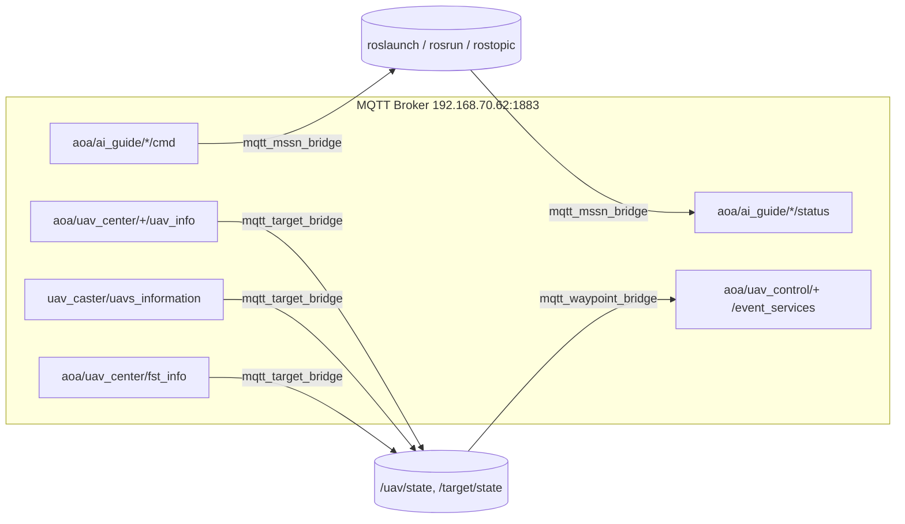
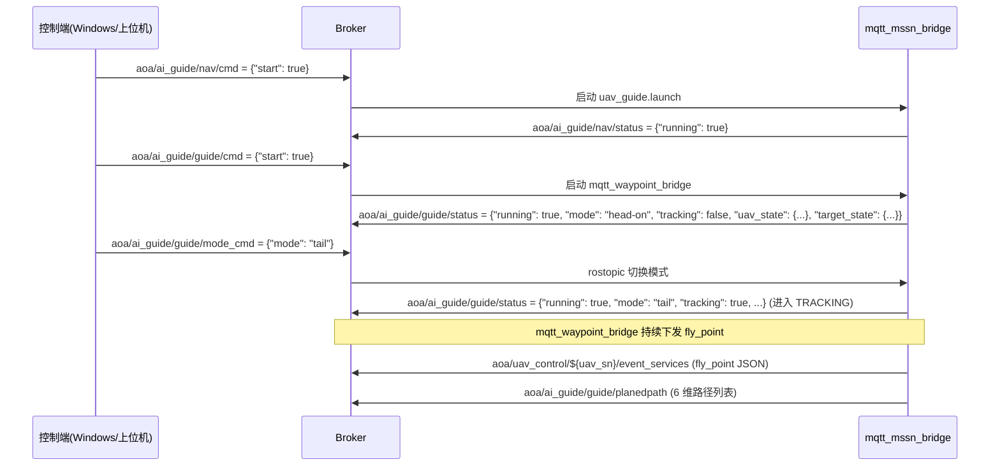

# ros_mqtt_bridge MQTT 接口设计文档

> 本文档汇总 `ros_mqtt_bridge` 功能包使用的**全部 MQTT 接口**：主题、载荷（JSON/值）、用途、使用方式。
> 版本：与仓库 `1.0.0` 分支同步（含 `mqtt_mssn_bridge` 远程控制能力）。

---

## 1. 概述

- **Broker**：`192.168.70.62:1883`（默认，见 `config/mqtt_bridge.yaml` 与 `config/mqtt_mssn_bridge.yaml`）
- **协议**：MQTT v3.1.1（libmosquitto），QoS 默认 0，KeepAlive 30 s
- **涉及节点**：

| 节点（可执行文件） | 方向 | 职责 |
|---|---|---|
| `mqtt_target_bridge`（= `mqtt_ros_bridge`） | MQTT → ROS | 订阅 UAV 位姿 / 列表，发布 `/uav/state`、`/target/state` |
| `mqtt_waypoint_bridge` | ROS → MQTT | 订阅 `/uav/guide_point`，发布 `fly_point` |
| `mqtt_mssn_bridge` | MQTT ⇄ ROS | 远程控制导航服务/引导动作/拦截模式，回报状态 |

**总体数据流：**



---

## 2. 话题总览

### 2.1 订阅话题（MQTT 入站）

| # | 主题 | 载荷 | 消费节点 | 说明 |
|---|---|---|---|---|
| 1 | `aoa/uav_center/+/uav_info` | JSON（`method=uav_info`） | `mqtt_target_bridge` | 本机/目标 UAV 位姿（→ `/uav/state`、`/target/state`） |
| 2 | `uav_caster/uavs_information` | JSON（`data.uavs[]`） | `mqtt_target_bridge` | **目标** UAV 列表（筛选 `SIL`） |
| 3 | `aoa/uav_center/fst_info` | JSON（`data.barrels[]`） | `mqtt_target_bridge` | **本机** UAV 列表（筛选 `NOCON`） |
| 4 | `aoa/ai_guide/nav/cmd` | JSON（`{"start": bool}`） | `mqtt_mssn_bridge` | 导航服务启停（`uav_guide.launch`） |
| 5 | `aoa/ai_guide/guide/cmd` | JSON（`{"start": bool}`） | `mqtt_mssn_bridge` | 引导动作启停（`mqtt_waypoint_bridge`） |
| 6 | `aoa/ai_guide/guide/mode_cmd` | JSON（`{"mode": string}`） | `mqtt_mssn_bridge` | 拦截模式切换（`head-on`/`tail`） |

### 2.2 发布话题（MQTT 出站）

| # | 主题 | 载荷 | 发布节点 | 频率 |
|---|---|---|---|---|
| 1 | `aoa/uav_control/${uav_sn}/event_services` | JSON（`method=fly_point`） | `mqtt_waypoint_bridge` | `/uav/guide_point` 时间戳更新时 |
| 2 | `aoa/ai_guide/nav/status` | JSON（`{"running": bool}`） | `mqtt_mssn_bridge` | 2 Hz |
| 3 | `aoa/ai_guide/guide/status` | JSON（`{"running","mode","tracking","uav_state","target_state"}`） | `mqtt_mssn_bridge` | 2 Hz |
| 4 | `aoa/ai_guide/guide/planedpath` | JSON（`{"planedPath": [[6 维路径点]...]}`） | `mqtt_mssn_bridge` | 2 Hz |

> `${uav_sn}`：UAV 序列号，由 `mqtt_target_bridge` 写入 `/uav/state` 的 `child_frame_id`，`mqtt_waypoint_bridge` 读取后拼入主题。

---

## 3. 订阅话题详解（MQTT → ROS）

### 3.1 `aoa/uav_center/+/uav_info` — UAV 位姿

**用途**：地面站实时上报 UAV 位姿。`+` 为通配层（如 `aoa/uav_center/SIL3NF0/uav_info`）。`mqtt_target_bridge` 按 `uav_sn` 匹配本机/目标，分别发布到 ROS `/uav/state`、`/target/state`。

**载荷 JSON（真实地面站格式）：**

```json
{
  "method": "uav_info",
  "mid": "地面站消息唯一标识（去重用）",
  "timestamp": 1785726967000,
  "data": {
    "uav_sn": "V2.4AOACRAFT-SIL3NF0",
    "mode": "Auto",
    "longitude": 116.92349937,
    "latitude": 34.01396246,
    "altitude": 120.0,
    "yaw": 45.0,
    "pitch": 0.0,
    "roll": 0.0,
    "vvg": 12.5,
    "climb_cur": 0.0
  }
}
```

**字段说明：**

| 字段 | 类型 | 必填 | 说明 |
|---|---|---|---|
| `method` | string | ✅ | 固定 `"uav_info"`，否则丢弃 |
| `mid` | string | - | 消息唯一标识，配合 `timestamp` 去重 |
| `timestamp` | int(ms) | - | epoch 毫秒 |
| `data.uav_sn` | string | ✅ | UAV 序列号，决定路由到本机或目标 |
| `data.longitude` / `latitude` / `altitude` | double | ✅ | WGS84，经度在前 |
| `data.yaw` / `pitch` / `roll` | double(deg) | - | 航空约定（0°=北、顺时针），内部转 ENU 弧度 |
| `data.vvg` | double(m/s) | - | 地速（标量），桥内结合航向分解为 vx/vy |
| `data.climb_cur` | double(m/s) | - | 爬升率 |

**路由规则**：`uav_sn` 含 `SIL` → `/target/state`（目标）；含 `NOCON` → `/uav/state`（本机）。

### 3.2 `uav_caster/uavs_information` — 目标 UAV 列表

**用途**：发现目标 UAV 列表，用于选择跟踪目标（筛选含 `SIL` 的序列号）。

```json
{
  "timestamp": 1785726967000,
  "sender": "MQTT-CM",
  "mid": "...",
  "data": { "uavs": [ { "uav_sn": "V2.4AOACRAFT-SIL3NF0" }, { "uav_sn": "..." } ] }
}
```

### 3.3 `aoa/uav_center/fst_info` — 本机 UAV 列表

**用途**：发现本机 UAV 列表（筛选含 `NOCON` 的序列号）。

```json
{
  "method": "fst_info",
  "mid": "...",
  "timestamp": 1785726967000,
  "data": {
    "barrels": [
      { "barrel_index": 2, "fill": 1, "self_check": 1, "uav_sn": "V2.4AOACRAFT-NOCONF0" }
    ]
  }
}
```

### 3.4 `aoa/ai_guide/nav/cmd` — 导航服务启停

**用途**：远程启动/停止导航服务（等效执行 `roslaunch uav_guide uav_guide.launch`）。

> 启动方式：有图形会话（`DISPLAY` 已设置）时在桌面**新建 xterm 终端**运行 launch；**无窗口环境**用 **tmux 会话**启动（`tmux attach -t uav_guide_launch` 查看输出，或 `tmux capture-pane -t uav_guide_launch -p` 抓屏）；tmux 不可用时回退后台日志。停止时自动关闭对应终端/会话。

```json
{ "start": true }   // 启动
{ "start": false }  // 停止
```

| 载荷 | 动作 |
|---|---|
| `{"start": true}` | 启动 `uav_guide.launch`（若未运行） |
| `{"start": false}` | 停止导航（先停引导动作，再停 `uav_guide.launch`） |

### 3.5 `aoa/ai_guide/guide/cmd` — 引导动作启停

**用途**：远程启动/停止引导动作（等效执行 `rosrun ros_mqtt_bridge mqtt_waypoint_bridge`）。

> 启动方式同 3.4：有图形会话用 **xterm** 终端；无窗口环境用 **tmux 会话**（`tmux attach -t mqtt_waypoint_bridge`）；tmux 不可用时回退后台日志。停止时自动关闭对应终端/会话。

```json
{ "start": true }   // 启动
{ "start": false }  // 停止
```

| 载荷 | 动作 |
|---|---|
| `{"start": true}` | 确保导航已启动，再启动 `mqtt_waypoint_bridge`（开始下发 `fly_point`） |
| `{"start": false}` | 停止引导动作（规划继续） |

### 3.6 `aoa/ai_guide/guide/mode_cmd` — 拦截模式切换

**用途**：远程切换迎头/尾追（等效 `rostopic pub -1 /uav_guide/intercept_mode_cmd std_msgs/String "data: 'tail'"`）。

```json
{ "mode": "head-on" }
{ "mode": "tail" }
```

| 载荷 | 动作 |
|---|---|
| `{"mode": "head-on"}`（兼容 `headon`/`head_on`） | 切换为迎头模式 |
| `{"mode": "tail"}` | 切换为尾追模式 |
| 其它 | 忽略并告警 |

> 默认会先确保导航已启动再下发（`mssn.ensure_nav_on_mode: true`）。

---

## 4. 发布话题详解（ROS → MQTT）

### 4.1 `aoa/uav_control/${uav_sn}/event_services` — fly_point 引导点

**用途**：向飞控下发 WGS84 引导点。当 ROS `/uav/guide_point`（`uav_guide/UavGuidePoint`）**时间戳更新时**发送（避免重复下发同一指令）。

```json
{
  "method": "fly_point",
  "data": {
    "target_longitude": 116.9234994,
    "target_latitude": 34.0139625,
    "target_altitude": 120.0,
    "target_radius": 500
  }
}
```

**精度约定**：`target_longitude`/`target_latitude` 固定 7 位小数；`target_altitude` 1 位小数；`target_radius` 数值（整数省略 `.0`）。

**字段来源**：对应 `/uav/guide_point` 的 `target_longitude`、`target_latitude`、`target_altitude`（WGS84 目标实时高度）、`target_radius`（弧段圆心 ±500 / 偏移引导点 +500）。

### 4.2 `aoa/ai_guide/nav/status` — 导航服务状态

JSON：`{"running": true}` = `uav_guide.launch` 运行中，`{"running": false}` = 未运行。

### 4.3 `aoa/ai_guide/guide/status` — 引导状态 + 模式 + 位姿

JSON（含引导运行态、拦截模式、TRACKING 状态，以及本机/目标位姿快照；位姿来自 ROS `/uav/state`、`/target/state` 的 `position` / `orientation`(四元数) / `twist.twist.linear`）：

```json
{
  "running": true,
  "mode": "head-on",
  "tracking": false,
  "uav_state": {
    "position":    { "x": 1.0, "y": 2.0, "z": 3.0 },
    "orientation": { "x": 0.0, "y": 0.0, "z": 0.0, "w": 1.0 },
    "linear":      { "x": 0.5, "y": 0.0, "z": 0.0 }
  },
  "target_state": { "position": {...}, "orientation": {...}, "linear": {...} }
}
```

- `running`：`mqtt_waypoint_bridge` 是否运行
- `mode`：`head-on` | `tail` | `unknown`（未收到 `/uav_guide/intercept_mode` 时）
- `tracking`：bool，是否进入 TRACKING（读 `/uav_guide/tracking_mode`）
- `uav_state` / `target_state`：未收到对应 ROS 话题时输出默认 0 / w=1

> 原独立的 `guide/mode`、`guide/tracking`、`ai_guide/status` 话题已并入本话题。

### 4.4 `aoa/ai_guide/guide/planedpath` — 规划路径（6 维）

JSON：来自 ROS `/uav/planned_path`（`uav_guide/UavPlannedPath`）的 `path` 数组，每个点编码为 **6 维**列表 `[x, y, z, yaw, pitch, curvature]`（对应 `beam_dubins/PathPoint` 的 6 个字段）：

```json
{
  "planedPath": [
    [0.0, 0.0, 0.0, 0.0, 0.0, 0.0],
    [10.0, 20.0, 0.0, 0.785, 0.0, 0.002]
  ]
}
```

> 未收到 `/uav/planned_path` 时 `planedPath` 为空数组 `[]`。

---

## 5. 通用约定

### 5.1 `ai_guide` 话题载荷约定（`mqtt_mssn_bridge`）

`ai_guide` 层级下**所有话题载荷均为 JSON**，字段类型与节点语义一致：

| 话题 | JSON 载荷 | 字段类型 |
|---|---|---|
| 命令 `nav/cmd`、`guide/cmd` | `{"start": <bool>}` | 布尔 |
| 命令 `guide/mode_cmd` | `{"mode": "<head-on\|tail>"}` | 字符串 |
| 状态 `nav/status` | `{"running": <bool>}` | 布尔 |
| 状态 `guide/status` | `{"running","mode","tracking","uav_state","target_state"}` | 布尔 + 字符串 + 对象 |
| 状态 `guide/planedpath` | `{"planedPath": [[x,y,z,yaw,pitch,curvature]...]}` | 6 维数值数组 |

> 命令载荷解析失败（非 JSON / 缺字段）会告警并忽略该命令。

### 5.2 QoS / retain

| 话题 | QoS | retain |
|---|---|---|
| 所有订阅话题 | 0 | - |
| `fly_point` | 0 | 否 |
| `aoa/ai_guide/*/status` | 0 | 否（2 Hz 周期刷新） |

### 5.3 主题前缀

`mqtt_bridge.yaml` 中 `topic_prefix: beam_dubins` 为预留配置；当前实际主题均以 `aoa/`、`uav_caster/` 开头，由各节点直接读取参数（见第 7 节）。

---

## 6. 使用示例

### 6.1 远程控制（`mosquitto_pub`，或任意 MQTT 客户端）

```bash
# 1) 启动导航服务
mosquitto_pub -h 192.168.70.62 -t aoa/ai_guide/nav/cmd -m '{"start": true}'

# 2) 启动引导动作（下发 fly_point）
mosquitto_pub -h 192.168.70.62 -t aoa/ai_guide/guide/cmd -m '{"start": true}'

# 3) 切换拦截模式（迎头 / 尾追）
mosquitto_pub -h 192.168.70.62 -t aoa/ai_guide/guide/mode_cmd -m '{"mode": "head-on"}'
mosquitto_pub -h 192.168.70.62 -t aoa/ai_guide/guide/mode_cmd -m '{"mode": "tail"}'

# 4) 停止引导动作 / 停止导航服务
mosquitto_pub -h 192.168.70.62 -t aoa/ai_guide/guide/cmd -m '{"start": false}'
mosquitto_pub -h 192.168.70.62 -t aoa/ai_guide/nav/cmd -m '{"start": false}'
```

### 6.2 订阅状态

```bash
mosquitto_sub -h 192.168.70.62 -v -t 'aoa/ai_guide/#'           # 全部控制状态
mosquitto_sub -h 192.168.70.62 -v -t 'aoa/uav_control/+/event_services'  # fly_point
mosquitto_sub -h 192.168.70.62 -v -t 'aoa/uav_center/+/uav_info'         # 位姿
```

### 6.3 端到端控制时序



---

## 7. 配置对照

| 配置项 | 值（默认） | 所在文件 |
|---|---|---|
| `mqtt.host` | `192.168.70.62` | `config/mqtt_bridge.yaml`、`config/mqtt_mssn_bridge.yaml` |
| `mqtt.port` | `1883` | 同上 |
| `mqtt.qos` / `keepalive_s` | `0` / `30` | 同上 |
| `mqtt.target_topic` | `aoa/uav_center/+/uav_info` | `config/mqtt_bridge.yaml` |
| `bridge.target_uav_topic` | `uav_caster/uavs_information` | 同上 |
| `bridge.target_uav_filter` | `SIL` | 同上 |
| `bridge.own_uav_topic` | `aoa/uav_center/fst_info` | 同上 |
| `bridge.own_uav_filter` | `NOCON` | 同上 |
| `mqtt.nav_cmd_topic` | `aoa/ai_guide/nav/cmd` | `config/mqtt_mssn_bridge.yaml` |
| `mqtt.guide_cmd_topic` | `aoa/ai_guide/guide/cmd` | 同上 |
| `mqtt.mode_cmd_topic` | `aoa/ai_guide/guide/mode_cmd` | 同上 |
| `mqtt.nav_status_topic` | `aoa/ai_guide/nav/status` | 同上 |
| `mqtt.guide_status_topic` | `aoa/ai_guide/guide/status` | 同上 |
| `mqtt.planedpath_topic` | `aoa/ai_guide/guide/planedpath` | 同上 |
| `mssn.status_poll_hz` | `2.0` | 同上 |
| `mssn.ensure_nav_on_mode` | `true` | 同上 |

---

## 8. JSON 契约（编解码层）

| 函数 | 消息 | schema / method |
|---|---|---|
| `decodeUavInfo` | `aoa/uav_center/+/uav_info` | `method = "uav_info"` |
| `decodeUavsInfo` | `uav_caster/uavs_information` | `data.uavs[].uav_sn` |
| `decodeFstInfo` | `aoa/uav_center/fst_info` | `data.barrels[].uav_sn` |
| `decodeStateBool` / `encodeStateBool` | `aoa/ai_guide/nav/cmd`、`guide/cmd`、`nav/status` | `{"start"\|"running": bool}` |
| `decodeStateString` / `encodeStateString` | `aoa/ai_guide/guide/mode_cmd`、`guide/status` | `{"mode": string}` |
| `encodeUavStateField` | `aoa/ai_guide/guide/status` | `uav_state` / `target_state` 对象 |
| `encodePlannedPathField` | `aoa/ai_guide/guide/planedpath` | `planedPath` 6 维数组 |
| `decodeTargetState` | （保留，测试用） | `schema = "beam_dubins.target_state.v1"` |
| `encodeFlyPoint` | `fly_point` | `method = "fly_point"` |
| `encodeWaypoint` | （保留，未接入） | `schema = "beam_dubins.waypoint.v1"` |
| `encodeRouteStatus` | （保留，未接入） | `schema = "beam_dubins.route_status.v1"` |

> 说明：`encodeWaypoint`、`encodeRouteStatus`、`decodeTargetState` 为 `json_codec` 预留能力，当前 `1.0.0` 分支未接入具体节点。

---

## 9. 变更记录

| 日期 | 内容 |
|---|---|
| 2026-08-02 | 新增 `mqtt_mssn_bridge` 及 `aoa/ai_guide/*` 话题组（原 `guide_mqtt_bridge` 能力融合入包） |
| 2026-08-03 | 新增 `uav_state` / `target_state` / `planedPath` 状态上报；`mode`+`tracking` 并入 `guide/status`；启动改为 xterm 弹窗 |
