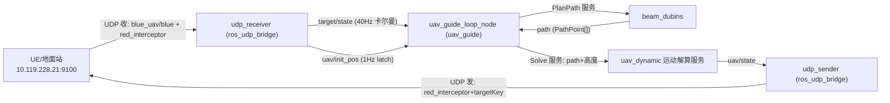

# ros_udp_bridge 设计方案（design_tool.md）

> 版本：v0.3 ｜ 日期：2026-08-08 ｜ 状态：阶段 1-3 编码中
> 配套协议：`logs/udp_msg.md`（红方拦截弹位姿协议 v1）
> 替代对象：`ros_mqtt_bridge`（MQTT → UDP）

---

> **解耦原则（v0.3）**：本版本代码**不依赖 `ros_mqtt_bridge` / `uav_guide`**（最后阶段会移除它们）。
> `geodesy`、卡尔曼滤波在 `ros_udp_bridge` 内**自包含实现**（namespace `ros_udp_bridge`）；
> 仅允许依赖核心算法包 `beam_dubins`（规划核心，不删除）。

---

## 1. 背景与目标

用 **UDP** 替代 MQTT 作为位姿输入通道，构建完整的 **收 → 跟踪 → 解算 → 发** 链路：

1. **接收**（`udp_receiver`）：从指定 IP:端口（测试 `192.168.90.34:11301`）接收 UDP JSON（一包一 JSON），按 `key` 区分 uav/target。
2. **uav 初始化**：首次收到 uav（`red_interceptor`）报文 → 经纬度经 geodesy 转本地坐标 → 发布 `uav/init_pos`（**1Hz，首包后内容不再变化**）；初始发射朝向**优先取报文 `heading`**，缺省（NaN/缺失）用 `init.heading_deg`（**默认 0° 正北**）。
3. **target/state**：按 `key==target_key` 过滤 `blue_uav`/`blue` 报文 → **40Hz** 发布，卡尔曼滤波估计速度/姿态（复用 `velocity_filter`，ROS 接口与 mqtt_bridge 一致）。
4. **全局轨迹**（uav_guide 的 `uav_guide_loop_node`）：根据 uav/target 位姿解算水平全局轨迹 → 请求 `beam_dubins` 得离散 path → 作为**运动解算服务**的请求。
5. **运动解算**（新包 `uav_dynamic`，服务）：输入 path + uav/target 高度 → 水平 DWA + 协调转弯律（50m/s、500m→25°）输出航向/滚转；纵向高度误差 PI（±3m/s、迎角±30°）→ 更新 `uav/state`。
6. **UDP 发送**（`udp_sender`）：订阅 `uav/state` → 组装 `red_interceptor`（含 `targetKey`）→ UDP 发送到 `udp.remote_host:remote_port`（默认 `10.119.228.21:9100`，**config 配置不硬编码**）。
7. 经纬度转换**复用 `ros_mqtt_bridge` 的 `geodesy.cpp`**。

> 本工作空间后续需要设计轨迹跟踪与运动学解算库，`uav_dynamic` 承担该职责（服务形态，参考 beam_dubins）。

---

## 2. 协议要点（摘录自 udp_msg.md）

| 项 | 值 |
|---|---|
| 传输 | UDP/IPv4 单播，一条数据报 = 一个 JSON 对象（不支持数组批量） |
| 编码 | UTF-8，无应答、无重传 |
| 目标端口 | `9100`（当前测试发送端为 `192.168.90.34:11301`） |
| 频率 | 测试基线 20Hz，建议 30~50Hz |
| 报文类型 | 接收：`blue_uav`/`blue`（蓝方目标）；发送：`red_interceptor`（红方拦截弹=本机 uav） |

**接收报文（蓝方目标，抓包实测 type=`blue_uav`/`blue`，无 targetKey/event）：**

```json
{"alt": 529.0, "heading": 209.7, "key": 30064967681, "lat": 30.3596,
 "lon": 104.1981, "name": "E1", "pitch": -24.5, "roll": 0.0,
 "t": 894.77, "type": "blue_uav", "velocity": 0.0}
```

| 字段 | 说明 |
|---|---|
| `key` | 目标实体唯一编号（**过滤关键词**） |
| `type` | `blue_uav` / `blue`（蓝方目标） |
| `lat/lon/alt` | WGS84 绝对海拔（米） |
| `heading/pitch/roll` | 角度制（heading 正北 0° 顺时针） |
| `t` | 仿真时间（秒） |
| `velocity` | 地速（本版本不使用） |
| `name` | 显示名称（E1/E2/...） |
| `targetKey`/`event` | **接收报文不包含**（仅发送时使用） |

**发送报文（红方拦截弹=本机 uav，type=`red_interceptor`，需加 `targetKey`）：**

```json
{
  "key": 425201827841,
  "type": "red_interceptor",
  "name": "IM-01",
  "t": 900.05,
  "lat": 30.3019811,
  "lon": 104.1527530,
  "alt": 600.618,
  "heading": 31.1686,
  "pitch": 0.0,
  "roll": 0.0,
  "targetKey": 30064967681,
  "event": "FIRE"
}
```

- `targetKey`：uav 跟踪的目标 `key`（= 接收到的目标报文 `key`）
- `event`：首帧大写 `FIRE`，仅触发界面提示

**坐标要求**：必须使用**源坐标锚点** `30.337989, 104.152629, 493m`（→ 映射至仙海地图锚点），不能直接发送已转换的仙海经纬度。

---

## 3. 系统架构与节点



### 4.1 `udp_receiver`（ros_udp_bridge，本版本核心）

| 项 | 说明 |
|---|---|
| 输入 | UDP socket（收）`udp.local_host:udp.local_port`（测试 `192.168.90.34:11301`） |
| 职责 | 收包 → 解析 JSON → 按 `key` 过滤 → uav 初始化 / target 更新 |
| 发布 | `target/state`（**40Hz**，卡尔曼）、`uav/init_pos`（**1Hz**，首包后不变）、`uav/init_heading`（1Hz）、`uav/state`（起点，**20Hz**，与 UDP 发送频率一致，含滤波后消息） |
| 订阅 | 无 |

处理逻辑：

```
收到 UDP 包
  → 解析 JSON（boost property_tree）
  → 按 key 过滤（type 仅辅助校验）：
       key == bridge.uav_key      → 分支 A：uav 起始初始化（仅首次；type=red_interceptor）
       key == bridge.target_key   → 分支 B：target 更新（每次；type=blue_uav/blue）
       其他                       → 忽略
```

**分支 A（uav 起始初始化，仅首次）**：
- `lat/lon/alt` → `geodesy.toLocal()` → 本地坐标 `(pos_x, pos_y, pos_z)`
- 初始发射朝向：**优先取报文 `heading`（有效时）**；若缺失/NaN → 用 `init.heading_deg`（**默认 0° 正北**）→ 转弧度
- 发布（首包后内容不再变化，`uav/init_pos` 以 **1Hz** 低频发布节省算力；建议 latch 便于后订阅者取到）：
  - `/uav/init_pos`（PoseStamped：position=(pos_x,pos_y,pos_z)；orientation 由朝向转四元数）
  - `/uav/init_heading`（Float64，初始朝向）
  - `/uav/state`（Odometry，起点位姿，供运动解算使用）

**分支 B（target 更新，每次）**：
- target 报文 type=`blue_uav`/`blue`，无 `targetKey`、无 `event`；靠 `key == bridge.target_key` 过滤。
- `lat/lon/alt` → `geodesy.toLocal()` → `(x,y,z)`
- `heading/pitch/roll` → 弧度，ENU 约定（`yaw = (90 - heading_deg)*PI/180`）
- **卡尔曼滤波**（复用 `ros_mqtt_bridge/velocity_filter.h`）：
  - `VelocityFilter` 估计 `vx/vy`（INS vvg×cos/sin 航向 为观测 + 位置差分 COG 观测）
  - `ScalarKalmanFilter` 估计 `yaw_rate/pitch_rate`（角度差/dt 为观测）
  - 参考 `mqtt_target_bridge.cpp` 的实现
- 发布 `/target/state`（nav_msgs/Odometry，**40Hz**，frame_id=map，child_frame_id=target_key）

### 4.2 `udp_sender`（ros_udp_bridge，新增）

| 项 | 说明 |
|---|---|
| 订阅 | `/uav/state`（运动解算后的 uav 位姿，Odometry） |
| 职责 | 本地坐标 → geodesy 逆变换 → 组装 `red_interceptor` JSON → UDP 发送 |
| 发送 | UDP `udp.remote_host:udp.remote_port`（默认 `10.119.228.21:9100`，**config 配置不硬编码**） |

输出 JSON 字段：

| JSON 字段 | 来源 |
|---|---|
| `key` | `bridge.uav_key` |
| `type` | 固定 `red_interceptor` |
| `name` | `bridge.uav_name`（配置，可加） |
| `t` | 单调递增（秒） |
| `lat/lon/alt` | `geodesy.toGeodetic()` 逆变换（WGS84 源坐标） |
| `heading/pitch/roll` | 解算姿态（角度制） |
| `targetKey` | `bridge.target_key`（**发送必加**） |
| `event` | 首帧 `FIRE`，后续省略 |

### 4.3 `uav_dynamic` 运动解算服务（新功能包）

> 参考 `beam_dubins` 的服务形态，把轨迹跟踪/运动学解算做成 **ROS 服务**。

**服务定义（uav_dynamic/UavDynamicsSolve.srv）**：

```
# 请求
beam_dubins/PathPoint[] path    # 全局离散路径（beam_dubins 规划输出）
float64 uav_height              # uav 当前高度
float64 target_height           # 目标高度
float64 speed_mps               # 水平速度模值（默认 50）
---
# 响应
bool success
float64 heading_rad             # 期望航向角（协调转弯律）
float64 roll_rad                # 期望滚转角（协调转弯律）
float64 pitch_rad               # 期望迎角（纵向 PI，限幅）
float64 climb_mps               # 期望垂直速度
```

**水平跟踪（DWA + 协调转弯律）**：
- 从 `path` 中取**下一个步长期望点**（前视点）
- 输入：`speed_mps`（50 m/s）+ 前视点 → 期望航向
- DWA：在速度/航向空间采样小段轨迹，选代价最低的航向（可借用 ROS MoveIt 的 DWA 思路/代码）
- **协调转弯律**：`roll = atan2(v², g·R)`；参量基准 **R_min=500m ↔ roll=25°**（v=50 时验证：atan2(2500, 9.81×500)=27°，以配置的 25° 为标定基准）

**纵向跟踪（高度误差 PI）**：
- 输入：`target_height - uav_height` 高度误差
- PI 控制器 → 期望垂直速度，**限幅 ±3.0 m/s**（P 值预估参考）
- 垂直速度 → 迎角输出，**限幅 ±30°**

**参数全部在 `uav_dynamic` 包 config 设置**（`speed_mps`、`min_turn_radius_m`、`bank_angle_deg`、`climb_vel_limit_mps`、`alpha_limit_deg`、PI 增益）。

---

## 4. 通信关系汇总

| 方向 | 节点/通道 | 类型 | 频率 |
|---|---|---|---|
| 入 | `udp_receiver` ← UDP `udp.local_host:udp.local_port` | 收：`blue_uav`/`blue`（目标）＋`red_interceptor`（uav 起始） | 现场（20~50Hz） |
| 出 | `udp_receiver` → `/target/state` | nav_msgs/Odometry（卡尔曼） | 40Hz |
| 出 | `udp_receiver` → `/uav/init_pos`、`/uav/init_heading` | PoseStamped / Float64（首包后不变） | 1Hz（latch） |
| 出 | `udp_receiver` → `/uav/state`（起点） | nav_msgs/Odometry | 一次 |
| 服务 | `uav_guide_loop_node` → `/beam_dubins/plan_path` | PlanPath（→ PathPoint[]） | 状态更新触发 |
| 服务 | `uav_guide_loop_node` → `/uav_dynamic/solve` | UavDynamicsSolve（path+高度） | path 更新触发 |
| 出 | `uav_dynamic` → `/uav/state`（解算后） | nav_msgs/Odometry | 解算频率 |
| 出 | `udp_sender` → UDP `udp.remote_host:udp.remote_port` | 发：`red_interceptor`（含 `targetKey`） | 解算频率 |

---

## 5. UDP socket 设计（接收）

- 套接字：`AF_INET` / `SOCK_DGRAM`（UDP）
- 绑定：`bind(local_host, local_port)` —— 测试 `192.168.90.34:11301`
- 收包：阻塞 `recvfrom` + `SO_RCVTIMEO`（如 100ms），超时/`EINTR` 时检查 `ros::ok()` 继续
- 单包最大长度：`udp.recv_buf_size`（4096 字节，报文远小于此）
- 线程模型：独立收包线程 + 入队/直接回调，不阻塞 roscpp 主循环
- 错误处理：非目标来源忽略；解析失败丢弃并计数，不影响后续包
- **容错注记**：吸取 MQTT 版 `invalid code sequence` 教训，若现场存在非 UTF-8 字节，需在 JSON 解析前做防御性清洗（非法字节 → U+FFFD），见 json_codec 经验。

---

## 6. 关键设计确认项

1. **target 数据来源（已确认，抓包实测）**：接收报文 type=`blue_uav`/`blue`（蓝方目标），**按 `key == bridge.target_key` 过滤** → `/target/state`。
   - 实测目标 key：E1=`30064967681`、E2=`30064967682`、E3=`30064967683`
   - **默认 `target_key = 30064967681`（E1）**，写入 config，用 key 值过滤。

2. **uav 数据来源（已确认）**：接收报文 type=`red_interceptor`（红方拦截弹=本机），按 `key == bridge.uav_key` 过滤；**首次收到即初始化 uav 起点**（一次性）。
   - **`uav_key` 暂用示例值 `425201827841`**，拦截弹发射后按现场实际确认。

3. **uav 重复报文处理**：仅初始化一次（flag），后续同 key 报文忽略（可配置刷新）。

4. **初始朝向**：优先取接收报文 `heading`（有效时）；缺失/NaN 用 `init.heading_deg`，**默认 0°（正北）**。

---

## 7. 配置设计（config/udp_bridge.yaml，占位已建）

```yaml
udp:
  local_host: 192.168.90.34   # 收：绑定地址
  local_port: 11301           # 收：端口（测试发送端）
  remote_host: 10.119.228.21  # 发：udp_sender 发送目标（config 配置，不硬编码）
  remote_port: 9100           # 发：udp_sender 发送端口
  recv_buf_size: 4096
  recv_timeout_ms: 100

bridge:
  uav_key: 425201827841       # 本机拦截弹 key（JSON.key 过滤）
  target_key: 30064967681     # 目标 key（JSON.key 过滤，默认 E1）
  uav_name: IM-01             # 发送 red_interceptor 的 name

init:
  heading_deg: 0.0            # 初始发射朝向默认值（角度制）；报文 heading 有效时优先用报文，默认 0°=正北

target:
  publish_hz: 40.0            # target/state 发布频率
  publish_tf: true
  timeout_ms: 5000
uav_state:
  publish_hz: 20.0            # uav/state 发布频率（与 UDP 发送频率一致）
init_pos:
  publish_hz: 1.0             # uav/init_pos 发布频率（1Hz，首包后内容不变）
  latch: true

geodesy:
  origin_latitude_deg: 30.337989   # 源坐标锚点
  origin_longitude_deg: 104.152629
  origin_altitude_m: 493.0
  altitude_reference: ellipsoid
```

> 运动解算参数（`speed_mps=50`、`min_turn_radius_m=500`、`bank_angle_deg=25`、`climb_vel_limit_mps=3`、`alpha_limit_deg=30`、PI 增益）在 **`uav_dynamic` 包**的 config 中设置（见 §4.3）。

---

## 8. 测试验证方案

1. **验证 UDP 收包**：数据已发到 `192.168.90.34:11301`。
   - 辅助工具：`socat -u UDP-RECV:11301 -` 或 `nc -u -l 11301` 直接看收包；python `socket` 脚本模拟发送。
   - 节点侧：打印收到的原始 JSON（`ROS_INFO`）确认到达。
2. **验证协议结构**：确认 `type/key/lat/lon/alt/heading` 字段解析正确。
3. **验证话题**：
   - `rostopic echo /uav/init_pos`（初始化一次，pos_x/y/z 为本地坐标）
   - `rostopic echo /target/state`（target_key 报文更新）
   - `rostopic info /target/state`（Publishers 存在）
4. **容错验证**：发送非法字节 / 非 JSON 包，确认不影响后续包。

---

## 9. 依赖与复用

| 依赖 | 用途 |
|---|---|
| `ros_mqtt_bridge`（geodesy.cpp / velocity_filter.h） | 经纬度↔本地坐标；卡尔曼速度/姿态滤波 |
| `beam_dubins`（PlanPath.srv / PathPoint.msg） | 全局离散路径（运动解算服务输入） |
| `uav_guide`（uav_guide_loop_node / plan_orchestrator） | 全局轨迹解算与 beam_dubins 请求 |
| `uav_dynamic`（新包） | 运动解算服务（DWA + 协调转弯 + 纵向 PI） |
| `roscpp` / `std_msgs` / `nav_msgs` / `geometry_msgs` / `tf` | 节点、消息、TF |
| boost（property_tree） | JSON 解析（与 json_codec 风格一致） |

> 注：若 geodesy 需跨包独立复用（uav_dynamic/udp_sender 都要用），建议后续提取到公共包或单独编译单元。

---

## 10. 实施计划（按方案执行，后续编码顺序）

| 阶段 | 内容 | 验证 |
|---|---|---|
| 1 | `udp_socket`（收）+ `udp_codec`（JSON 解析/key 过滤，含容错清洗） | 打印原始 JSON，验证收包与解析 |
| 2 | `udp_receiver`：uav 初始化（`/uav/init_pos` 1Hz、`/uav/init_heading`、起点 `/uav/state`） | `rostopic echo /uav/init_pos` |
| 3 | `udp_receiver`：`target/state` 40Hz + 卡尔曼滤波 | `rostopic hz /target/state`、位姿平滑 |
| 4 | `uav_dynamic` 包：`UavDynamicsSolve.srv` + DWA/协调转弯 + 纵向 PI | 服务调用返回正确航向/滚转/迎角 |
| 5 | `uav_guide_loop_node` 对接：beam_dubins path → `uav_dynamic` 服务 → `uav/state` | 端到端轨迹跟踪 |
| 6 | `udp_sender`：`uav/state` → `red_interceptor`（含 `targetKey`）→ UDP 发送 | 接收端（UE/抓包）收到正确 JSON |
| 7 | 参数整定（50m/s、500m↔25°、±3m/s、±30°） | 现场/仿真 |

---

## 11. 里程碑

- [x] 新建 `ros_udp_bridge` 包骨架（package.xml / CMakeLists / config / launch）
- [x] 编写设计方案 `scripts/design_tool.md`（v0.3）
- [x] 确认 target 报文格式（blue_uav/blue，靠 key 区分）＋网络对接（宿主机转发抓包成功）
- [x] **阶段 1：UDP 收包 + JSON 解析（真实数据验证通过）**
- [x] **阶段 2：uav 初始化发布（/uav/init_pos 1Hz、/uav/init_heading）**
- [x] **阶段 3：target/state 40Hz + 卡尔曼（实测 40.0Hz）**
- [x] **uav/state 20Hz（实测 20.0Hz）**
- [ ] 阶段 4：uav_dynamic 运动解算服务（DWA + 协调转弯 + 纵向 PI）
- [ ] 阶段 5：uav_guide_loop 对接（beam_dubins → uav_dynamic）
- [ ] 阶段 6：udp_sender（red_interceptor + targetKey 发送）
- [ ] 阶段 7：参数整定
